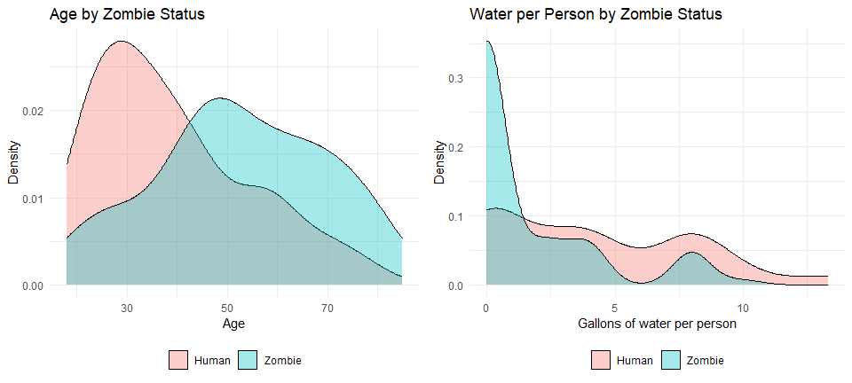
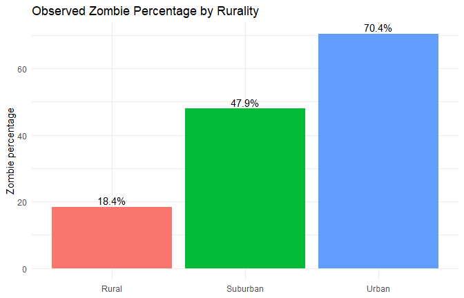
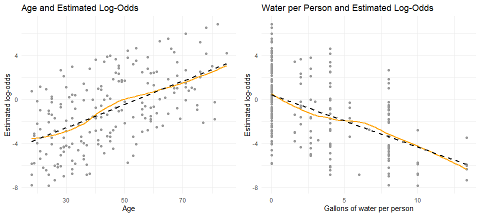
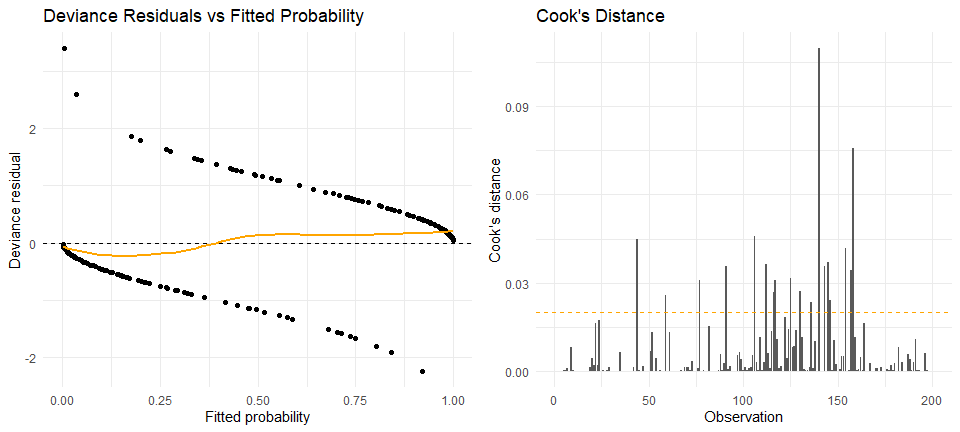

# Are You Ready for a Zombie Apocalypse?
George Oikonomidis

- [<span class="toc-section-number">1</span> Logistic
  regression](#logistic-regression)
- [<span class="toc-section-number">2</span> Libraries and
  data](#libraries-and-data)
- [<span class="toc-section-number">3</span> Cleaning and feature
  engineering](#cleaning-and-feature-engineering)
- [<span class="toc-section-number">4</span> Age and water
  availability](#age-and-water-availability)
- [<span class="toc-section-number">5</span> Comparing categorical
  characteristics](#comparing-categorical-characteristics)
- [<span class="toc-section-number">6</span> Chi-square
  tests](#chi-square-tests)
- [<span class="toc-section-number">7</span> Tests for age and
  water](#tests-for-age-and-water)
- [<span class="toc-section-number">8</span> Logistic regression
  model](#logistic-regression-model)
- [<span class="toc-section-number">9</span> Odds ratios](#odds-ratios)
- [<span class="toc-section-number">10</span> Overall model
  test](#overall-model-test)
- [<span class="toc-section-number">11</span> Classification
  summary](#classification-summary)
- [<span class="toc-section-number">12</span>
  Multicollinearity](#multicollinearity)
- [<span class="toc-section-number">13</span> Linearity of numeric
  predictors](#linearity-of-numeric-predictors)
- [<span class="toc-section-number">14</span> Residuals and influential
  observations](#residuals-and-influential-observations)
- [<span class="toc-section-number">15</span> Scenario
  predictions](#scenario-predictions)
- [<span class="toc-section-number">16</span> Conclusion](#conclusion)

This educational project uses fictional zombie-apocalypse data to
examine which personal characteristics and supplies are associated with
zombie status. The main method is logistic regression, followed by
simple model diagnostics and probability predictions.

The project began as a guided DataCamp exercise and was later revised to
improve the explanations, correct technical issues, and make the
analysis reproducible.

## Logistic regression

The response has two possible outcomes: `Human` and `Zombie`. If $p$ is
the probability of being classified as a zombie, logistic regression
models the log-odds:

$$\log\left(\frac{p}{1-p}\right)
= \beta_0 + \beta_1X_1 + \cdots + \beta_kX_k.$$

The exponential of a coefficient is an odds ratio:

$$\text{Odds Ratio} = e^{\beta_j}.$$

An odds ratio above 1 indicates higher estimated odds of zombie status,
while a value below 1 indicates lower estimated odds, holding the other
variables constant.

## Libraries and data

``` r
library(ggplot2)
library(gridExtra)
library(car)

theme_set(theme_minimal())
```

``` r
zombies <- read.csv(
  "data/zombies.csv",
  stringsAsFactors = TRUE
)

dim(zombies)
```

    [1] 200  14

``` r
summary(zombies)
```

        zombieid         zombie         age            sex          rurality 
     Min.   :  1.00   Human :121   Min.   :18.00   Female: 99   Rural   :98  
     1st Qu.: 50.75   Zombie: 79   1st Qu.:29.00   Male  :101   Suburban:48  
     Median :100.50                Median :42.00                Urban   :54  
     Mean   :100.50                Mean   :44.41                             
     3rd Qu.:150.25                3rd Qu.:58.00                             
     Max.   :200.00                Max.   :85.00                             
       household        water            food             medication 
     Min.   :1.00   Min.   : 0.00   Food   :110   Medication   : 94  
     1st Qu.:2.00   1st Qu.: 0.00   No food: 90   No medication:106  
     Median :2.50   Median : 8.00                                    
     Mean   :2.68   Mean   : 8.75                                    
     3rd Qu.:4.00   3rd Qu.: 8.00                                    
     Max.   :6.00   Max.   :40.00                                    
          tools                      firstaid           sanitation      clothing  
     No tools:101   First aid supplies   :106   No sanitation:102   Clothing:126  
     tools   : 99   No first aid supplies: 94   Sanitation   : 98   NAs     : 74  
                                                                                  
                                                                                  
                                                                                  
                                                                                  
         documents  
     Documents: 66  
     NAs      :134  
                    
                    
                    
                    

The dataset contains 200 fictional observations. The variables describe
zombie status, age, sex, rurality, household size, water, food,
medication, tools, first-aid supplies, sanitation, clothing, and
documents.

## Cleaning and feature engineering

Missing values in `clothing` and `documents` mean that the person does
not have those supplies. They are therefore recoded as explicit
categories.

``` r
zombies$zombie <- factor(
  zombies$zombie,
  levels = c("Human", "Zombie")
)

zombies$clothing <- as.character(zombies$clothing)
zombies$clothing[is.na(zombies$clothing)] <- "No clothing"
zombies$clothing <- factor(zombies$clothing)

zombies$documents <- as.character(zombies$documents)
zombies$documents[is.na(zombies$documents)] <- "No documents"
zombies$documents <- factor(zombies$documents)

# Water available to each member of the household
zombies$water.person <- zombies$water / zombies$household

summary(zombies[, c("age", "water.person", "clothing", "documents")])
```

          age         water.person           clothing          documents  
     Min.   :18.00   Min.   : 0.000   Clothing   :126   Documents   : 66  
     1st Qu.:29.00   1st Qu.: 0.000   No clothing: 74   No documents:134  
     Median :42.00   Median : 2.000                                       
     Mean   :44.41   Mean   : 3.092                                       
     3rd Qu.:58.00   3rd Qu.: 5.333                                       
     Max.   :85.00   Max.   :13.333                                       

`water.person` is more useful than total household water because it
accounts for the number of people sharing the available supply.

## Age and water availability

``` r
age_plot <- ggplot(zombies, aes(x = age, fill = zombie)) +
  geom_density(alpha = 0.35) +
  labs(
    title = "Age by Zombie Status",
    x = "Age",
    y = "Density",
    fill = NULL
  ) +
  theme(legend.position = "bottom")

water_plot <- ggplot(zombies, aes(x = water.person, fill = zombie)) +
  geom_density(alpha = 0.35) +
  labs(
    title = "Water per Person by Zombie Status",
    x = "Gallons of water per person",
    y = "Density",
    fill = NULL
  ) +
  theme(legend.position = "bottom")

grid.arrange(age_plot, water_plot, ncol = 2)
```



The plots suggest that zombies tend to be older and have less water
available per person. These are descriptive relationships and do not
prove causation.

## Comparing categorical characteristics

The following tables show the percentage of humans and zombies within
important categorical groups.

``` r
round(
  100 * prop.table(table(zombies$rurality, zombies$zombie), margin = 1),
  1
)
```

              
               Human Zombie
      Rural     81.6   18.4
      Suburban  52.1   47.9
      Urban     29.6   70.4

``` r
round(
  100 * prop.table(table(zombies$food, zombies$zombie), margin = 1),
  1
)
```

             
              Human Zombie
      Food     82.7   17.3
      No food  33.3   66.7

``` r
round(
  100 * prop.table(table(zombies$medication, zombies$zombie), margin = 1),
  1
)
```

                   
                    Human Zombie
      Medication     83.0   17.0
      No medication  40.6   59.4

``` r
round(
  100 * prop.table(table(zombies$sanitation, zombies$zombie), margin = 1),
  1
)
```

                   
                    Human Zombie
      No sanitation  47.1   52.9
      Sanitation     74.5   25.5

Urban observations have the highest observed zombie percentage, while
rural observations have the lowest. Food, medication, and sanitation
also show clear differences between the two groups.

``` r
rurality_percentages <- as.data.frame(
  100 * prop.table(table(zombies$rurality, zombies$zombie), margin = 1)
)

names(rurality_percentages) <- c("Rurality", "Status", "Percentage")

ggplot(
  subset(rurality_percentages, Status == "Zombie"),
  aes(x = Rurality, y = Percentage, fill = Rurality)
) +
  geom_col(show.legend = FALSE) +
  geom_text(
    aes(label = paste0(round(Percentage, 1), "%")),
    vjust = -0.3
  ) +
  labs(
    title = "Observed Zombie Percentage by Rurality",
    x = NULL,
    y = "Zombie percentage"
  )
```



## Chi-square tests

Chi-square tests examine whether each categorical variable is associated
with zombie status. A small p-value provides evidence against the
hypothesis of no association.

``` r
chi_sex <- chisq.test(table(zombies$sex, zombies$zombie))
chi_rurality <- chisq.test(table(zombies$rurality, zombies$zombie))
chi_food <- chisq.test(table(zombies$food, zombies$zombie))
chi_medication <- chisq.test(table(zombies$medication, zombies$zombie))
chi_tools <- chisq.test(table(zombies$tools, zombies$zombie))
chi_firstaid <- chisq.test(table(zombies$firstaid, zombies$zombie))
chi_sanitation <- chisq.test(table(zombies$sanitation, zombies$zombie))
chi_clothing <- chisq.test(table(zombies$clothing, zombies$zombie))
chi_documents <- chisq.test(table(zombies$documents, zombies$zombie))

chi_results <- data.frame(
  Variable = c(
    "Sex", "Rurality", "Food", "Medication", "Tools",
    "First aid", "Sanitation", "Clothing", "Documents"
  ),
  P_value = c(
    chi_sex$p.value,
    chi_rurality$p.value,
    chi_food$p.value,
    chi_medication$p.value,
    chi_tools$p.value,
    chi_firstaid$p.value,
    chi_sanitation$p.value,
    chi_clothing$p.value,
    chi_documents$p.value
  )
)

chi_results <- chi_results[order(chi_results$P_value), ]
chi_results
```

        Variable      P_value
    3       Food 3.319551e-12
    2   Rurality 1.091825e-09
    4 Medication 2.246524e-09
    7 Sanitation 1.321953e-04
    9  Documents 2.721159e-01
    6  First aid 4.921689e-01
    8   Clothing 6.042469e-01
    1        Sex 6.424046e-01
    5      Tools 1.000000e+00

Rurality, food, medication, and sanitation have statistically
significant associations with zombie status. Sex, tools, first-aid
supplies, clothing, and documents do not show strong evidence of
association in this sample.

## Tests for age and water

Welch two-sample t-tests compare the mean age and mean water per person
between humans and zombies.

``` r
age_test <- t.test(age ~ zombie, data = zombies)
water_test <- t.test(water.person ~ zombie, data = zombies)

age_test
```


        Welch Two Sample t-test

    data:  age by zombie
    t = -5.6247, df = 155.02, p-value = 8.453e-08
    alternative hypothesis: true difference in means between group Human and group Zombie is not equal to 0
    95 percent confidence interval:
     -18.099289  -8.690751
    sample estimates:
     mean in group Human mean in group Zombie 
                39.12397             52.51899 

``` r
water_test
```


        Welch Two Sample t-test

    data:  water.person by zombie
    t = 5.5436, df = 197.43, p-value = 9.415e-08
    alternative hypothesis: true difference in means between group Human and group Zombie is not equal to 0
    95 percent confidence interval:
     1.636281 3.443253
    sample estimates:
     mean in group Human mean in group Zombie 
                4.095041             1.555274 

Both tests produce very small p-values. In this fictional sample,
zombies are older on average and have less water available per person.
Statistical association does not establish a causal effect.

## Logistic regression model

The model includes the variables that showed clear relationships with
zombie status in the exploratory analysis.

``` r
zombie_model <- glm(
  zombie ~ age + water.person + food + rurality + medication + sanitation,
  data = zombies,
  family = binomial(link = "logit")
)

summary(zombie_model)
```


    Call:
    glm(formula = zombie ~ age + water.person + food + rurality + 
        medication + sanitation, family = binomial(link = "logit"), 
        data = zombies)

    Coefficients:
                            Estimate Std. Error z value Pr(>|z|)    
    (Intercept)             -6.09863    1.10056  -5.541 3.00e-08 ***
    age                      0.07701    0.01624   4.743 2.10e-06 ***
    water.person            -0.24363    0.08216  -2.966  0.00302 ** 
    foodNo food              2.20013    0.52018   4.230 2.34e-05 ***
    ruralitySuburban         1.30748    0.56242   2.325  0.02009 *  
    ruralityUrban            2.67815    0.62713   4.271 1.95e-05 ***
    medicationNo medication  1.70862    0.53068   3.220  0.00128 ** 
    sanitationSanitation    -1.15782    0.48061  -2.409  0.01599 *  
    ---
    Signif. codes:  0 '***' 0.001 '**' 0.01 '*' 0.05 '.' 0.1 ' ' 1

    (Dispersion parameter for binomial family taken to be 1)

        Null deviance: 268.37  on 199  degrees of freedom
    Residual deviance: 122.78  on 192  degrees of freedom
    AIC: 138.78

    Number of Fisher Scoring iterations: 6

Positive coefficients increase the estimated log-odds of zombie status.
Negative coefficients reduce the estimated log-odds, after controlling
for the other predictors.

## Odds ratios

``` r
model_coefficients <- summary(zombie_model)$coefficients

odds_ratio_results <- data.frame(
  Variable = rownames(model_coefficients),
  Odds_ratio = exp(model_coefficients[, "Estimate"]),
  Lower_95_CI = exp(
    model_coefficients[, "Estimate"] -
      1.96 * model_coefficients[, "Std. Error"]
  ),
  Upper_95_CI = exp(
    model_coefficients[, "Estimate"] +
      1.96 * model_coefficients[, "Std. Error"]
  ),
  P_value = model_coefficients[, "Pr(>|z|)"],
  row.names = NULL
)

odds_ratio_results[, 2:5] <- round(odds_ratio_results[, 2:5], 4)
odds_ratio_results
```

                     Variable Odds_ratio Lower_95_CI Upper_95_CI P_value
    1             (Intercept)     0.0022      0.0003      0.0194  0.0000
    2                     age     1.0801      1.0462      1.1150  0.0000
    3            water.person     0.7838      0.6672      0.9207  0.0030
    4             foodNo food     9.0262      3.2563     25.0200  0.0000
    5        ruralitySuburban     3.6969      1.2277     11.1320  0.0201
    6           ruralityUrban    14.5582      4.2588     49.7656  0.0000
    7 medicationNo medication     5.5213      1.9513     15.6231  0.0013
    8    sanitationSanitation     0.3142      0.1225      0.8059  0.0160

Older age, no food, suburban or urban residence, and no medication are
associated with higher estimated zombie odds. More water per person and
access to sanitation are associated with lower estimated odds.

## Overall model test

The likelihood-ratio test compares the fitted model with an
intercept-only model.

``` r
null_model <- glm(
  zombie ~ 1,
  data = zombies,
  family = binomial(link = "logit")
)

anova(null_model, zombie_model, test = "Chisq")
```

    Analysis of Deviance Table

    Model 1: zombie ~ 1
    Model 2: zombie ~ age + water.person + food + rurality + medication + 
        sanitation
      Resid. Df Resid. Dev Df Deviance  Pr(>Chi)    
    1       199     268.37                          
    2       192     122.78  7    145.6 < 2.2e-16 ***
    ---
    Signif. codes:  0 '***' 0.001 '**' 0.01 '*' 0.05 '.' 0.1 ' ' 1

The small p-value indicates that the predictors improve model fit when
considered together.

## Classification summary

Probabilities at or above 0.50 are classified as `Zombie`.

``` r
fitted_probability <- predict(zombie_model, type = "response")

predicted_status <- ifelse(
  fitted_probability >= 0.50,
  "Zombie",
  "Human"
)

confusion_matrix <- table(
  Observed = zombies$zombie,
  Predicted = predicted_status
)

confusion_matrix
```

            Predicted
    Observed Human Zombie
      Human    109     12
      Zombie    16     63

``` r
accuracy <- sum(diag(confusion_matrix)) / sum(confusion_matrix)

sensitivity <-
  confusion_matrix["Zombie", "Zombie"] /
  sum(confusion_matrix["Zombie", ])

specificity <-
  confusion_matrix["Human", "Human"] /
  sum(confusion_matrix["Human", ])

observed_zombie <- ifelse(zombies$zombie == "Zombie", 1, 0)
brier_score <- mean((observed_zombie - fitted_probability)^2)

classification_results <- data.frame(
  Metric = c("Accuracy", "Sensitivity", "Specificity", "Brier score"),
  Value = c(accuracy, sensitivity, specificity, brier_score)
)

classification_results$Value <- round(classification_results$Value, 3)
classification_results
```

           Metric Value
    1    Accuracy 0.860
    2 Sensitivity 0.797
    3 Specificity 0.901
    4 Brier score 0.093

The model correctly classifies 172 of the 200 observations. Sensitivity
is approximately 79.7% and specificity approximately 90.1%.

These results are **in-sample** because the same observations were used
to fit and evaluate the model. They describe apparent fit and may be
optimistic.

## Multicollinearity

Variance inflation factors examine whether predictors contain strongly
overlapping information.

``` r
vif(zombie_model)
```

                     GVIF Df GVIF^(1/(2*Df))
    age          1.508748  1        1.228311
    water.person 1.188868  1        1.090352
    food         1.304250  1        1.142038
    rurality     1.313980  2        1.070649
    medication   1.271348  1        1.127541
    sanitation   1.102351  1        1.049929

The adjusted generalized VIF values are close to 1, so there is little
evidence of problematic multicollinearity.

## Linearity of numeric predictors

Logistic regression assumes that numeric predictors have an
approximately linear relationship with the log-odds of the response.

``` r
zombies$logit_zombie <- log(
  fitted_probability / (1 - fitted_probability)
)

age_linearity <- ggplot(zombies, aes(x = age, y = logit_zombie)) +
  geom_point(color = "gray60") +
  geom_smooth(method = "loess", se = FALSE, color = "orange") +
  geom_smooth(
    method = "lm",
    se = FALSE,
    color = "black",
    linetype = "dashed"
  ) +
  labs(
    title = "Age and Estimated Log-Odds",
    x = "Age",
    y = "Estimated log-odds"
  )

water_linearity <- ggplot(
  zombies,
  aes(x = water.person, y = logit_zombie)
) +
  geom_point(color = "gray60") +
  geom_smooth(method = "loess", se = FALSE, color = "orange") +
  geom_smooth(
    method = "lm",
    se = FALSE,
    color = "black",
    linetype = "dashed"
  ) +
  labs(
    title = "Water per Person and Estimated Log-Odds",
    x = "Gallons of water per person",
    y = "Estimated log-odds"
  )

grid.arrange(age_linearity, water_linearity, ncol = 2)
```



The relationships are reasonably close to linear, although the plots
should be interpreted as informal diagnostics rather than strict
pass-or-fail tests.

## Residuals and influential observations

``` r
deviance_residuals <- residuals(zombie_model, type = "deviance")
cook_values <- cooks.distance(zombie_model)

residual_plot <- ggplot(
  data.frame(
    Probability = fitted_probability,
    Residual = deviance_residuals
  ),
  aes(x = Probability, y = Residual)
) +
  geom_point() +
  geom_hline(yintercept = 0, linetype = "dashed") +
  geom_smooth(method = "loess", se = FALSE, color = "orange") +
  labs(
    title = "Deviance Residuals vs Fitted Probability",
    x = "Fitted probability",
    y = "Deviance residual"
  )

influence_plot <- ggplot(
  data.frame(
    Observation = 1:nrow(zombies),
    Cook_distance = cook_values
  ),
  aes(x = Observation, y = Cook_distance)
) +
  geom_col() +
  geom_hline(
    yintercept = 4 / nrow(zombies),
    color = "orange",
    linetype = "dashed"
  ) +
  labs(
    title = "Cook's Distance",
    x = "Observation",
    y = "Cook's distance"
  )

grid.arrange(residual_plot, influence_plot, ncol = 2)
```



Potentially influential observations should be investigated, not
automatically removed.

## Scenario predictions

The fitted model is used to estimate zombie probabilities for three
fictional people.

``` r
scenario_data <- data.frame(
  Person = c("Dad", "Brother", "Me"),
  age = c(71, 40, 24),
  water.person = c(5, 3, 10),
  food = c("Food", "Food", "Food"),
  rurality = c("Suburban", "Urban", "Rural"),
  medication = c("Medication", "Medication", "No medication"),
  sanitation = c("Sanitation", "Sanitation", "Sanitation")
)

scenario_data$Zombie_probability <- predict(
  zombie_model,
  newdata = scenario_data,
  type = "response"
)

scenario_data$Zombie_percentage <- paste0(
  round(100 * scenario_data$Zombie_probability, 2),
  "%"
)

scenario_data[, c("Person", "Zombie_probability", "Zombie_percentage")]
```

       Person Zombie_probability Zombie_percentage
    1     Dad         0.15457694            15.46%
    2 Brother         0.09720797             9.72%
    3      Me         0.00215924             0.22%

The original fitted probabilities are approximately 15.5% for Dad, 9.7%
for Brother, and 0.2% for Me. These are playful outputs based on
fictional data, not real risk estimates.

## Conclusion

This project demonstrates a complete but accessible logistic-regression
workflow. Age, water availability, food, rurality, medication, and
sanitation help explain zombie status in the fictional sample. Odds
ratios make the fitted coefficients easier to interpret, while the
diagnostic plots provide checks for multicollinearity, linearity,
residual patterns, and influential observations.

The main limitations are the fictional data, exploratory variable
screening, and in-sample evaluation. The results should therefore be
treated as an educational statistical-learning exercise rather than a
real prediction system.
