# Multiple Linear Regression and Model Selection


- [<span class="toc-section-number">1</span> Libraries and
  data](#libraries-and-data)
- [<span class="toc-section-number">2</span> Descriptive
  statistics](#descriptive-statistics)
- [<span class="toc-section-number">3</span> Distribution of the
  response](#distribution-of-the-response)
- [<span class="toc-section-number">4</span> Predictor
  distributions](#predictor-distributions)
- [<span class="toc-section-number">5</span> Correlation
  plots](#correlation-plots)
- [<span class="toc-section-number">6</span> Pair plots](#pair-plots)
- [<span class="toc-section-number">7</span> Full multiple regression
  model](#full-multiple-regression-model)
- [<span class="toc-section-number">8</span> Initial multicollinearity
  screening](#initial-multicollinearity-screening)
- [<span class="toc-section-number">9</span> AIC and BIC before stepwise
  selection](#aic-and-bic-before-stepwise-selection)
- [<span class="toc-section-number">10</span> Stepwise model
  selection](#stepwise-model-selection)
  - [<span class="toc-section-number">10.1</span> Model
    comparison](#model-comparison)
- [<span class="toc-section-number">11</span> Final AIC
  model](#final-aic-model)
- [<span class="toc-section-number">12</span> Model
  diagnostics](#model-diagnostics)
  - [<span class="toc-section-number">12.1</span> Cook’s
    distance](#cooks-distance)
  - [<span class="toc-section-number">12.2</span> Residual
    results](#residual-results)
- [<span class="toc-section-number">13</span> Observed and fitted
  values](#observed-and-fitted-values)
- [<span class="toc-section-number">14</span> Conclusions and
  limitations](#conclusions-and-limitations)
- [<span class="toc-section-number">15</span> Corrections made to the
  original script](#corrections-made-to-the-original-script)

This project applies multiple linear regression to a dataset with one
response variable, `Y2`, and 52 candidate explanatory variables. The
analysis follows the original MSc assignment: descriptive analysis,
correlation inspection, multicollinearity screening, stepwise model
selection with AIC and BIC, and diagnostic analysis of the final model.

The main objective is to identify a smaller and interpretable set of
predictors without ignoring the problems created by a very large
candidate set and a small sample.

For observation $i$, the full multiple linear regression model is

$$Y_i = \beta_0 + \beta_1X_{i1} + \beta_2X_{i2} + \cdots + \beta_{52}X_{i52} + \varepsilon_i,$$

where

$$\varepsilon_i \overset{\mathrm{iid}}{\sim} N(0,\sigma^2).$$

Each coefficient $\beta_j$ represents the expected change in `Y2` for a
one-unit increase in $X_j$, holding the other predictors constant.

## Libraries and data

``` r
library(ggplot2)
library(tidyr)
library(corrplot)
library(broom)
library(car)
```

The original Excel worksheet was cleaned once and stored as a CSV inside
the repository. This avoids using an absolute path and allows the
project to run on another computer.

``` r
data_path <- "data/multiple_regression_dataset2.csv"
df <- read.csv(data_path)

dim(df)
```

    [1] 59 53

``` r
str(df)
```

    'data.frame':   59 obs. of  53 variables:
     $ Y2 : num  0.0652 0.0985 -0.1765 -0.3618 0.1447 ...
     $ X1 : num  0.288 -0.18 -0.185 -0.722 0.541 ...
     $ X2 : num  0.01077 0.00224 -0.01971 -0.01221 -0.00345 ...
     $ X3 : num  -0.00103 0.00222 -0.00459 -0.04578 0.00463 ...
     $ X4 : num  0.0935 0.0855 0.1796 0.1754 0.088 ...
     $ X5 : num  0.024459 -0.000146 -0.039888 0.011732 0.013931 ...
     $ X6 : num  0.01643 0.00111 -0.00972 0.006 0.0032 ...
     $ X7 : num  -0.01913 0.02692 0.01129 -0.01018 0.00131 ...
     $ X8 : num  0.1195 -0.0201 -0.0751 -0.0292 0.0101 ...
     $ X9 : num  0.2203 -0.0977 -0.748 0.1215 0.2898 ...
     $ X10: num  0.03214 -0.00733 -0.02859 0.02368 0.00858 ...
     $ X11: num  0.01219 0.02394 0.00568 0.03172 0.00253 ...
     $ X12: num  0.000643 0.003851 -0.002566 -0.006443 0 ...
     $ X13: num  -0.005366 -0.013153 -0.000779 0.007764 -0.015589 ...
     $ X14: num  0.01405 0.01023 0.00868 0.0036 -0.0072 ...
     $ X15: num  -0.02208 -0.00447 0.00269 -0.00628 -0.02737 ...
     $ X16: num  0.02672 -0.01277 -0.00897 -0.0278 0.00251 ...
     $ X17: num  0.2204 -0.0889 -0.7666 0.1419 0.2876 ...
     $ X18: num  0.187 -0.15 -0.497 -0.158 0.19 ...
     $ X19: num  0.0976 -0.0574 -0.1774 -0.0503 0.1111 ...
     $ X20: num  0.012459 0.002879 -0.025132 -0.009327 -0.000965 ...
     $ X21: num  1.14e-02 1.85e-03 -2.69e-02 -8.47e-03 -7.81e-05 ...
     $ X22: num  0.013288 0.006683 0.000103 -0.0055 -0.003578 ...
     $ X23: num  0.00275 -0.00774 -0.00904 -0.00254 -0.00493 ...
     $ X24: num  0.00157 -0.00889 -0.0107 -0.00197 -0.00433 ...
     $ X25: num  0.004925 -0.000896 0.001633 -0.003943 -0.004276 ...
     $ X26: num  -0.00995 -0.01005 0.02 0 0.04832 ...
     $ X27: num  -0.0351 0 0.0351 -0.0715 -0.077 ...
     $ X28: num  0.00442 -0.00294 -0.00591 -0.00297 0.00148 ...
     $ X29: num  0.000114 -0.010522 -0.036056 -0.063911 -0.04099 ...
     $ X30: num  -0.0765 -0.0615 -0.1008 -0.1602 -0.0914 ...
     $ X31: num  0.04291 0.01527 -0.00599 -0.02406 -0.02218 ...
     $ X32: num  0.110964 0.000143 -0.067858 -0.153198 -0.039642 ...
     $ X33: num  -0.00569 0.01605 -0.0384 -0.08571 -0.11879 ...
     $ X34: num  -0.0114 -0.065 -0.0834 -0.0987 -0.1502 ...
     $ X35: num  0.05214 0.03751 0.01467 -0.04287 -0.00741 ...
     $ X36: num  0.04097 0.00982 -0.01951 0.02161 0.01944 ...
     $ X37: num  -0.01475 -0.00196 0.04288 -0.02762 -0.11026 ...
     $ X38: num  0.0436 0.0271 0.1138 0.0034 0.0333 ...
     $ X39: num  -0.02588 -0.05916 -0.02578 -0.04113 -0.00955 ...
     $ X40: num  -0.0146 0.0113 -0.0177 -0.0661 0.1327 ...
     $ X41: num  0.00137 -0.14191 -0.07845 -0.0805 -0.00627 ...
     $ X42: num  1.58e-01 8.88e-02 -5.23e-05 5.79e-04 9.62e-02 ...
     $ X43: num  0.037209 0.039095 0.000578 -0.029391 0.004118 ...
     $ X44: num  -0.01423 0.00214 0.03747 -0.02039 -0.02089 ...
     $ X45: num  0.1156 0.0327 -0.0114 -0.086 -0.0209 ...
     $ X46: num  -0.03217 0.08305 0.00587 0.01446 -0.04029 ...
     $ X47: num  0.114 0.0937 0.1378 0.1278 -0.1414 ...
     $ X48: num  0.22 -0.228 -0.477 -0.178 0.322 ...
     $ X49: num  0.0345 -0.2116 -0.296 -0.1703 0.0376 ...
     $ X50: num  -0.0915 -0.069 -0.1646 -0.1142 -0.0992 ...
     $ X51: num  -0.0514 -0.1587 -0.2629 -0.2321 0.0164 ...
     $ X52: num  -0.0347 -0.0624 -0.102 -0.1123 -0.1437 ...

``` r
summary(df)
```

           Y2                  X1                 X2                  X3           
     Min.   :-0.361823   Min.   :-0.72190   Min.   :-0.092419   Min.   :-0.067586  
     1st Qu.:-0.065437   1st Qu.:-0.21815   1st Qu.: 0.006186   1st Qu.: 0.005637  
     Median : 0.023469   Median :-0.03309   Median : 0.010717   Median : 0.010862  
     Mean   : 0.006734   Mean   : 0.01709   Mean   : 0.009744   Mean   : 0.009396  
     3rd Qu.: 0.103758   3rd Qu.: 0.17568   3rd Qu.: 0.014346   3rd Qu.: 0.015784  
     Max.   : 0.322205   Max.   : 0.70014   Max.   : 0.084232   Max.   : 0.046661  
           X4                  X5                   X6           
     Min.   :-0.331033   Min.   :-0.0398877   Min.   :-0.011425  
     1st Qu.:-0.052073   1st Qu.: 0.0001957   1st Qu.: 0.002514  
     Median :-0.022990   Median : 0.0047222   Median : 0.005748  
     Mean   :-0.006381   Mean   : 0.0055810   Mean   : 0.006290  
     3rd Qu.: 0.005076   3rd Qu.: 0.0111721   3rd Qu.: 0.009665  
     Max.   : 0.916291   Max.   : 0.0307349   Max.   : 0.024728  
           X7                  X8                  X9            
     Min.   :-0.026725   Min.   :-0.075145   Min.   :-0.7479884  
     1st Qu.:-0.010468   1st Qu.:-0.013762   1st Qu.:-0.0690865  
     Median : 0.001306   Median : 0.001258   Median : 0.0077929  
     Mean   : 0.001909   Mean   : 0.005467   Mean   : 0.0006115  
     3rd Qu.: 0.010690   3rd Qu.: 0.021762   3rd Qu.: 0.0823780  
     Max.   : 0.053124   Max.   : 0.119456   Max.   : 0.2898279  
          X10                 X11                 X12           
     Min.   :-0.205751   Min.   :-0.013100   Min.   :-0.009956  
     1st Qu.:-0.010781   1st Qu.: 0.000683   1st Qu.: 0.000000  
     Median : 0.004866   Median : 0.005176   Median : 0.003376  
     Mean   : 0.009555   Mean   : 0.009610   Mean   : 0.007379  
     3rd Qu.: 0.021012   3rd Qu.: 0.013074   3rd Qu.: 0.010716  
     Max.   : 0.259888   Max.   : 0.071099   Max.   : 0.055917  
          X13                 X14                 X15           
     Min.   :-0.085037   Min.   :-0.010905   Min.   :-0.086775  
     1st Qu.:-0.006454   1st Qu.: 0.001853   1st Qu.:-0.006848  
     Median : 0.002941   Median : 0.005823   Median : 0.004272  
     Mean   : 0.009575   Mean   : 0.008620   Mean   : 0.001948  
     3rd Qu.: 0.033625   3rd Qu.: 0.013957   3rd Qu.: 0.013342  
     Max.   : 0.120483   Max.   : 0.042222   Max.   : 0.064893  
          X16                 X17                  X18           
     Min.   :-0.054840   Min.   :-0.7666000   Min.   :-0.496597  
     1st Qu.: 0.006037   1st Qu.:-0.0665518   1st Qu.:-0.041452  
     Median : 0.010084   Median : 0.0093936   Median : 0.006235  
     Mean   : 0.009939   Mean   : 0.0001588   Mean   : 0.003296  
     3rd Qu.: 0.013890   3rd Qu.: 0.0846583   3rd Qu.: 0.053703  
     Max.   : 0.109849   Max.   : 0.2875578   Max.   : 0.337962  
          X19                 X20                 X21           
     Min.   :-0.177408   Min.   :-0.101243   Min.   :-0.108515  
     1st Qu.:-0.065592   1st Qu.: 0.007116   1st Qu.: 0.006503  
     Median :-0.024425   Median : 0.009964   Median : 0.010217  
     Mean   : 0.001576   Mean   : 0.009738   Mean   : 0.009659  
     3rd Qu.: 0.036525   3rd Qu.: 0.012947   3rd Qu.: 0.013063  
     Max.   : 0.406536   Max.   : 0.097673   Max.   : 0.106774  
          X22                 X23                 X24           
     Min.   :-0.129382   Min.   :-0.096685   Min.   :-0.104280  
     1st Qu.: 0.007699   1st Qu.: 0.003193   1st Qu.: 0.002827  
     Median : 0.010089   Median : 0.005779   Median : 0.005802  
     Mean   : 0.009836   Mean   : 0.004862   Mean   : 0.004856  
     3rd Qu.: 0.013768   3rd Qu.: 0.007265   3rd Qu.: 0.007576  
     Max.   : 0.086467   Max.   : 0.089409   Max.   : 0.098714  
          X25                 X26                 X27          
     Min.   :-0.129382   Min.   :-0.146603   Min.   :-0.24116  
     1st Qu.: 0.002237   1st Qu.:-0.041818   1st Qu.:-0.06085  
     Median : 0.004589   Median :-0.009390   Median : 0.00000  
     Mean   : 0.003655   Mean   :-0.009401   Mean   :-0.02183  
     3rd Qu.: 0.006644   3rd Qu.: 0.017752   3rd Qu.: 0.00000  
     Max.   : 0.078956   Max.   : 0.115832   Max.   : 0.11778  
          X28                  X29                 X30          
     Min.   :-0.0240252   Min.   :-0.335261   Min.   :-0.26154  
     1st Qu.:-0.0046730   1st Qu.:-0.004045   1st Qu.:-0.01509  
     Median :-0.0015049   Median : 0.013872   Median : 0.02124  
     Mean   :-0.0004818   Mean   : 0.008711   Mean   : 0.01303  
     3rd Qu.: 0.0029989   3rd Qu.: 0.026316   3rd Qu.: 0.04499  
     Max.   : 0.0390440   Max.   : 0.381675   Max.   : 0.42748  
          X31                 X32                 X33           
     Min.   :-0.390761   Min.   :-0.422457   Min.   :-0.376541  
     1st Qu.:-0.007163   1st Qu.:-0.047345   1st Qu.:-0.019994  
     Median : 0.011244   Median : 0.015205   Median : 0.015978  
     Mean   : 0.005510   Mean   :-0.007372   Mean   : 0.004301  
     3rd Qu.: 0.022808   3rd Qu.: 0.056038   3rd Qu.: 0.045651  
     Max.   : 0.343309   Max.   : 0.288569   Max.   : 0.315455  
          X34                 X35                 X36            
     Min.   :-0.411509   Min.   :-0.365785   Min.   :-0.4118526  
     1st Qu.:-0.026396   1st Qu.:-0.014379   1st Qu.:-0.0148109  
     Median : 0.023856   Median : 0.006781   Median : 0.0022010  
     Mean   : 0.005687   Mean   : 0.003673   Mean   : 0.0005908  
     3rd Qu.: 0.044528   3rd Qu.: 0.025144   3rd Qu.: 0.0190555  
     Max.   : 0.360468   Max.   : 0.345869   Max.   : 0.3660331  
          X37                X38                  X39           
     Min.   :-0.37115   Min.   :-0.3424257   Min.   :-0.361999  
     1st Qu.:-0.05458   1st Qu.:-0.0418724   1st Qu.:-0.033183  
     Median :-0.02280   Median : 0.0032526   Median : 0.006850  
     Mean   :-0.01615   Mean   :-0.0001618   Mean   : 0.003643  
     3rd Qu.: 0.01172   3rd Qu.: 0.0424791   3rd Qu.: 0.035847  
     Max.   : 0.38875   Max.   : 0.2618902   Max.   : 0.329175  
          X40                 X41                 X42           
     Min.   :-0.336569   Min.   :-0.370585   Min.   :-0.416832  
     1st Qu.:-0.016733   1st Qu.:-0.026980   1st Qu.:-0.046402  
     Median : 0.003105   Median : 0.001018   Median : 0.001191  
     Mean   : 0.009366   Mean   :-0.001658   Mean   : 0.008522  
     3rd Qu.: 0.033669   3rd Qu.: 0.024583   3rd Qu.: 0.070043  
     Max.   : 0.319622   Max.   : 0.332876   Max.   : 0.328053  
          X43                 X44                 X45                 X46          
     Min.   :-0.425138   Min.   :-0.357274   Min.   :-0.349692   Min.   :-0.34105  
     1st Qu.:-0.032938   1st Qu.:-0.035142   1st Qu.:-0.031308   1st Qu.:-0.03460  
     Median : 0.004118   Median : 0.008474   Median : 0.007157   Median : 0.01455  
     Mean   : 0.007328   Mean   : 0.004959   Mean   : 0.008283   Mean   : 0.01118  
     3rd Qu.: 0.038152   3rd Qu.: 0.043871   3rd Qu.: 0.059817   3rd Qu.: 0.04612  
     Max.   : 0.419284   Max.   : 0.358503   Max.   : 0.312135   Max.   : 0.24325  
          X47                X48                X49                 X50          
     Min.   :-0.37206   Min.   :-0.47703   Min.   :-0.295998   Min.   :-0.16462  
     1st Qu.:-0.03796   1st Qu.:-0.09119   1st Qu.:-0.021378   1st Qu.:-0.02638  
     Median : 0.01261   Median :-0.02231   Median : 0.025691   Median : 0.02097  
     Mean   : 0.01504   Mean   : 0.01183   Mean   : 0.005284   Mean   : 0.00878  
     3rd Qu.: 0.07371   3rd Qu.: 0.10583   3rd Qu.: 0.043127   3rd Qu.: 0.04267  
     Max.   : 0.32114   Max.   : 0.35439   Max.   : 0.242424   Max.   : 0.16261  
          X51                 X52           
     Min.   :-0.301534   Min.   :-0.143715  
     1st Qu.:-0.034355   1st Qu.:-0.004975  
     Median : 0.016353   Median : 0.017381  
     Mean   : 0.004688   Mean   : 0.008627  
     3rd Qu.: 0.054583   3rd Qu.: 0.046043  
     Max.   : 0.287145   Max.   : 0.078460  

The dataset contains 59 observations. All 53 modeling variables are
numeric: one response (`Y2`) and 52 candidate predictors (`X1`-`X52`).

This is a difficult modeling setting because the number of candidate
predictors is close to the sample size. The full model estimates 53
coefficients from only 59 observations, leaving very little information
for estimating the residual variance.

## Descriptive statistics

``` r
descriptives_df <- data.frame(
  min = sapply(df, function(x) min(x, na.rm = TRUE)),
  quantile_1 = sapply(df, function(x) quantile(x, 0.25, na.rm = TRUE)),
  median = sapply(df, function(x) median(x, na.rm = TRUE)),
  mean = sapply(df, function(x) mean(x, na.rm = TRUE)),
  quantile_3 = sapply(df, function(x) quantile(x, 0.75, na.rm = TRUE)),
  max = sapply(df, function(x) max(x, na.rm = TRUE))
)

descriptives_df
```

                 min    quantile_1       median          mean  quantile_3
    Y2  -0.361822595 -0.0654371478  0.023468752  0.0067335898 0.103758178
    X1  -0.721897816 -0.2181518055 -0.033093320  0.0170887544 0.175684125
    X2  -0.092418553  0.0061859363  0.010716594  0.0097439013 0.014346416
    X3  -0.067586025  0.0056365517  0.010862275  0.0093964372 0.015783959
    X4  -0.331032513 -0.0520727461 -0.022989518 -0.0063809758 0.005076186
    X5  -0.039887715  0.0001957009  0.004722201  0.0055810243 0.011172111
    X6  -0.011425002  0.0025138104  0.005747990  0.0062901043 0.009664562
    X7  -0.026725166 -0.0104677797  0.001306172  0.0019094821 0.010689888
    X8  -0.075145039 -0.0137618424  0.001258111  0.0054673059 0.021762036
    X9  -0.747988407 -0.0690864922  0.007792909  0.0006114943 0.082377962
    X10 -0.205750908 -0.0107805511  0.004866190  0.0095554376 0.021011884
    X11 -0.013099851  0.0006829976  0.005176201  0.0096100369 0.013073832
    X12 -0.009956158  0.0000000000  0.003376480  0.0073788626 0.010715569
    X13 -0.085037043 -0.0064540422  0.002941179  0.0095754043 0.033625197
    X14 -0.010905233  0.0018525401  0.005823375  0.0086196014 0.013957237
    X15 -0.086775277 -0.0068475853  0.004271685  0.0019480298 0.013342485
    X16 -0.054840428  0.0060369022  0.010084202  0.0099386983 0.013890445
    X17 -0.766600006 -0.0665518352  0.009393575  0.0001588114 0.084658312
    X18 -0.496596655 -0.0414515353  0.006235406  0.0032956602 0.053702945
    X19 -0.177407542 -0.0655916386 -0.024424552  0.0015758721 0.036524605
    X20 -0.101243011  0.0071159463  0.009964354  0.0097381959 0.012946561
    X21 -0.108515338  0.0065034288  0.010217318  0.0096585072 0.013062831
    X22 -0.129382306  0.0076993945  0.010088793  0.0098356479 0.013768455
    X23 -0.096685377  0.0031929759  0.005778702  0.0048621069 0.007265468
    X24 -0.104280046  0.0028273243  0.005801758  0.0048557208 0.007576408
    X25 -0.129382491  0.0022374454  0.004589137  0.0036553310 0.006643784
    X26 -0.146603474 -0.0418184477 -0.009389740 -0.0094013137 0.017752427
    X27 -0.241162057 -0.0608484675  0.000000000 -0.0218280388 0.000000000
    X28 -0.024025180 -0.0046730446 -0.001504891 -0.0004817585 0.002998934
    X29 -0.335260722 -0.0040451190  0.013871879  0.0087105766 0.026315929
    X30 -0.261543050 -0.0150912411  0.021239885  0.0130323710 0.044993935
    X31 -0.390760800 -0.0071631966  0.011244038  0.0055098773 0.022807647
    X32 -0.422456757 -0.0473448282  0.015205133 -0.0073720393 0.056037781
    X33 -0.376541102 -0.0199935972  0.015977963  0.0043014114 0.045650867
    X34 -0.411509235 -0.0263956903  0.023856270  0.0056865327 0.044528114
    X35 -0.365784824 -0.0143790408  0.006781463  0.0036734273 0.025144004
    X36 -0.411852581 -0.0148109407  0.002200998  0.0005907761 0.019055490
    X37 -0.371154744 -0.0545753875 -0.022805001 -0.0161525464 0.011718938
    X38 -0.342425690 -0.0418724138  0.003252559 -0.0001617794 0.042479124
    X39 -0.361998643 -0.0331828668  0.006849766  0.0036425163 0.035847200
    X40 -0.336569266 -0.0167327718  0.003105269  0.0093664603 0.033668752
    X41 -0.370584635 -0.0269801387  0.001018401 -0.0016584708 0.024582886
    X42 -0.416832038 -0.0464017478  0.001191119  0.0085224060 0.070042511
    X43 -0.425138349 -0.0329380029  0.004117566  0.0073281392 0.038152395
    X44 -0.357274261 -0.0351421219  0.008474370  0.0049593340 0.043871096
    X45 -0.349691908 -0.0313074960  0.007156845  0.0082833847 0.059817205
    X46 -0.341046210 -0.0345972661  0.014549137  0.0111769783 0.046120046
    X47 -0.372062333 -0.0379603017  0.012605531  0.0150446354 0.073708001
    X48 -0.477028395 -0.0911917865 -0.022313983  0.0118295595 0.105830576
    X49 -0.295998129 -0.0213784305  0.025691353  0.0052844004 0.043127456
    X50 -0.164621980 -0.0263756562  0.020965128  0.0087800676 0.042671831
    X51 -0.301534185 -0.0343550220  0.016352566  0.0046877527 0.054582950
    X52 -0.143714780 -0.0049751654  0.017381136  0.0086272167 0.046042842
               max
    Y2  0.32220482
    X1  0.70013929
    X2  0.08423210
    X3  0.04666149
    X4  0.91629073
    X5  0.03073492
    X6  0.02472775
    X7  0.05312381
    X8  0.11945627
    X9  0.28982788
    X10 0.25988753
    X11 0.07109946
    X12 0.05591715
    X13 0.12048298
    X14 0.04222228
    X15 0.06489257
    X16 0.10984861
    X17 0.28755775
    X18 0.33796208
    X19 0.40653635
    X20 0.09767304
    X21 0.10677437
    X22 0.08646725
    X23 0.08940916
    X24 0.09871378
    X25 0.07895623
    X26 0.11583182
    X27 0.11778304
    X28 0.03904400
    X29 0.38167468
    X30 0.42748047
    X31 0.34330914
    X32 0.28856867
    X33 0.31545548
    X34 0.36046838
    X35 0.34586925
    X36 0.36603315
    X37 0.38875109
    X38 0.26189021
    X39 0.32917467
    X40 0.31962197
    X41 0.33287645
    X42 0.32805344
    X43 0.41928412
    X44 0.35850255
    X45 0.31213518
    X46 0.24325050
    X47 0.32113586
    X48 0.35438979
    X49 0.24242359
    X50 0.16260902
    X51 0.28714545
    X52 0.07845986

The table provides the center, spread and range of every variable. It is
used as an initial data check and helps identify differences in scale
before fitting the regression models.

## Distribution of the response

``` r
ggplot(df, aes(x = Y2)) +
  geom_histogram(
    aes(y = after_stat(density)),
    bins = 15,
    color = "black",
    fill = "#A9C8E5"
  ) +
  geom_density(color = "#2C7FB8", linewidth = 1) +
  labs(
    title = "Distribution of the dependent variable",
    x = "Y2",
    y = "Density"
  ) +
  theme_minimal()
```

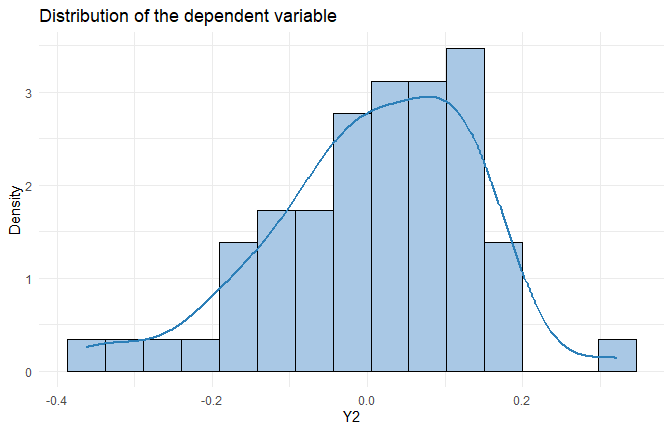

The histogram and density curve describe the marginal distribution of
`Y2`. In the original script, the histogram used counts while the
density curve used density values. The corrected version places both on
the density scale so that they can be interpreted together.

## Predictor distributions

The predictors are divided into two groups so that their histograms
remain readable.

``` r
first_data_split <- df[, 2:27]
second_data_split <- df[, 28:53]

histograms_df1 <- first_data_split |>
  pivot_longer(cols = everything())

histograms_df1$name <- factor(
  histograms_df1$name,
  levels = names(first_data_split)
)

histograms_df2 <- second_data_split |>
  pivot_longer(cols = everything())

histograms_df2$name <- factor(
  histograms_df2$name,
  levels = names(second_data_split)
)
```

``` r
ggplot(histograms_df1, aes(x = value)) +
  geom_histogram(color = "black", fill = "#0586F5") +
  facet_wrap(~ name, scales = "free", ncol = 4) +
  theme_minimal() +
  labs(title = "Distributions of X1-X26", x = NULL, y = "Count")
```

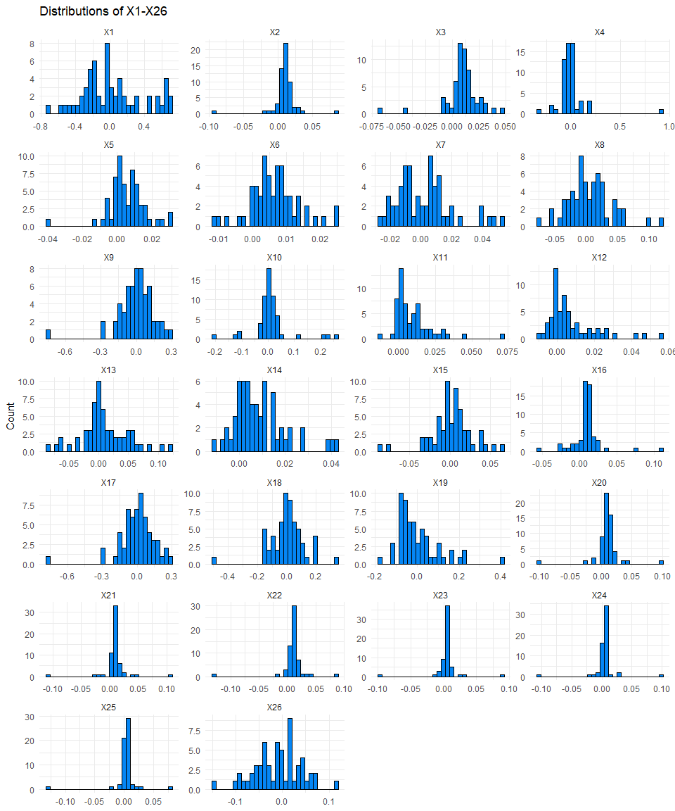

``` r
ggplot(histograms_df2, aes(x = value)) +
  geom_histogram(color = "black", fill = "#0586F5") +
  facet_wrap(~ name, scales = "free", ncol = 4) +
  theme_minimal() +
  labs(title = "Distributions of X27-X52", x = NULL, y = "Count")
```

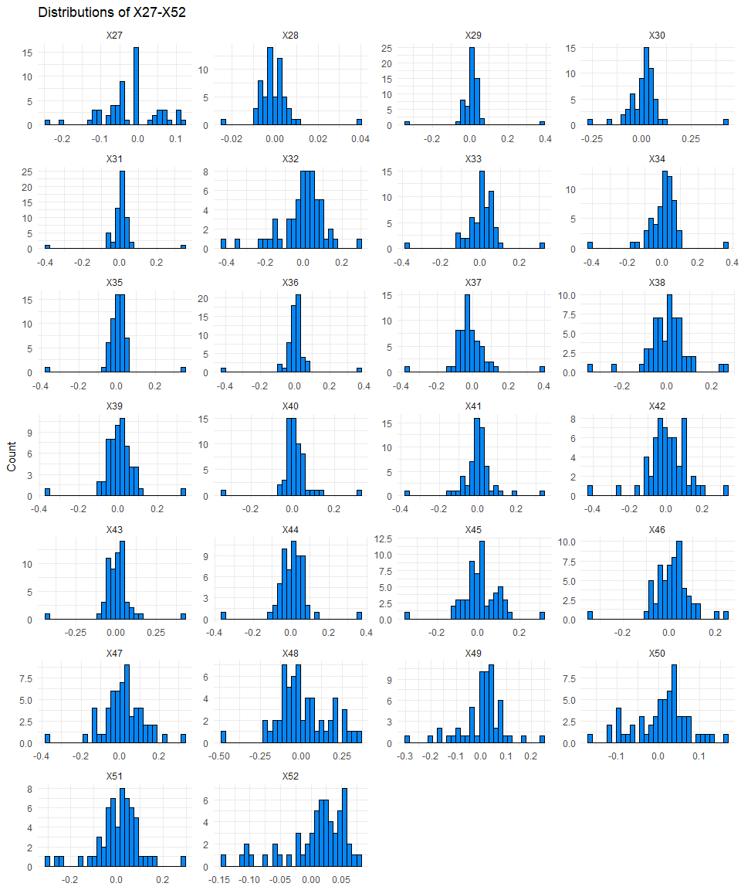

## Correlation plots

The correlation matrix is divided into the same three hardcoded groups
used in the original assignment.

The Pearson correlation between two variables $X$ and $Y$ is

$$r_{XY} = \frac{\operatorname{cov}(X,Y)}{s_Xs_Y}.$$

Values close to $1$ or $-1$ indicate a strong linear relationship. Large
correlations among predictors can make individual regression
coefficients unstable, even when the overall model fits the data well.

``` r
corrplot_group1 <- df[, 1:17]
corrplot_group2 <- df[, c(1, 18:35)]
corrplot_group3 <- df[, c(1, 36:53)]

M1 <- cor(corrplot_group1)
M2 <- cor(corrplot_group2)
M3 <- cor(corrplot_group3)

corrplot(
  M1,
  method = "square",
  order = "AOE",
  addCoef.col = "black",
  tl.pos = "d",
  cl.pos = "n",
  col = colorRampPalette(c("#A77062", "white", "#2AB6EF"))(20)
)
```

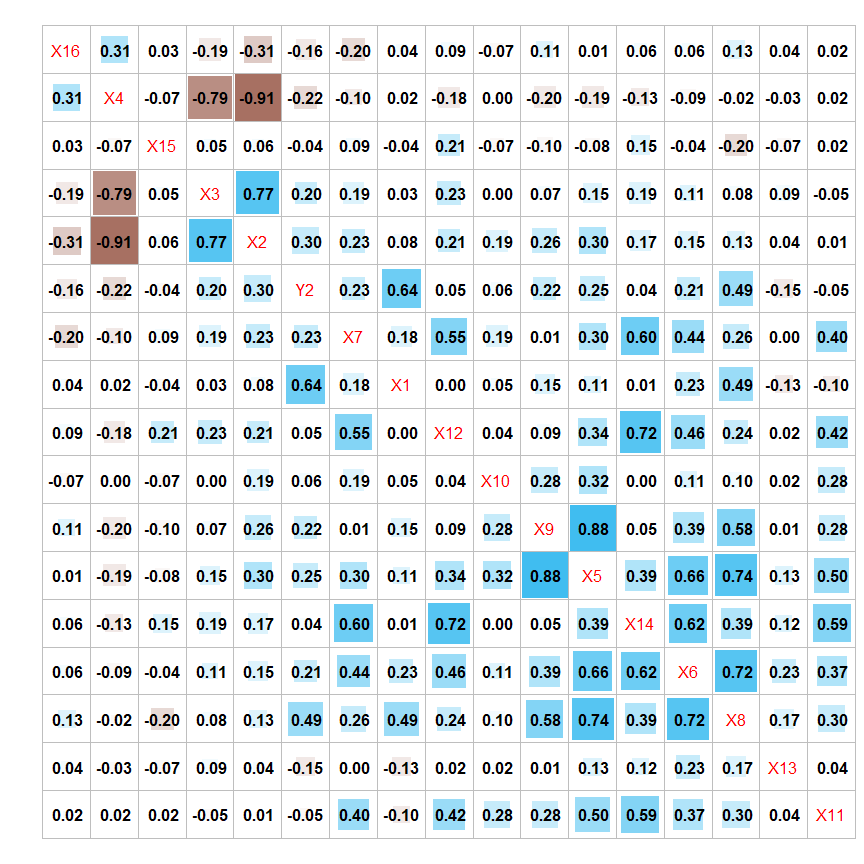

``` r
corrplot(
  M2,
  method = "square",
  order = "AOE",
  addCoef.col = "black",
  tl.pos = "d",
  cl.pos = "n",
  col = colorRampPalette(c("#A77062", "white", "#2AB6EF"))(20)
)
```

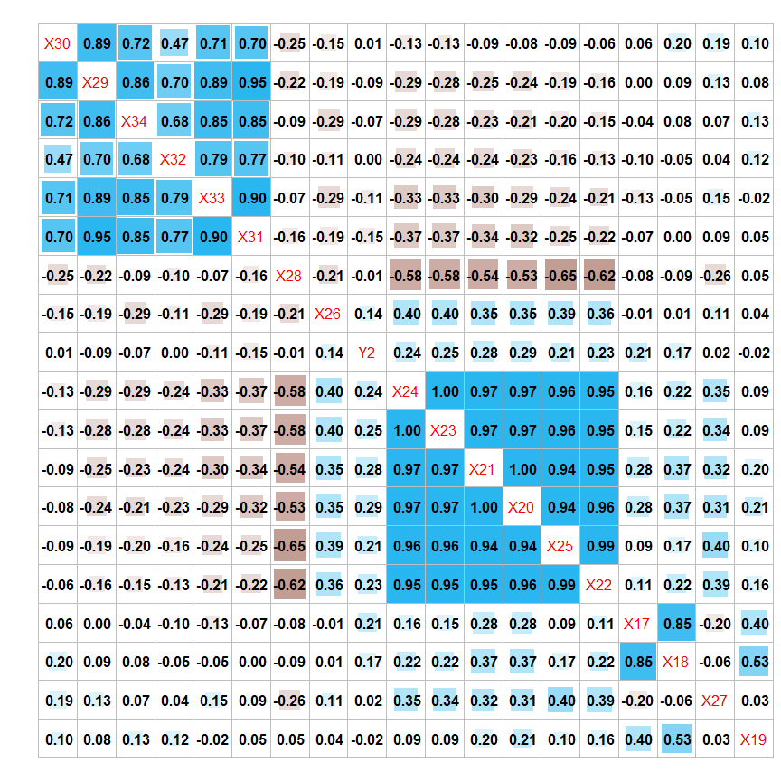

``` r
corrplot(
  M3,
  method = "square",
  order = "AOE",
  addCoef.col = "black",
  tl.pos = "d",
  cl.pos = "n",
  col = colorRampPalette(c("#A77062", "white", "#2AB6EF"))(20)
)
```

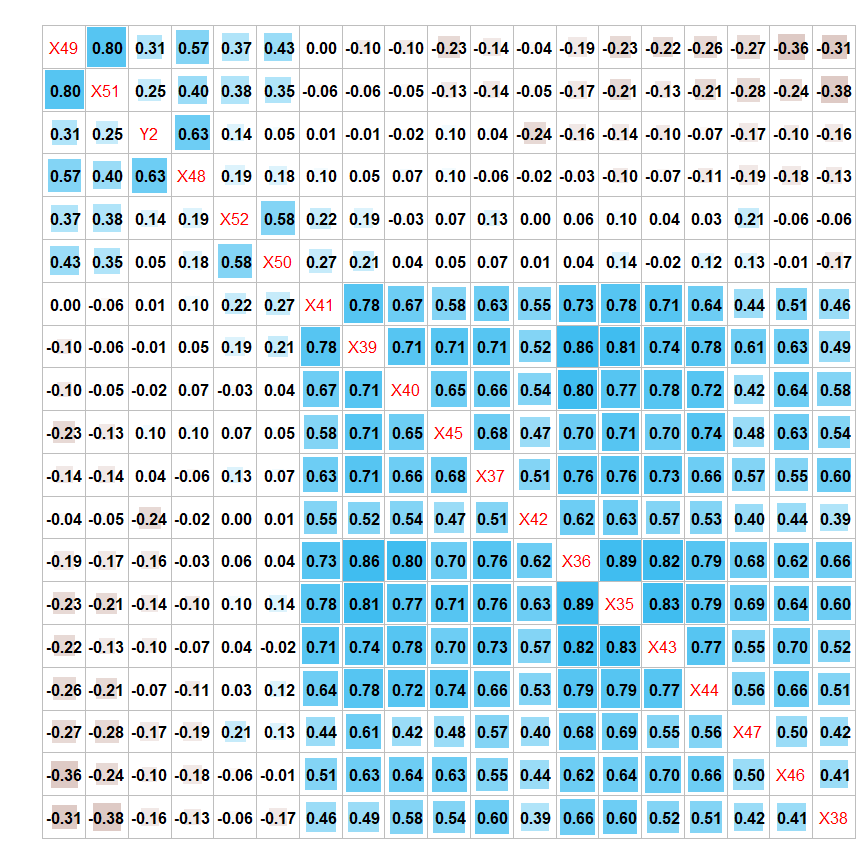

## Pair plots

The pair plots are retained from the original work. They are divided
into smaller groups because a single plot with all predictors would be
unreadable.

These plots provide a visual check for linear relationships, unusual
observations and strongly related predictor pairs. They are exploratory
and do not replace the formal regression diagnostics below.

``` r
num_columns <- ncol(df)

for (i in seq(1, num_columns, by = 10)) {
  subset_data <- df[, i:min(i + 9, num_columns)]

  pairs(
    subset_data,
    main = paste(
      "Pairs Plot - Columns",
      i,
      "to",
      min(i + 9, num_columns)
    ),
    col = "#0998CE"
  )
}
```

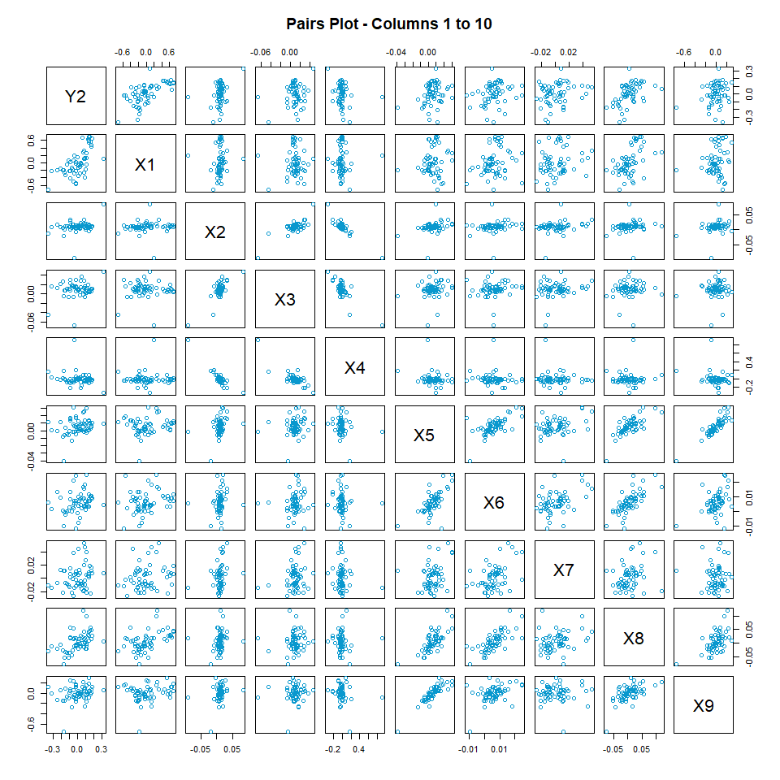

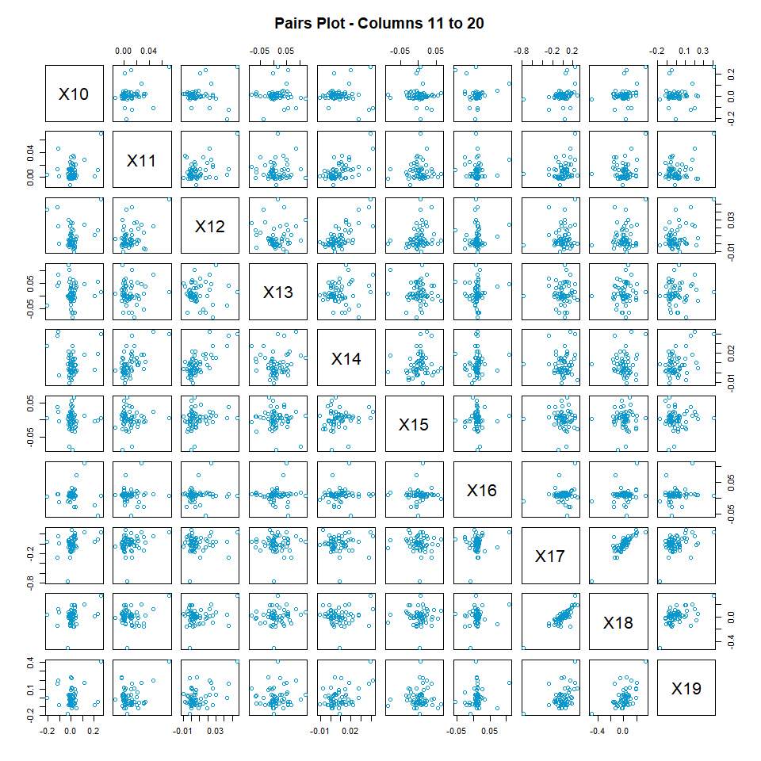

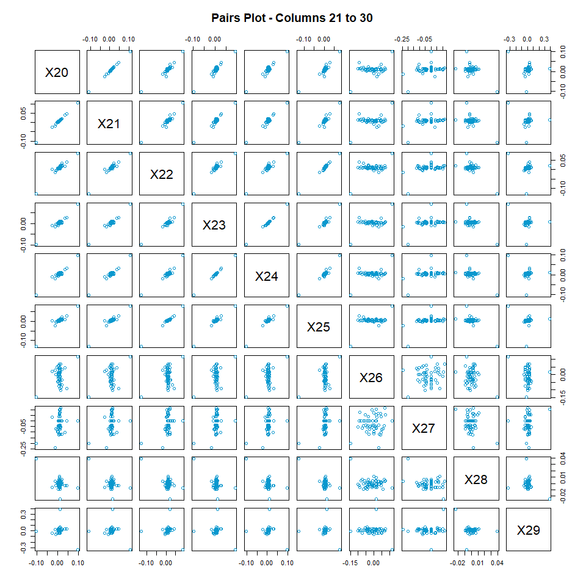

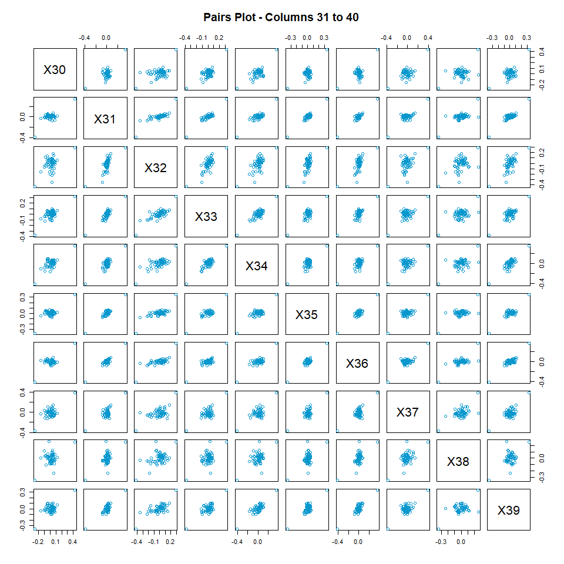

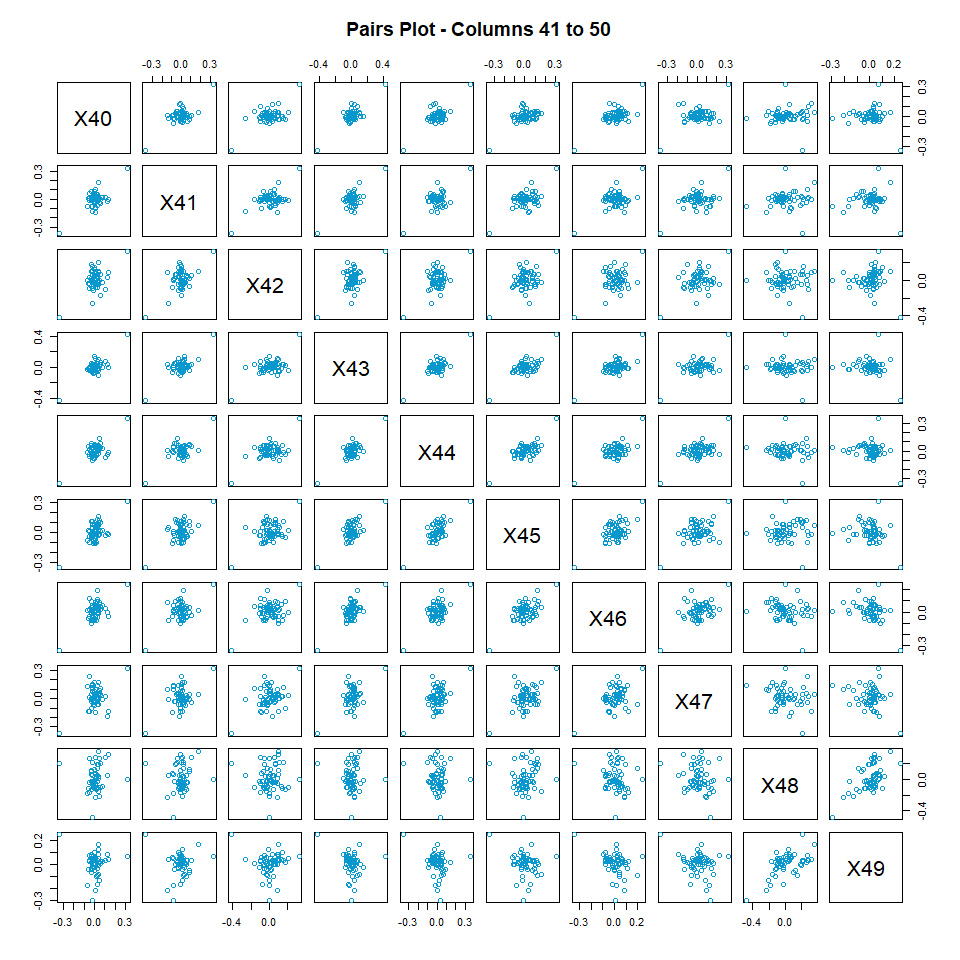

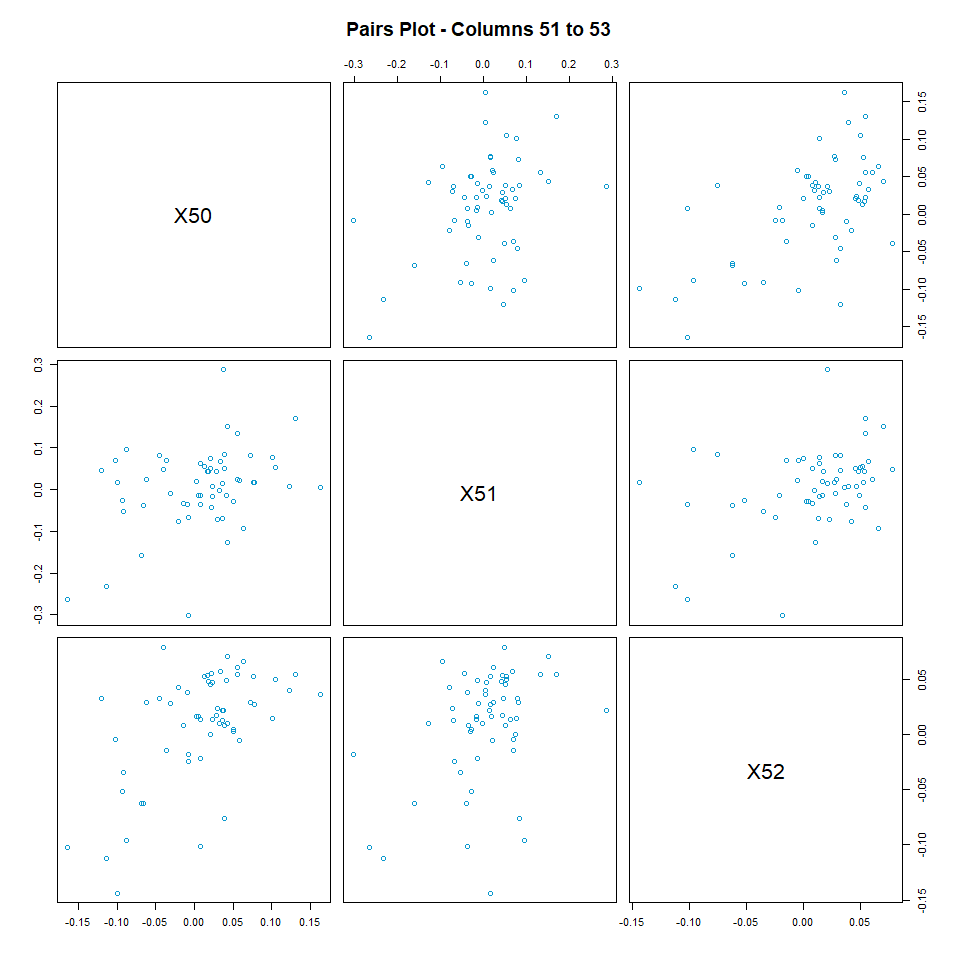

## Full multiple regression model

``` r
first_full_model <- lm(Y2 ~ ., data = df)

summary(first_full_model)
```


    Call:
    lm(formula = Y2 ~ ., data = df)

    Residuals:
          Min        1Q    Median        3Q       Max 
    -0.034680 -0.012814 -0.003322  0.012930  0.041602 

    Coefficients:
                  Estimate Std. Error t value Pr(>|t|)  
    (Intercept) -1.279e-01  1.292e-01  -0.990   0.3603  
    X1          -6.890e-02  1.106e-01  -0.623   0.5562  
    X2          -9.566e-01  6.405e+00  -0.149   0.8862  
    X3           9.376e+00  3.958e+00   2.369   0.0556 .
    X4           3.197e-01  5.584e-01   0.573   0.5878  
    X5          -5.706e+00  8.442e+00  -0.676   0.5243  
    X6           6.767e+00  7.677e+00   0.881   0.4120  
    X7          -6.877e+00  2.944e+00  -2.336   0.0582 .
    X8          -1.575e+00  1.550e+00  -1.016   0.3489  
    X9           2.314e+00  2.877e+00   0.804   0.4518  
    X10          4.293e-01  5.001e-01   0.858   0.4237  
    X11         -5.073e+00  2.905e+00  -1.746   0.1314  
    X12          2.750e+00  2.857e+00   0.963   0.3730  
    X13         -3.515e-01  6.840e-01  -0.514   0.6257  
    X14          4.622e+00  5.591e+00   0.827   0.4400  
    X15          4.994e-01  6.155e-01   0.811   0.4481  
    X16          3.191e-01  1.797e+00   0.178   0.8649  
    X17         -2.406e+00  2.582e+00  -0.932   0.3872  
    X18         -9.476e-01  9.435e-01  -1.004   0.3540  
    X19          7.164e-02  3.877e-01   0.185   0.8595  
    X20         -5.595e+02  2.929e+02  -1.911   0.1046  
    X21          5.962e+02  2.945e+02   2.025   0.0893 .
    X22         -4.290e+00  1.902e+01  -0.226   0.8290  
    X23          4.949e+02  2.792e+02   1.773   0.1266  
    X24         -5.353e+02  2.844e+02  -1.882   0.1088  
    X25          7.000e+00  1.953e+01   0.358   0.7323  
    X26          8.578e-01  5.476e-01   1.566   0.1683  
    X27         -4.766e-01  6.981e-01  -0.683   0.5203  
    X28          1.168e+01  6.228e+00   1.875   0.1100  
    X29          6.542e+00  6.066e+00   1.078   0.3223  
    X30         -1.514e+00  2.389e+00  -0.634   0.5496  
    X31         -2.597e+01  1.131e+01  -2.297   0.0614 .
    X32          8.055e-01  3.996e-01   2.016   0.0905 .
    X33          3.238e+00  1.897e+00   1.707   0.1387  
    X34          2.516e+00  1.395e+00   1.804   0.1212  
    X35         -5.627e-01  9.079e-01  -0.620   0.5582  
    X36          2.722e+00  1.415e+00   1.924   0.1026  
    X37          1.935e+00  7.329e-01   2.640   0.0385 *
    X38         -1.023e+00  4.544e-01  -2.252   0.0653 .
    X39          1.943e+00  1.569e+00   1.238   0.2619  
    X40          9.067e-01  1.182e+00   0.767   0.4722  
    X41          8.815e-01  5.296e-01   1.664   0.1471  
    X42          2.601e+00  1.436e+00   1.812   0.1200  
    X43          2.278e+00  1.243e+00   1.833   0.1165  
    X44          1.734e+00  5.453e-01   3.180   0.0191 *
    X45         -2.933e-02  3.560e-01  -0.082   0.9370  
    X46          2.447e-02  5.225e-01   0.047   0.9642  
    X47          1.502e+00  7.644e-01   1.965   0.0971 .
    X48          1.107e+00  4.490e-01   2.465   0.0488 *
    X49          3.630e-04  7.342e-01   0.000   0.9996  
    X50         -1.316e+00  6.123e-01  -2.150   0.0751 .
    X51         -1.771e+00  5.362e-01  -3.303   0.0163 *
    X52         -3.813e-01  1.009e+00  -0.378   0.7185  
    ---
    Signif. codes:  0 '***' 0.001 '**' 0.01 '*' 0.05 '.' 0.1 ' ' 1

    Residual standard error: 0.05987 on 6 degrees of freedom
    Multiple R-squared:  0.9786,    Adjusted R-squared:  0.7932 
    F-statistic: 5.278 on 52 and 6 DF,  p-value: 0.02153

``` r
round(vif(first_full_model), 2)
```

           X1        X2        X3        X4        X5        X6        X7        X8 
        23.93    233.72     67.65    110.49    132.38     47.49     45.16     46.07 
           X9       X10       X11       X12       X13       X14       X15       X16 
      3191.07     18.95     25.54     22.83     11.73     60.95      4.03     23.07 
          X17       X18       X19       X20       X21       X22       X23       X24 
      2611.58    198.70     25.45 606275.99 708203.39   2944.80 429640.16 533660.63 
          X25       X26       X27       X28       X29       X30       X31       X32 
      2740.12     11.64     39.95     36.20   3059.39    631.54  11408.14     35.19 
          X33       X34       X35       X36       X37       X38       X39       X40 
       387.37    267.71     70.24    201.12     69.61     26.70    256.54    120.63 
          X41       X42       X43       X44       X45       X46       X47       X48 
        32.28    402.90    212.38     32.36     16.78     28.02    107.36     79.50 
          X49       X50       X51       X52 
        62.61     26.10     42.76     40.84 

The full model uses 52 predictors with only 59 observations. It can be
estimated, but it has very few residual degrees of freedom and is likely
to overfit the sample.

The full model produces $R^2 = 0.979$, but its adjusted $R^2$ is lower
at approximately $0.793$. More importantly, only six residual degrees of
freedom remain. The very high $R^2$ therefore does not by itself
indicate a reliable predictive model.

## Initial multicollinearity screening

The following variables were removed in the original assignment after
inspection of the correlation and VIF results.

For predictor $X_j$, the variance inflation factor is

$$\operatorname{VIF}_j = \frac{1}{1-R_j^2},$$

where $R_j^2$ is obtained by regressing $X_j$ on the remaining
predictors. A large VIF indicates that the predictor is strongly
explained by the other predictors and that its estimated coefficient may
have inflated variance.

``` r
removecol <- c(
  "X5", "X8", "X9", "X20", "X21", "X22", "X23",
  "X24", "X25", "X29", "X34", "X36", "X44"
)

transformed_df <- df[, !(names(df) %in% removecol)]

transformed_model <- lm(Y2 ~ ., data = transformed_df)

summary(transformed_model)
```


    Call:
    lm(formula = Y2 ~ ., data = transformed_df)

    Residuals:
         Min       1Q   Median       3Q      Max 
    -0.11285 -0.03628  0.00457  0.02947  0.13230 

    Coefficients:
                Estimate Std. Error t value Pr(>|t|)  
    (Intercept)  0.02383    0.04262   0.559   0.5826  
    X1           0.16572    0.10370   1.598   0.1265  
    X2           4.60734    3.49928   1.317   0.2036  
    X3           2.09826    2.07666   1.010   0.3250  
    X4           0.36943    0.50854   0.726   0.4764  
    X6          -4.42613    3.78476  -1.169   0.2567  
    X7          -0.63001    1.37420  -0.458   0.6518  
    X10         -0.44952    0.46401  -0.969   0.3448  
    X11         -0.36679    1.96686  -0.186   0.8540  
    X12         -0.54329    2.61087  -0.208   0.8374  
    X13         -0.56557    0.49060  -1.153   0.2633  
    X14         -0.63619    4.40854  -0.144   0.8868  
    X15          1.25494    0.72989   1.719   0.1018  
    X16         -1.13246    0.99484  -1.138   0.2691  
    X17         -0.14674    0.30285  -0.485   0.6335  
    X18          0.39094    0.40464   0.966   0.3461  
    X19          0.16828    0.34770   0.484   0.6339  
    X26          0.82369    0.50501   1.631   0.1193  
    X27         -0.20616    0.47263  -0.436   0.6676  
    X28          3.69793    4.06623   0.909   0.3745  
    X30          0.56717    0.51768   1.096   0.2869  
    X31          1.30107    3.35680   0.388   0.7026  
    X32          0.01508    0.41289   0.037   0.9712  
    X33          1.03961    1.08777   0.956   0.3512  
    X35         -0.56055    1.03823  -0.540   0.5955  
    X37          0.88457    0.39693   2.229   0.0381 *
    X38         -0.52361    0.47034  -1.113   0.2795  
    X39         -0.76498    0.72837  -1.050   0.3068  
    X40          0.18387    0.55039   0.334   0.7420  
    X41         -0.31108    0.53955  -0.577   0.5710  
    X42         -0.70753    0.48879  -1.448   0.1641  
    X43         -0.60362    0.63543  -0.950   0.3541  
    X45         -0.27180    0.41831  -0.650   0.5236  
    X46         -0.16769    0.39537  -0.424   0.6762  
    X47         -0.15164    0.41734  -0.363   0.7203  
    X48          0.61398    0.33667   1.824   0.0840 .
    X49         -0.44981    0.56323  -0.799   0.4344  
    X50         -0.29444    0.34154  -0.862   0.3994  
    X51         -0.56529    0.33391  -1.693   0.1068  
    X52         -0.34847    0.73762  -0.472   0.6420  
    ---
    Signif. codes:  0 '***' 0.001 '**' 0.01 '*' 0.05 '.' 0.1 ' ' 1

    Residual standard error: 0.09373 on 19 degrees of freedom
    Multiple R-squared:  0.834, Adjusted R-squared:  0.4931 
    F-statistic: 2.447 on 39 and 19 DF,  p-value: 0.01969

``` r
anova(transformed_model)
```

    Analysis of Variance Table

    Response: Y2
              Df  Sum Sq Mean Sq F value    Pr(>F)    
    X1         1 0.40972 0.40972 46.6366 1.615e-06 ***
    X2         1 0.06296 0.06296  7.1669   0.01491 *  
    X3         1 0.00033 0.00033  0.0372   0.84910    
    X4         1 0.00001 0.00001  0.0008   0.97776    
    X6         1 0.00100 0.00100  0.1142   0.73915    
    X7         1 0.00258 0.00258  0.2932   0.59447    
    X10        1 0.00089 0.00089  0.1009   0.75416    
    X11        1 0.00033 0.00033  0.0375   0.84857    
    X12        1 0.00128 0.00128  0.1459   0.70668    
    X13        1 0.00708 0.00708  0.8055   0.38070    
    X14        1 0.00336 0.00336  0.3823   0.54372    
    X15        1 0.00092 0.00092  0.1051   0.74939    
    X16        1 0.00858 0.00858  0.9761   0.33558    
    X17        1 0.00703 0.00703  0.8000   0.38227    
    X18        1 0.00353 0.00353  0.4016   0.53380    
    X19        1 0.00744 0.00744  0.8470   0.36895    
    X26        1 0.03171 0.03171  3.6094   0.07274 .  
    X27        1 0.00379 0.00379  0.4311   0.51931    
    X28        1 0.02621 0.02621  2.9837   0.10033    
    X30        1 0.01085 0.01085  1.2355   0.28020    
    X31        1 0.06462 0.06462  7.3555   0.01382 *  
    X32        1 0.00205 0.00205  0.2334   0.63451    
    X33        1 0.00052 0.00052  0.0593   0.81028    
    X35        1 0.00585 0.00585  0.6664   0.42444    
    X37        1 0.05141 0.05141  5.8517   0.02576 *  
    X38        1 0.00058 0.00058  0.0659   0.80009    
    X39        1 0.00081 0.00081  0.0919   0.76509    
    X40        1 0.01740 0.01740  1.9808   0.17546    
    X41        1 0.00062 0.00062  0.0706   0.79328    
    X42        1 0.00941 0.00941  1.0710   0.31372    
    X43        1 0.00679 0.00679  0.7733   0.39019    
    X45        1 0.00791 0.00791  0.9001   0.35467    
    X46        1 0.01100 0.01100  1.2521   0.27710    
    X47        1 0.00164 0.00164  0.1862   0.67099    
    X48        1 0.01294 0.01294  1.4733   0.23970    
    X49        1 0.01400 0.01400  1.5939   0.22205    
    X50        1 0.01065 0.01065  1.2124   0.28461    
    X51        1 0.02858 0.02858  3.2531   0.08717 .  
    X52        1 0.00196 0.00196  0.2232   0.64201    
    Residuals 19 0.16692 0.00879                      
    ---
    Signif. codes:  0 '***' 0.001 '**' 0.01 '*' 0.05 '.' 0.1 ' ' 1

``` r
round(vif(transformed_model), 2)
```

        X1     X2     X3     X4     X6     X7    X10    X11    X12    X13    X14 
      8.58  28.46   7.60  37.40   4.71   4.01   6.66   4.78   7.78   2.46  15.46 
       X15    X16    X17    X18    X19    X26    X27    X28    X30    X31    X32 
      2.31   2.88  14.66  14.91   8.35   4.04   7.47   6.30  12.10 410.12  15.33 
       X33    X35    X37    X38    X39    X40    X41    X42    X43    X45    X46 
     51.97  37.48   8.33  11.67  22.55  10.67  13.67  19.06  22.65   9.45   6.55 
       X47    X48    X49    X50    X51    X52 
     13.06  18.24  15.03   3.31   6.77   8.90 

The screening step is part of the original academic workflow. It reduces
the number of predictors but does not guarantee that all
multicollinearity has been removed.

After removing the 13 specified variables, 39 predictors remain. The
transformed model has 19 residual degrees of freedom, $R^2 = 0.834$ and
adjusted $R^2 = 0.493$. The reduction in fit is expected because the
model is now considerably less saturated.

## AIC and BIC before stepwise selection

``` r
aic_first_model <- AIC(first_full_model)
bic_first_model <- BIC(first_full_model)
aic_transformed_model <- AIC(transformed_model)
bic_transformed_model <- BIC(transformed_model)

data.frame(
  model = c("Full model", "Transformed model"),
  AIC = c(aic_first_model, aic_transformed_model),
  BIC = c(bic_first_model, bic_transformed_model)
)
```

                  model        AIC       BIC
    1        Full model -191.66158 -79.47456
    2 Transformed model  -96.76302 -11.58399

## Stepwise model selection

The original assignment compares AIC and BIC selection using both the
full and transformed candidate sets.

For a model with maximized likelihood $L$ and $k$ estimated parameters,

$$\operatorname{AIC} = -2\log(L) + 2k,$$

and

$$\operatorname{BIC} = -2\log(L) + k\log(n).$$

Both criteria balance model fit against complexity. For this dataset,
$\log(59) > 2$, so BIC penalizes additional predictors more strongly
than AIC.

``` r
first_AIC <- step(
  first_full_model,
  direction = "both",
  trace = 0
)

first_BIC <- step(
  first_full_model,
  k = log(nrow(df)),
  direction = "both",
  trace = 0
)

transformed_AIC <- step(
  transformed_model,
  direction = "both",
  trace = 0
)

transformed_BIC <- step(
  transformed_model,
  k = log(nrow(transformed_df)),
  direction = "both",
  trace = 0
)
```

``` r
summary(first_AIC)
```


    Call:
    lm(formula = Y2 ~ X1 + X3 + X4 + X5 + X6 + X7 + X8 + X9 + X10 + 
        X11 + X12 + X13 + X14 + X15 + X17 + X18 + X20 + X21 + X22 + 
        X23 + X24 + X25 + X26 + X27 + X28 + X29 + X30 + X31 + X32 + 
        X33 + X34 + X35 + X36 + X37 + X38 + X39 + X40 + X41 + X42 + 
        X43 + X44 + X47 + X48 + X50 + X51 + X52, data = df)

    Residuals:
          Min        1Q    Median        3Q       Max 
    -0.033743 -0.013142 -0.003427  0.014204  0.042499 

    Coefficients:
                  Estimate Std. Error t value Pr(>|t|)    
    (Intercept)   -0.11768    0.05124  -2.297 0.040452 *  
    X1            -0.07194    0.06834  -1.053 0.313178    
    X3             9.00402    1.90829   4.718 0.000498 ***
    X4             0.26414    0.26127   1.011 0.331968    
    X5            -6.69897    4.97835  -1.346 0.203300    
    X6             7.06120    3.52761   2.002 0.068451 .  
    X7            -6.77717    1.39373  -4.863 0.000390 ***
    X8            -1.52204    0.88586  -1.718 0.111439    
    X9             1.94897    1.76560   1.104 0.291298    
    X10            0.43256    0.25083   1.725 0.110249    
    X11           -4.92585    1.61844  -3.044 0.010206 *  
    X12            2.60550    1.74446   1.494 0.161106    
    X13           -0.35139    0.34314  -1.024 0.326009    
    X14            5.44588    3.03880   1.792 0.098344 .  
    X15            0.45876    0.38988   1.177 0.262140    
    X17           -2.05193    1.54422  -1.329 0.208634    
    X18           -0.84577    0.38170  -2.216 0.046790 *  
    X20         -538.55615  136.16376  -3.955 0.001910 ** 
    X21          575.11797  138.03261   4.167 0.001307 ** 
    X22           -6.83748   10.58573  -0.646 0.530492    
    X23          482.77167  132.79279   3.636 0.003416 ** 
    X24         -522.43928  134.74023  -3.877 0.002198 ** 
    X25            8.22749   10.83825   0.759 0.462435    
    X26            0.93265    0.30552   3.053 0.010035 *  
    X27           -0.37282    0.26192  -1.423 0.180087    
    X28           10.49294    3.82466   2.743 0.017816 *  
    X29            6.54544    3.29400   1.987 0.070227 .  
    X30           -1.59578    1.24351  -1.283 0.223620    
    X31          -25.20571    5.79149  -4.352 0.000941 ***
    X32            0.76815    0.25761   2.982 0.011446 *  
    X33            3.15429    0.61867   5.099 0.000262 ***
    X34            2.37590    0.69456   3.421 0.005072 ** 
    X35           -0.54381    0.50594  -1.075 0.303575    
    X36            2.71141    0.77636   3.492 0.004443 ** 
    X37            1.81196    0.32956   5.498 0.000137 ***
    X38           -0.96580    0.26553  -3.637 0.003405 ** 
    X39            1.86739    0.54550   3.423 0.005048 ** 
    X40            0.83130    0.39857   2.086 0.059023 .  
    X41            0.89608    0.28561   3.137 0.008572 ** 
    X42            2.50742    0.77603   3.231 0.007204 ** 
    X43            2.18427    0.68531   3.187 0.007815 ** 
    X44            1.67779    0.34211   4.904 0.000363 ***
    X47            1.40326    0.43874   3.198 0.007655 ** 
    X48            1.13242    0.24115   4.696 0.000518 ***
    X50           -1.17599    0.25774  -4.563 0.000652 ***
    X51           -1.79873    0.26379  -6.819 1.85e-05 ***
    X52           -0.37432    0.51054  -0.733 0.477520    
    ---
    Signif. codes:  0 '***' 0.001 '**' 0.01 '*' 0.05 '.' 0.1 ' ' 1

    Residual standard error: 0.04295 on 12 degrees of freedom
    Multiple R-squared:  0.978, Adjusted R-squared:  0.8936 
    F-statistic: 11.59 on 46 and 12 DF,  p-value: 2.827e-05

``` r
summary(first_BIC)
```


    Call:
    lm(formula = Y2 ~ X1 + X3 + X5 + X6 + X7 + X8 + X9 + X10 + X11 + 
        X12 + X13 + X14 + X15 + X17 + X18 + X20 + X21 + X23 + X24 + 
        X26 + X27 + X28 + X29 + X30 + X31 + X32 + X33 + X34 + X35 + 
        X36 + X37 + X38 + X39 + X40 + X41 + X42 + X43 + X44 + X47 + 
        X48 + X50 + X51 + X52, data = df)

    Residuals:
          Min        1Q    Median        3Q       Max 
    -0.037307 -0.015793 -0.004528  0.013191  0.046664 

    Coefficients:
                  Estimate Std. Error t value Pr(>|t|)    
    (Intercept)   -0.13366    0.03326  -4.019 0.001115 ** 
    X1            -0.07659    0.05979  -1.281 0.219626    
    X3             8.70374    1.72082   5.058 0.000142 ***
    X5            -5.51349    4.22705  -1.304 0.211779    
    X6             6.78903    3.24960   2.089 0.054144 .  
    X7            -6.68288    1.27304  -5.250 9.80e-05 ***
    X8            -1.30730    0.74584  -1.753 0.100044    
    X9             2.05689    1.49610   1.375 0.189374    
    X10            0.50431    0.19619   2.571 0.021312 *  
    X11           -4.66778    1.46556  -3.185 0.006150 ** 
    X12            2.67019    1.51157   1.767 0.097648 .  
    X13           -0.42891    0.28567  -1.501 0.154009    
    X14            4.32061    2.43415   1.775 0.096189 .  
    X15            0.61806    0.33005   1.873 0.080747 .  
    X17           -2.22968    1.32755  -1.680 0.113748    
    X18           -0.86789    0.32356  -2.682 0.017052 *  
    X20         -529.97301  124.34131  -4.262 0.000682 ***
    X21          563.10010  126.16198   4.463 0.000455 ***
    X23          472.01463  123.06276   3.836 0.001621 ** 
    X24         -508.67356  124.42592  -4.088 0.000969 ***
    X26            0.85197    0.27836   3.061 0.007929 ** 
    X27           -0.35200    0.20827  -1.690 0.111672    
    X28            9.97810    3.19165   3.126 0.006934 ** 
    X29            8.11219    2.62703   3.088 0.007499 ** 
    X30           -2.23862    0.97877  -2.287 0.037133 *  
    X31          -25.86582    5.09520  -5.077 0.000137 ***
    X32            0.81313    0.22943   3.544 0.002944 ** 
    X33            3.18095    0.57537   5.529 5.79e-05 ***
    X34            2.38002    0.62544   3.805 0.001724 ** 
    X35           -0.65335    0.43233  -1.511 0.151507    
    X36            2.59319    0.67108   3.864 0.001529 ** 
    X37            1.79167    0.27113   6.608 8.32e-06 ***
    X38           -0.87940    0.21277  -4.133 0.000885 ***
    X39            1.66025    0.48129   3.450 0.003575 ** 
    X40            0.86057    0.36823   2.337 0.033714 *  
    X41            0.97122    0.24635   3.943 0.001303 ** 
    X42            2.46327    0.70557   3.491 0.003282 ** 
    X43            2.18498    0.62629   3.489 0.003299 ** 
    X44            1.62179    0.30740   5.276 9.32e-05 ***
    X47            1.37340    0.37761   3.637 0.002434 ** 
    X48            1.12263    0.21540   5.212 0.000105 ***
    X50           -1.13035    0.21647  -5.222 0.000103 ***
    X51           -1.75301    0.24156  -7.257 2.80e-06 ***
    X52           -0.65237    0.41871  -1.558 0.140069    
    ---
    Signif. codes:  0 '***' 0.001 '**' 0.01 '*' 0.05 '.' 0.1 ' ' 1

    Residual standard error: 0.04041 on 15 degrees of freedom
    Multiple R-squared:  0.9756,    Adjusted R-squared:  0.9058 
    F-statistic: 13.97 on 43 and 15 DF,  p-value: 9.997e-07

``` r
summary(transformed_AIC)
```


    Call:
    lm(formula = Y2 ~ X1 + X2 + X6 + X10 + X15 + X16 + X17 + X18 + 
        X26 + X33 + X37 + X39 + X42 + X43 + X47 + X48 + X49 + X51, 
        data = transformed_df)

    Residuals:
          Min        1Q    Median        3Q       Max 
    -0.132714 -0.034447 -0.001626  0.035944  0.147589 

    Coefficients:
                Estimate Std. Error t value Pr(>|t|)    
    (Intercept)  0.04521    0.01913   2.363 0.023054 *  
    X1           0.11393    0.05215   2.185 0.034834 *  
    X2           2.15906    0.86294   2.502 0.016540 *  
    X6          -4.59041    2.08364  -2.203 0.033412 *  
    X10         -0.30971    0.17111  -1.810 0.077822 .  
    X15          1.20167    0.47542   2.528 0.015538 *  
    X16         -1.19884    0.55872  -2.146 0.038021 *  
    X17         -0.21670    0.16823  -1.288 0.205106    
    X18          0.38174    0.22032   1.733 0.090868 .  
    X26          0.92684    0.25685   3.609 0.000847 ***
    X33          1.21818    0.30917   3.940 0.000318 ***
    X37          0.50448    0.18872   2.673 0.010822 *  
    X39         -0.76212    0.26837  -2.840 0.007065 ** 
    X42         -0.46572    0.12539  -3.714 0.000622 ***
    X43         -0.30000    0.19760  -1.518 0.136832    
    X47         -0.35489    0.15898  -2.232 0.031265 *  
    X48          0.74661    0.19244   3.880 0.000381 ***
    X49         -0.36582    0.27131  -1.348 0.185132    
    X51         -0.48528    0.21489  -2.258 0.029452 *  
    ---
    Signif. codes:  0 '***' 0.001 '**' 0.01 '*' 0.05 '.' 0.1 ' ' 1

    Residual standard error: 0.07221 on 40 degrees of freedom
    Multiple R-squared:  0.7925,    Adjusted R-squared:  0.6992 
    F-statistic:  8.49 on 18 and 40 DF,  p-value: 1.169e-08

``` r
summary(transformed_BIC)
```


    Call:
    lm(formula = Y2 ~ X1 + X2 + X37 + X39 + X42 + X48, data = transformed_df)

    Residuals:
          Min        1Q    Median        3Q       Max 
    -0.221665 -0.042440  0.001416  0.050753  0.193563 

    Coefficients:
                 Estimate Std. Error t value Pr(>|t|)    
    (Intercept)  0.001241   0.012301   0.101  0.92004    
    X1           0.190599   0.043098   4.422    5e-05 ***
    X2           1.497971   0.606196   2.471  0.01678 *  
    X37          0.644596   0.180164   3.578  0.00076 ***
    X39         -0.414934   0.206622  -2.008  0.04983 *  
    X42         -0.383595   0.116721  -3.286  0.00182 ** 
    X48          0.239400   0.094289   2.539  0.01415 *  
    ---
    Signif. codes:  0 '***' 0.001 '**' 0.01 '*' 0.05 '.' 0.1 ' ' 1

    Residual standard error: 0.08099 on 52 degrees of freedom
    Multiple R-squared:  0.6607,    Adjusted R-squared:  0.6216 
    F-statistic: 16.88 on 6 and 52 DF,  p-value: 1.068e-10

### Model comparison

``` r
model_comparison <- data.frame(
  model = c(
    "Full candidate set - AIC",
    "Full candidate set - BIC",
    "Transformed candidate set - AIC",
    "Transformed candidate set - BIC"
  ),
  predictors = c(
    length(coef(first_AIC)) - 1,
    length(coef(first_BIC)) - 1,
    length(coef(transformed_AIC)) - 1,
    length(coef(transformed_BIC)) - 1
  ),
  adjusted_R_squared = c(
    summary(first_AIC)$adj.r.squared,
    summary(first_BIC)$adj.r.squared,
    summary(transformed_AIC)$adj.r.squared,
    summary(transformed_BIC)$adj.r.squared
  ),
  AIC = c(
    AIC(first_AIC),
    AIC(first_BIC),
    AIC(transformed_AIC),
    AIC(transformed_BIC)
  ),
  BIC = c(
    BIC(first_AIC),
    BIC(first_BIC),
    BIC(transformed_AIC),
    BIC(transformed_BIC)
  )
)

model_comparison
```

                                model predictors adjusted_R_squared       AIC
    1        Full candidate set - AIC         46          0.8935884 -201.9726
    2        Full candidate set - BIC         43          0.9057969 -201.9969
    3 Transformed candidate set - AIC         18          0.6991935 -125.6281
    4 Transformed candidate set - BIC          6          0.6215734 -120.6049
             BIC
    1 -102.25077
    2 -108.50770
    3  -84.07739
    4 -103.98461

AIC usually retains more predictors, while BIC applies a stronger
penalty for model complexity. Because the sample is small relative to
the number of candidate predictors, all selected models should be
interpreted cautiously.

The stepwise results illustrate this difference:

- selection from the transformed set retains 18 predictors with AIC;
- selection from the transformed set retains only 6 predictors with BIC;
- the transformed AIC model has adjusted $R^2 = 0.699$;
- the transformed BIC model has adjusted $R^2 = 0.622$.

The searches beginning from the full model still retain 46 predictors
under AIC and 43 under BIC. Although these models have strong in-sample
fit, they remain very large for 59 observations. The original assignment
therefore continued with the screened candidate set.

## Final AIC model

The original project selected the AIC model produced from the
transformed dataset. Its formula is kept explicitly rather than
generated programmatically.

``` r
final_aic_model <- lm(
  Y2 ~ X1 + X2 + X6 + X10 + X15 + X16 + X17 + X18 +
    X26 + X33 + X37 + X39 + X42 + X43 + X47 + X48 + X49 + X51,
  data = transformed_df
)

summary(final_aic_model)
```


    Call:
    lm(formula = Y2 ~ X1 + X2 + X6 + X10 + X15 + X16 + X17 + X18 + 
        X26 + X33 + X37 + X39 + X42 + X43 + X47 + X48 + X49 + X51, 
        data = transformed_df)

    Residuals:
          Min        1Q    Median        3Q       Max 
    -0.132714 -0.034447 -0.001626  0.035944  0.147589 

    Coefficients:
                Estimate Std. Error t value Pr(>|t|)    
    (Intercept)  0.04521    0.01913   2.363 0.023054 *  
    X1           0.11393    0.05215   2.185 0.034834 *  
    X2           2.15906    0.86294   2.502 0.016540 *  
    X6          -4.59041    2.08364  -2.203 0.033412 *  
    X10         -0.30971    0.17111  -1.810 0.077822 .  
    X15          1.20167    0.47542   2.528 0.015538 *  
    X16         -1.19884    0.55872  -2.146 0.038021 *  
    X17         -0.21670    0.16823  -1.288 0.205106    
    X18          0.38174    0.22032   1.733 0.090868 .  
    X26          0.92684    0.25685   3.609 0.000847 ***
    X33          1.21818    0.30917   3.940 0.000318 ***
    X37          0.50448    0.18872   2.673 0.010822 *  
    X39         -0.76212    0.26837  -2.840 0.007065 ** 
    X42         -0.46572    0.12539  -3.714 0.000622 ***
    X43         -0.30000    0.19760  -1.518 0.136832    
    X47         -0.35489    0.15898  -2.232 0.031265 *  
    X48          0.74661    0.19244   3.880 0.000381 ***
    X49         -0.36582    0.27131  -1.348 0.185132    
    X51         -0.48528    0.21489  -2.258 0.029452 *  
    ---
    Signif. codes:  0 '***' 0.001 '**' 0.01 '*' 0.05 '.' 0.1 ' ' 1

    Residual standard error: 0.07221 on 40 degrees of freedom
    Multiple R-squared:  0.7925,    Adjusted R-squared:  0.6992 
    F-statistic:  8.49 on 18 and 40 DF,  p-value: 1.169e-08

``` r
anova(final_aic_model)
```

    Analysis of Variance Table

    Response: Y2
              Df  Sum Sq Mean Sq F value    Pr(>F)    
    X1         1 0.40972 0.40972 78.5866 5.532e-11 ***
    X2         1 0.06296 0.06296 12.0769 0.0012429 ** 
    X6         1 0.00101 0.00101  0.1941 0.6619375    
    X10        1 0.00041 0.00041  0.0786 0.7805855    
    X15        1 0.00107 0.00107  0.2058 0.6525004    
    X16        1 0.01345 0.01345  2.5795 0.1161238    
    X17        1 0.00780 0.00780  1.4957 0.2284900    
    X18        1 0.00466 0.00466  0.8929 0.3503715    
    X26        1 0.02729 0.02729  5.2335 0.0275202 *  
    X33        1 0.00320 0.00320  0.6133 0.4381424    
    X37        1 0.01718 0.01718  3.2956 0.0769695 .  
    X39        1 0.03715 0.03715  7.1257 0.0109268 *  
    X42        1 0.09308 0.09308 17.8528 0.0001341 ***
    X43        1 0.01260 0.01260  2.4177 0.1278514    
    X47        1 0.01768 0.01768  3.3903 0.0730040 .  
    X48        1 0.03226 0.03226  6.1882 0.0171286 *  
    X49        1 0.02861 0.02861  5.4879 0.0242103 *  
    X51        1 0.02659 0.02659  5.0999 0.0294516 *  
    Residuals 40 0.20855 0.00521                      
    ---
    Signif. codes:  0 '***' 0.001 '**' 0.01 '*' 0.05 '.' 0.1 ' ' 1

``` r
round(vif(final_aic_model), 2)
```

       X1    X2    X6   X10   X15   X16   X17   X18   X26   X33   X37   X39   X42 
     3.66  2.92  2.41  1.53  1.65  1.53  7.62  7.45  1.76  7.07  3.17  5.16  2.11 
      X43   X47   X48   X49   X51 
     3.69  3.19 10.04  5.88  4.72 

The hardcoded formula above exactly reproduces the model returned by
`transformed_AIC`. The final model explains approximately $79.3\%$ of
the observed variation in `Y2`, while its adjusted $R^2$ is
approximately $69.9\%$. The difference between the two values reflects
the penalty for including 18 predictors.

The coefficient signs describe partial associations after controlling
for the other selected variables. For example, positive coefficients
indicate that larger predictor values are associated with larger
expected `Y2`, while negative coefficients indicate the opposite.
Coefficient magnitudes should not be compared directly when predictors
use different measurement scales.

Several predictors, including `X26`, `X33`, `X42` and `X48`, have
particularly small p-values in this fitted model. However, these
p-values are exploratory because the same sample was first used for
variable selection and then for inference.

## Model diagnostics

The classical linear-model assumptions are:

1.  linearity between the response and predictors;
2.  independent errors;
3.  approximately constant error variance;
4.  approximately normal residuals for inference;
5.  absence of extreme influential observations;
6.  no perfect multicollinearity.

The four standard diagnostic plots examine residual patterns, normality,
scale-location behavior and influential observations.

``` r
par(mfrow = c(2, 2))
plot(final_aic_model)
```

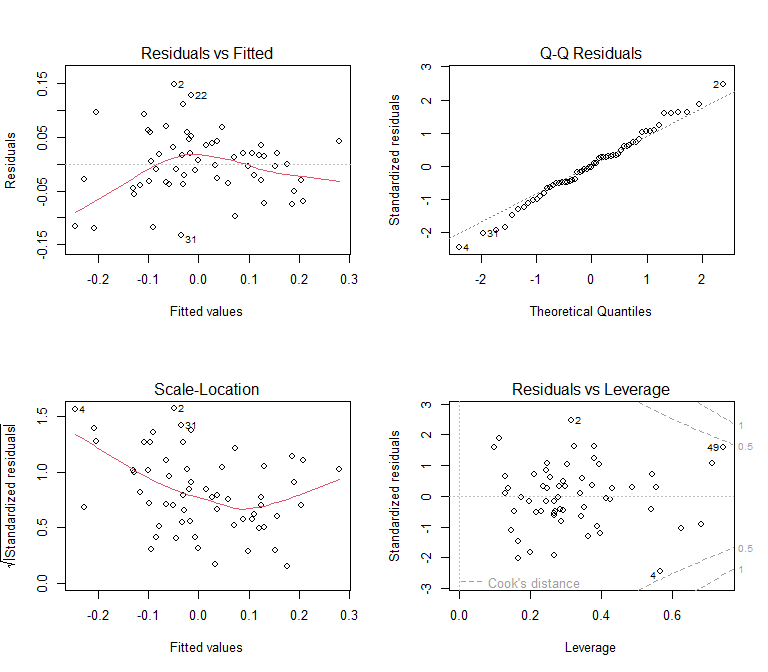

``` r
par(mfrow = c(1, 1))
```

``` r
shapiro.test(residuals(final_aic_model))
```


        Shapiro-Wilk normality test

    data:  residuals(final_aic_model)
    W = 0.98717, p-value = 0.7898

For the final model, the Shapiro-Wilk test gives approximately $W=0.987$
and $p=0.790$. Therefore, there is no statistical evidence against
residual normality at the 5% significance level. The test is still
considered together with the Q-Q plot; it does not assess linearity,
independence or constant variance.

### Cook’s distance

Cook’s distance measures how strongly the fitted model changes when an
observation is removed. The conventional exploratory cutoff used here is

$$D_i > \frac{4}{n} = \frac{4}{59} \approx 0.0678.$$

``` r
cook_values <- cooks.distance(final_aic_model)
cook_cutoff <- 4 / nrow(transformed_df)

plot(
  cook_values,
  col = "#0576F5",
  pch = 16,
  main = "Cook's distance",
  xlab = "Observation",
  ylab = "Cook's distance"
)

abline(h = cook_cutoff, col = "red", lty = 2)
```

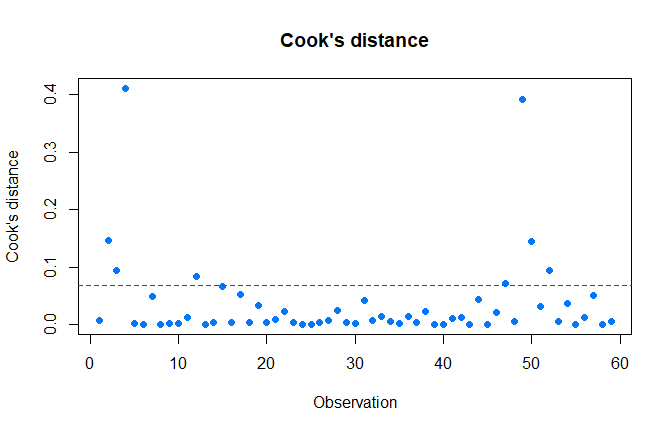

``` r
influential_points <- which(cook_values > cook_cutoff)
influential_points
```

     2  3  4 12 47 49 50 52 
     2  3  4 12 47 49 50 52 

Using the $4/n$ rule identifies observations 2, 3, 4, 12, 47, 49, 50 and
52 for closer inspection. This does not automatically mean that these
observations are erroneous or should be deleted. Their data quality and
effect on the substantive conclusions should be examined before changing
the model.

### Residual results

``` r
AIC_aug <- augment(final_aic_model)

results_final_model <- AIC_aug[, c(
  ".fitted",
  ".resid",
  ".hat",
  ".sigma",
  ".cooksd",
  ".std.resid"
)]

head(results_final_model, 10)
```

    # A tibble: 10 x 6
       .fitted   .resid  .hat .sigma   .cooksd .std.resid
         <dbl>    <dbl> <dbl>  <dbl>     <dbl>      <dbl>
     1  0.0279  0.0374  0.257 0.0728 0.00654       0.600 
     2 -0.0491  0.148   0.314 0.0673 0.147         2.47  
     3 -0.131  -0.0457  0.625 0.0721 0.0935       -1.03  
     4 -0.245  -0.117   0.566 0.0674 0.411        -2.45  
     5  0.131   0.0141  0.430 0.0731 0.00264       0.258 
     6  0.0331 -0.00189 0.278 0.0731 0.0000192    -0.0308
     7 -0.0646  0.0697  0.381 0.0717 0.0487        1.23  
     8 -0.0449 -0.0103  0.267 0.0731 0.000532     -0.167 
     9  0.107   0.0200  0.298 0.0730 0.00245       0.331 
    10 -0.0158  0.0197  0.235 0.0730 0.00156       0.311 

``` r
hist(
  results_final_model$.resid,
  breaks = 10,
  probability = TRUE,
  main = "Distribution of residuals",
  xlab = "Residuals",
  ylab = "Density",
  col = "#0576F5"
)

lines(
  density(results_final_model$.resid),
  col = "#06B1E5",
  lwd = 2
)
```

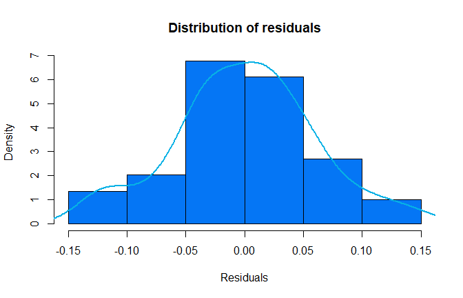

## Observed and fitted values

The original script generated random predictor values and then attempted
to use an `actual_response` column that did not exist. Without known
response values for new observations, a predicted-versus-actual
comparison cannot be made. The corrected graph therefore compares the
observed `Y2` values with the fitted values from the final model.

For a new predictor vector $\mathbf{x}_0$, the fitted mean response is

$$\widehat{Y}_0 = \mathbf{x}_0^T\widehat{\boldsymbol{\beta}}.$$

A prediction interval is wider than a confidence interval for the mean
because it also includes the uncertainty of an individual future
observation.

``` r
my_predictions <- predict(
  final_aic_model,
  newdata = transformed_df,
  interval = "prediction"
)

prediction_results <- data.frame(
  actual = transformed_df$Y2,
  predicted = my_predictions[, "fit"],
  lower = my_predictions[, "lwr"],
  upper = my_predictions[, "upr"]
)

head(prediction_results, 10)
```

             actual   predicted       lower       upper
    1   0.065211737  0.02785093 -0.13573271  0.19143456
    2   0.098482371 -0.04910660 -0.21639693  0.11818372
    3  -0.176476886 -0.13075215 -0.31675430  0.05524999
    4  -0.361822595 -0.24525090 -0.42785460 -0.06264720
    5   0.144698461  0.13062596 -0.04387913  0.30513105
    6   0.031245028  0.03313320 -0.13183414  0.19810054
    7   0.005076225 -0.06464344 -0.23611434  0.10682745
    8  -0.055222623 -0.04490689 -0.20913906  0.11932528
    9   0.127040435  0.10699780 -0.05926749  0.27326310
    10  0.003833290 -0.01583744 -0.17798584  0.14631097

``` r
plot(
  prediction_results$predicted,
  prediction_results$actual,
  main = "Observed vs. fitted values",
  xlab = "Fitted Y2",
  ylab = "Observed Y2",
  col = "#0576F5",
  pch = 16
)

abline(a = 0, b = 1, col = "red", lty = 2, lwd = 2)
```

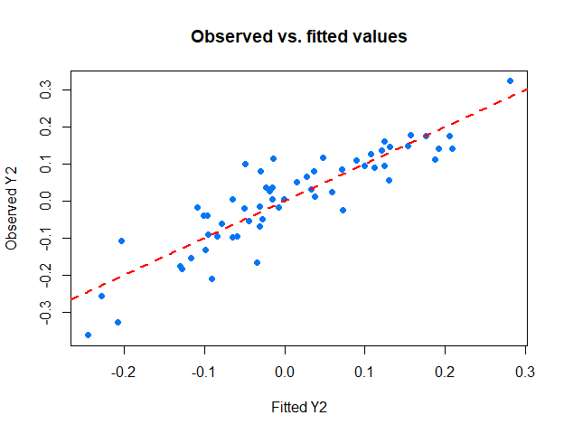

This is an in-sample assessment, not an evaluation on unseen test data.

Points close to the red 45-degree line have fitted values close to their
observed responses. Because these observations were also used to
estimate the model, the graph describes model fit and must not be
presented as test-set predictive performance.

## Conclusions and limitations

The project compares multiple linear regression models selected through
AIC and BIC. The final model follows the original assignment choice: the
AIC model fitted after the initial multicollinearity screening.

The main limitations are the small sample relative to the 52 initial
predictors, possible overfitting, remaining multicollinearity, and the
instability associated with stepwise selection. The reported diagnostics
and fitted values describe the available sample and should not be
interpreted as validated out-of-sample predictive performance.

## Corrections made to the original script

The project logic and hardcoded final model were retained. The following
technical problems were corrected:

- the data path is relative to the repository rather than fixed to drive
  `E:`;
- unnecessary duplicate package imports and interactive `View()` calls
  were removed;
- the response histogram and density curve now use the same vertical
  scale;
- the predictor order is preserved in the faceted histograms;
- the BIC penalty uses `nrow(df)` directly;
- the final hardcoded formula was checked against the actual
  `transformed_AIC` result;
- the residual histogram uses a density scale before adding `density()`;
- the undefined `explanatory_data$actual_response` was removed;
- randomly generated predictors were not presented as a valid prediction
  test;
- the final observed-versus-fitted graph uses the real `Y2` values and
  the correct 45-degree reference line.

These corrections make the code executable and the interpretation more
accurate without changing the central methodology of the original
assignment.
