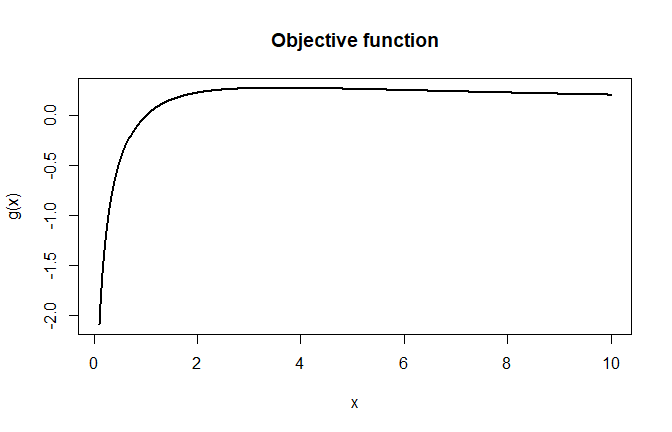

# Numerical Optimization in R
George Oikonomidis

- [Aim](#aim)
- [A one-dimensional objective](#a-one-dimensional-objective)
- [Newton–Raphson from scratch](#newtonraphson-from-scratch)
- [Verification with `optimize()`](#verification-with-optimize)
- [Multivariate optimization: Rosenbrock
  function](#multivariate-optimization-rosenbrock-function)
- [Practical checklist](#practical-checklist)

## Aim

Many statistical estimators are solutions of an optimization problem or
a score equation. This notebook implements a transparent one-dimensional
Newton–Raphson routine and then moves to R’s general-purpose optimizers.

``` r
options(digits = 5)
```

## A one-dimensional objective

Consider

$$g(x)=\frac{\log x}{1+x}, \qquad x>0.$$

Its stationary points solve $g'(x)=0$. The first and second derivatives
are

$$g'(x)=\frac{1+1/x-\log x}{(1+x)^2},$$

$$g''(x)=-\frac{3+4/x+1/x^2-2\log x}{(1+x)^3}.$$

``` r
g <- function(x) log(x) / (1 + x)

score <- function(x) {
  (1 + 1 / x - log(x)) / (1 + x)^2
}

score_derivative <- function(x) {
  -(3 + 4 / x + 1 / x^2 - 2 * log(x)) / (1 + x)^3
}

curve(g, from = 0.1, to = 10, n = 500,
      xlab = "x", ylab = "g(x)", lwd = 2,
      main = "Objective function")
```



## Newton–Raphson from scratch

For a score equation $s(x)=0$, Newton–Raphson updates

$$x_{k+1}=x_k-\frac{s(x_k)}{s'(x_k)}.$$

The implementation below adds the safeguards that were implicit in the
classroom code: a maximum number of iterations, a domain check, and a
small-derivative check.

``` r
newton_score <- function(start, score, score_derivative,
                         tolerance = 1e-10, max_iter = 100) {
  current <- start
  trace <- data.frame(
    iteration = 0,
    estimate = current,
    score = score(current)
  )

  for (iteration in seq_len(max_iter)) {
    derivative <- score_derivative(current)

    if (!is.finite(derivative) || abs(derivative) < .Machine$double.eps) {
      stop("Derivative is numerically zero or non-finite.")
    }

    candidate <- current - score(current) / derivative

    if (!is.finite(candidate) || candidate <= 0) {
      stop("Newton step left the admissible domain x > 0.")
    }

    trace <- rbind(
      trace,
      data.frame(
        iteration = iteration,
        estimate = candidate,
        score = score(candidate)
      )
    )

    if (abs(candidate - current) <= tolerance * (1 + abs(current))) {
      return(list(root = candidate, converged = TRUE, trace = trace))
    }

    current <- candidate
  }

  list(root = current, converged = FALSE, trace = trace)
}

newton_fit <- newton_score(
  start = 3,
  score = score,
  score_derivative = score_derivative
)

newton_fit$trace
```

      iteration estimate      score
    1         0   3.0000 1.4670e-02
    2         1   3.4178 3.2582e-03
    3         2   3.5740 2.9141e-04
    4         3   3.5909 2.9620e-06
    5         4   3.5911 3.1427e-10
    6         5   3.5911 1.0534e-17
    7         6   3.5911 1.0534e-17

The curvature at the solution is negative, confirming a local maximum.

``` r
c(
  estimate = newton_fit$root,
  objective = g(newton_fit$root),
  curvature = score_derivative(newton_fit$root)
)
```

     estimate objective curvature 
      3.59112   0.27846  -0.01689 

## Verification with `optimize()`

For a bounded one-dimensional problem, `optimize()` provides a useful
independent check.

``` r
bounded_fit <- optimize(g, interval = c(0.1, 10), maximum = TRUE)

comparison <- data.frame(
  method = c("Newton-Raphson", "optimize"),
  estimate = c(newton_fit$root, bounded_fit$maximum),
  objective = c(g(newton_fit$root), bounded_fit$objective)
)

comparison
```

              method estimate objective
    1 Newton-Raphson   3.5911   0.27846
    2       optimize   3.5911   0.27846

Agreement is expected here, but it should not be treated as automatic:
Newton’s method is fast near the solution and sensitive to starting
values, while a bounded search is slower but more robust in one
dimension.

## Multivariate optimization: Rosenbrock function

The Rosenbrock function is a standard test problem:

$$f(x_1,x_2)=100(x_2-x_1^2)^2+(1-x_1)^2.$$

Its global minimum is at $(1,1)$.

``` r
rosenbrock <- function(par) {
  100 * (par[2] - par[1]^2)^2 + (1 - par[1])^2
}

start <- c(-1.2, 1)

fit_bfgs <- optim(start, rosenbrock, method = "BFGS")
fit_nelder <- optim(start, rosenbrock, method = "Nelder-Mead")

optimization_results <- data.frame(
  method = c("BFGS", "Nelder-Mead"),
  x1 = c(fit_bfgs$par[1], fit_nelder$par[1]),
  x2 = c(fit_bfgs$par[2], fit_nelder$par[2]),
  objective = c(fit_bfgs$value, fit_nelder$value),
  convergence = c(fit_bfgs$convergence, fit_nelder$convergence),
  function_evaluations = c(fit_bfgs$counts[1], fit_nelder$counts[1])
)

optimization_results
```

           method     x1      x2  objective convergence function_evaluations
    1        BFGS 0.9998 0.99961 3.8274e-08           0                  118
    2 Nelder-Mead 1.0003 1.00051 8.8252e-08           0                  195

In `optim()`, a convergence code of zero indicates successful
termination. The solution, objective value, convergence code, and
sensitivity to starting values should all be inspected—not only the
returned parameter vector.

## Practical checklist

1.  Work on a parameter scale that respects constraints.
2.  Use explicit stopping rules and a maximum iteration count.
3.  Inspect convergence diagnostics and the objective value.
4.  Try more than one starting value when local optima are possible.
5.  Verify custom algorithms with an independent numerical routine
    whenever possible.
