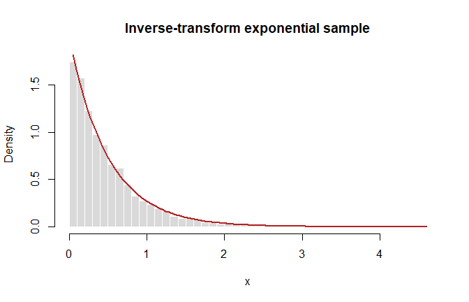
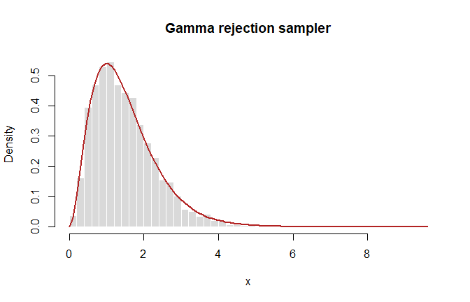
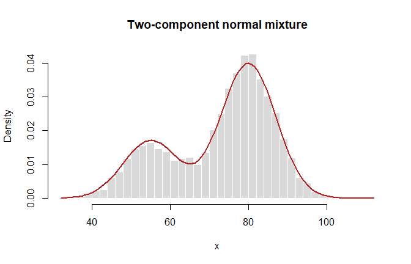

# Random-Variable Generation and Simulation
George Oikonomidis

- [Aim](#aim)
- [The `d` / `p` / `q` / `r` convention](#the-d--p--q--r-convention)
- [Empirical versus theoretical
  moments](#empirical-versus-theoretical-moments)
- [Inverse-transform simulation](#inverse-transform-simulation)
- [Rejection sampling: Gamma target](#rejection-sampling-gamma-target)
- [Composition: a normal mixture](#composition-a-normal-mixture)
- [Hierarchical simulation: Titanic
  example](#hierarchical-simulation-titanic-example)

## Aim

This notebook moves from R’s built-in distribution functions to three
general simulation strategies: inverse transform, rejection sampling,
and composition. Every experiment is reproducible.

``` r
set.seed(2026)
options(digits = 5)
```

## The `d` / `p` / `q` / `r` convention

For a distribution such as the normal distribution, R uses:

- `dnorm()` for the density or probability mass function,
- `pnorm()` for the cumulative distribution function,
- `qnorm()` for quantiles,
- `rnorm()` for random generation.

The same naming convention applies to `unif`, `exp`, `gamma`, `binom`,
`pois`, and many other distributions.

## Empirical versus theoretical moments

``` r
n <- 10000

simulation_specs <- list(
  Normal = list(
    sample = rnorm(n, mean = 2, sd = 3),
    theoretical_mean = 2,
    theoretical_variance = 3^2
  ),
  Uniform = list(
    sample = runif(n, min = -1, max = 5),
    theoretical_mean = 2,
    theoretical_variance = (5 - (-1))^2 / 12
  ),
  Exponential = list(
    sample = rexp(n, rate = 2),
    theoretical_mean = 1 / 2,
    theoretical_variance = 1 / 2^2
  ),
  Gamma = list(
    sample = rgamma(n, shape = 3, rate = 2),
    theoretical_mean = 3 / 2,
    theoretical_variance = 3 / 2^2
  ),
  Binomial = list(
    sample = rbinom(n, size = 10, prob = 0.3),
    theoretical_mean = 10 * 0.3,
    theoretical_variance = 10 * 0.3 * 0.7
  ),
  Poisson = list(
    sample = rpois(n, lambda = 4),
    theoretical_mean = 4,
    theoretical_variance = 4
  )
)

moment_comparison <- do.call(
  rbind,
  lapply(names(simulation_specs), function(distribution) {
    item <- simulation_specs[[distribution]]
    data.frame(
      distribution = distribution,
      empirical_mean = mean(item$sample),
      theoretical_mean = item$theoretical_mean,
      empirical_variance = var(item$sample),
      theoretical_variance = item$theoretical_variance
    )
  })
)

moment_comparison
```

      distribution empirical_mean theoretical_mean empirical_variance
    1       Normal        2.01102              2.0            9.02628
    2      Uniform        2.00738              2.0            2.99579
    3  Exponential        0.49138              0.5            0.24379
    4        Gamma        1.51173              1.5            0.75397
    5     Binomial        2.98840              3.0            2.14628
    6      Poisson        3.99140              4.0            3.98532
      theoretical_variance
    1                 9.00
    2                 3.00
    3                 0.25
    4                 0.75
    5                 2.10
    6                 4.00

Small differences are Monte Carlo error, not model failure. They shrink
as the simulation size increases.

## Inverse-transform simulation

If $U\sim U(0,1)$ and $F$ is a continuous CDF, then $F^{-1}(U)$ has CDF
$F$. For an exponential distribution with rate $\lambda$,

$$X=-\frac{\log U}{\lambda}.$$

``` r
n_inverse <- 5000
lambda <- 2

u <- runif(n_inverse)
x_inverse <- -log(u) / lambda

data.frame(
  empirical_mean = mean(x_inverse),
  theoretical_mean = 1 / lambda,
  empirical_variance = var(x_inverse),
  theoretical_variance = 1 / lambda^2
)
```

      empirical_mean theoretical_mean empirical_variance theoretical_variance
    1        0.49578              0.5            0.25515                 0.25

``` r
hist(x_inverse, probability = TRUE, breaks = 35,
     col = "grey85", border = "white",
     main = "Inverse-transform exponential sample",
     xlab = "x")
curve(dexp(x, rate = lambda), add = TRUE,
      col = "firebrick", lwd = 2)
```



## Rejection sampling: Gamma target

Let the target be $\operatorname{Gamma}(\alpha,\beta)$ with shape
$\alpha>1$ and rate $\beta$. Use an exponential proposal with rate
$0<\lambda<\beta$.

Ignoring constants, the target-to-proposal ratio is maximized through

$$h(x)=x^{\alpha-1}e^{-(\beta-\lambda)x},$$

at

$$\widehat x=\frac{\alpha-1}{\beta-\lambda}.$$

The normalized acceptance probability is

$$\left(\frac{V}{\widehat x}\right)^{\alpha-1}
\exp\{-(\beta-\lambda)(V-\widehat x)\}.$$

``` r
rgamma_rejection <- function(n, shape, rate, proposal_rate) {
  stopifnot(
    n > 0,
    shape > 1,
    proposal_rate > 0,
    proposal_rate < rate
  )

  x_hat <- (shape - 1) / (rate - proposal_rate)
  accepted <- numeric(n)
  attempts <- 0L
  stored <- 0L

  while (stored < n) {
    candidate <- rexp(1, rate = proposal_rate)
    uniform <- runif(1)
    acceptance_probability <-
      (candidate / x_hat)^(shape - 1) *
      exp(-(rate - proposal_rate) * (candidate - x_hat))

    attempts <- attempts + 1L
    if (uniform <= acceptance_probability) {
      stored <- stored + 1L
      accepted[stored] <- candidate
    }
  }

  list(
    sample = accepted,
    acceptance_rate = n / attempts,
    attempts = attempts
  )
}

gamma_draws <- rgamma_rejection(
  n = 5000,
  shape = 3,
  rate = 2,
  proposal_rate = 1
)

gamma_draws$acceptance_rate
```

    [1] 0.46698

``` r
hist(gamma_draws$sample, probability = TRUE, breaks = 35,
     col = "grey85", border = "white",
     main = "Gamma rejection sampler",
     xlab = "x")
curve(dgamma(x, shape = 3, rate = 2), add = TRUE,
      col = "firebrick", lwd = 2)
```



## Composition: a normal mixture

A mixture can be simulated in two steps: first choose a component, then
draw from that component.

``` r
n_mixture <- 5000
mixing_weight <- 0.30
component <- rbinom(n_mixture, size = 1, prob = mixing_weight)

mixture_sample <- ifelse(
  component == 1,
  rnorm(n_mixture, mean = 55, sd = 7),
  rnorm(n_mixture, mean = 80, sd = 7)
)

hist(mixture_sample, probability = TRUE, breaks = 40,
     col = "grey85", border = "white",
     main = "Two-component normal mixture",
     xlab = "x")
curve(
  mixing_weight * dnorm(x, 55, 7) +
    (1 - mixing_weight) * dnorm(x, 80, 7),
  add = TRUE, col = "firebrick", lwd = 2
)
```



## Hierarchical simulation: Titanic example

The course data record individual survival outcomes. A simple binomial
simulation uses the observed survival proportion as a plug-in
probability; a hierarchical extension can also let the number of trials
be random.

``` r
titanic <- read.csv("data/titanic_long.csv")
survival_probability <- mean(titanic$survived)
passengers <- nrow(titanic)

simulated_survivors <- rbinom(
  n = 1000,
  size = passengers,
  prob = survival_probability
)

c(
  observed_survivors = sum(titanic$survived),
  simulated_mean = mean(simulated_survivors),
  theoretical_mean = passengers * survival_probability
)
```

    observed_survivors     simulated_mean   theoretical_mean 
                711.00             710.66             711.00 

Simulation reproduces a specified model; it does not validate the
assumptions used to specify that model.
