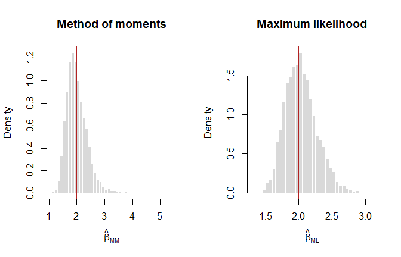
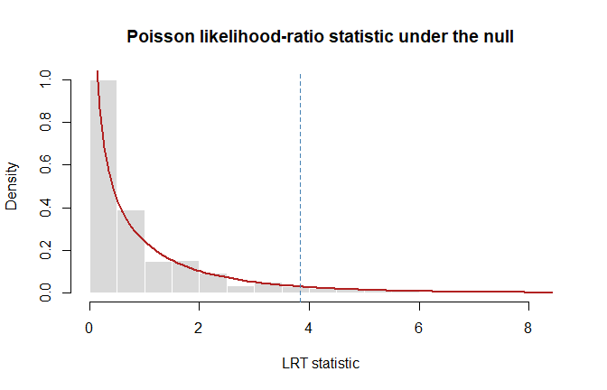

# Monte Carlo Methods for Statistical Inference
George Oikonomidis

- [Aim](#aim)
- [Monte Carlo integration](#monte-carlo-integration)
- [Comparing two estimators](#comparing-two-estimators)
- [Monte Carlo calibration of a Poisson likelihood-ratio
  test](#monte-carlo-calibration-of-a-poisson-likelihood-ratio-test)
- [Monte Carlo reporting checklist](#monte-carlo-reporting-checklist)

## Aim

Monte Carlo methods approximate a statistical quantity by repeatedly
sampling from a known model. This notebook illustrates numerical
integration, sampling distributions of competing estimators, and
simulation-based calibration of a test statistic.

``` r
set.seed(2026)
options(digits = 5)
```

## Monte Carlo integration

For $U\sim U(0,1)$,

$$\int_0^1 e^{-x^2}\,dx=E\left[e^{-U^2}\right].$$

``` r
mc_integral <- function(n) {
  u <- runif(n)
  values <- exp(-u^2)

  c(
    estimate = mean(values),
    monte_carlo_se = sd(values) / sqrt(n)
  )
}

mc_sizes <- c(100, 1000, 10000, 100000)
mc_results <- t(vapply(mc_sizes, mc_integral, numeric(2)))
mc_results <- data.frame(n = mc_sizes, mc_results, row.names = NULL)

reference_value <- integrate(function(x) exp(-x^2), 0, 1)$value
mc_results$absolute_error <- abs(mc_results$estimate - reference_value)

mc_results
```

          n estimate monte_carlo_se absolute_error
    1 1e+02  0.75737     0.02017154     0.01054672
    2 1e+03  0.74520     0.00633891     0.00162348
    3 1e+04  0.74757     0.00200906     0.00074416
    4 1e+05  0.74604     0.00063674     0.00078565

``` r
reference_value
```

    [1] 0.74682

The Monte Carlo standard error decreases at the characteristic rate
$1/\sqrt{n}$.

## Comparing two estimators

Suppose $X$ follows an inverse-Gamma distribution with known shape
$\alpha>2$ and unknown scale parameter $\beta$:

$$f(x)=\frac{\beta^\alpha}{\Gamma(\alpha)}x^{-(\alpha+1)}e^{-\beta/x},
\qquad x>0.$$

Two estimators are

$$\widehat\beta_{MM}=(\alpha-1)\overline X,
\qquad
\widehat\beta_{ML}=\frac{n\alpha}{\sum_i 1/X_i}.$$

``` r
alpha <- 3
beta <- 2
n <- 25
replications <- 5000

beta_mm <- numeric(replications)
beta_ml <- numeric(replications)

for (replication in seq_len(replications)) {
  # If Y ~ Gamma(alpha, rate = beta), then X = 1/Y is inverse-Gamma.
  x <- 1 / rgamma(n, shape = alpha, rate = beta)
  beta_mm[replication] <- (alpha - 1) * mean(x)
  beta_ml[replication] <- n * alpha / sum(1 / x)
}

estimator_summary <- data.frame(
  estimator = c("Method of moments", "Maximum likelihood"),
  empirical_mean = c(mean(beta_mm), mean(beta_ml)),
  theoretical_mean = c(
    beta,
    n * alpha * beta / (n * alpha - 1)
  ),
  empirical_bias = c(mean(beta_mm) - beta, mean(beta_ml) - beta),
  theoretical_bias = c(
    0,
    beta / (n * alpha - 1)
  ),
  empirical_variance = c(var(beta_mm), var(beta_ml)),
  theoretical_variance = c(
    beta^2 / (n * (alpha - 2)),
    (n * alpha)^2 * beta^2 /
      ((n * alpha - 1)^2 * (n * alpha - 2))
  ),
  empirical_mse = c(
    mean((beta_mm - beta)^2),
    mean((beta_ml - beta)^2)
  )
)

estimator_summary
```

               estimator empirical_mean theoretical_mean empirical_bias
    1  Method of moments         2.0051            2.000      0.0050719
    2 Maximum likelihood         2.0335            2.027      0.0335338
      theoretical_bias empirical_variance theoretical_variance empirical_mse
    1         0.000000           0.150586             0.160000      0.150581
    2         0.027027           0.058875             0.056285      0.059988

The method-of-moments estimator is unbiased in this setting. The
finite-sample MLE is slightly positively biased; the theoretical entries
above use the exact inverse moments of a Gamma random variable rather
than only the large-sample approximation.

``` r
par(mfrow = c(1, 2))
hist(beta_mm, breaks = 35, probability = TRUE,
     col = "grey85", border = "white",
     main = "Method of moments", xlab = expression(hat(beta)[MM]))
abline(v = beta, col = "firebrick", lwd = 2)

hist(beta_ml, breaks = 35, probability = TRUE,
     col = "grey85", border = "white",
     main = "Maximum likelihood", xlab = expression(hat(beta)[ML]))
abline(v = beta, col = "firebrick", lwd = 2)
```



``` r
par(mfrow = c(1, 1))
```

The simulation evaluates bias, variance, and MSE under one clearly
stated data-generating mechanism. Changing $n$, $\alpha$, or $\beta$
defines a different Monte Carlo experiment.

## Monte Carlo calibration of a Poisson likelihood-ratio test

For $X_i\sim\operatorname{Poisson}(\lambda)$, test

$$H_0:\lambda=\lambda_0$$

using the likelihood-ratio statistic

$$T=2n\left\{\lambda_0-\widehat\lambda+
\widehat\lambda\log\left(\frac{\widehat\lambda}{\lambda_0}\right)\right\},$$

with the convention $0\log 0=0$.

``` r
poisson_lrt <- function(x, lambda0) {
  lambda_hat <- mean(x)
  log_term <- if (lambda_hat == 0) 0 else {
    lambda_hat * log(lambda_hat / lambda0)
  }

  2 * length(x) * (lambda0 - lambda_hat + log_term)
}

lambda0 <- 5
n_test <- 25
test_replications <- 10000

lrt_values <- replicate(
  test_replications,
  poisson_lrt(rpois(n_test, lambda = lambda0), lambda0)
)

cutoff_asymptotic <- qchisq(0.95, df = 1)
cutoff_monte_carlo <- unname(quantile(lrt_values, 0.95))

data.frame(
  method = c("Chi-square approximation", "Monte Carlo"),
  cutoff_95 = c(cutoff_asymptotic, cutoff_monte_carlo),
  null_rejection_rate_using_cutoff = c(
    mean(lrt_values > cutoff_asymptotic),
    mean(lrt_values > cutoff_monte_carlo)
  )
)
```

                        method cutoff_95 null_rejection_rate_using_cutoff
    1 Chi-square approximation    3.8415                           0.0514
    2              Monte Carlo    3.9940                           0.0469

``` r
hist(lrt_values, probability = TRUE, breaks = 45,
     col = "grey85", border = "white",
     main = "Poisson likelihood-ratio statistic under the null",
     xlab = "LRT statistic", xlim = c(0, quantile(lrt_values, 0.995)))
curve(dchisq(x, df = 1), add = TRUE,
      col = "firebrick", lwd = 2, from = 0.01)
abline(v = cutoff_asymptotic, lty = 2, col = "steelblue")
```



## Monte Carlo reporting checklist

- State the data-generating distribution and all parameter values.
- Set and report a random seed.
- Report the number of replications.
- Quantify Monte Carlo uncertainty when the estimate itself is a
  probability or expectation.
- Separate simulation error from sampling error in the statistical
  problem.
