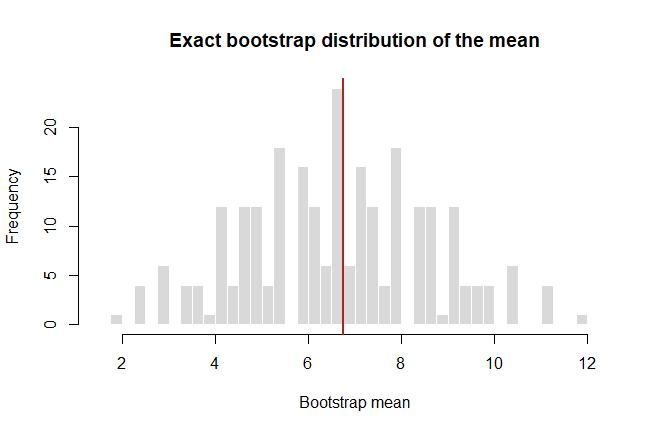
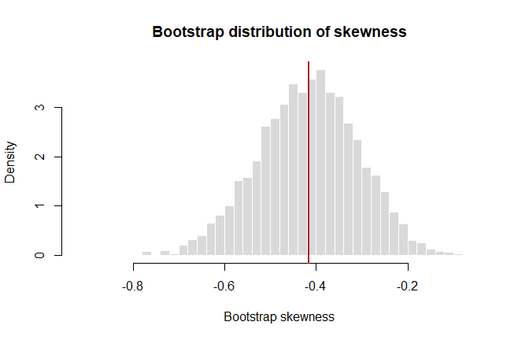

# Bootstrap and Resampling
George Oikonomidis

- [Aim](#aim)
- [Exact bootstrap for a tiny
  sample](#exact-bootstrap-for-a-tiny-sample)
- [Non-parametric bootstrap:
  skewness](#non-parametric-bootstrap-skewness)
- [Parametric bootstrap: variance of the sample
  variance](#parametric-bootstrap-variance-of-the-sample-variance)
- [Parametric resampling as a model
  check](#parametric-resampling-as-a-model-check)
- [Bootstrap-$t$ confidence interval](#bootstrap-t-confidence-interval)
- [Coverage simulation for confidence
  intervals](#coverage-simulation-for-confidence-intervals)
- [What changes across methods?](#what-changes-across-methods)

## Aim

The bootstrap replaces repeated sampling from an unknown population with
repeated resampling from the observed data—or from a fitted parametric
model. The examples below distinguish non-parametric bootstrap,
parametric bootstrap, and a simulation-based model check.

``` r
set.seed(2026)
options(digits = 5)
```

## Exact bootstrap for a tiny sample

For the sample $(2,4,9,12)$, there are $4^4=256$ ordered resamples of
size four. They can be enumerated exactly.

``` r
small_sample <- c(2, 4, 9, 12)
indices <- expand.grid(rep(list(seq_along(small_sample)), length(small_sample)))

exact_bootstrap_means <- apply(
  indices,
  1,
  function(index) mean(small_sample[as.integer(index)])
)

c(
  observed_mean = mean(small_sample),
  bootstrap_mean = mean(exact_bootstrap_means),
  bootstrap_standard_error = sd(exact_bootstrap_means)
)
```

               observed_mean           bootstrap_mean bootstrap_standard_error 
                      6.7500                   6.7500                   1.9843 

``` r
hist(exact_bootstrap_means, breaks = seq(1.5, 12.5, by = 0.25),
     col = "grey85", border = "white",
     main = "Exact bootstrap distribution of the mean",
     xlab = "Bootstrap mean")
abline(v = mean(small_sample), col = "firebrick", lwd = 2)
```



## Non-parametric bootstrap: skewness

The Old Faithful eruption durations are available in base R. Define the
moment coefficient of skewness as

$$\gamma_1=\frac{m_3}{m_2^{3/2}}.$$

``` r
skewness <- function(x) {
  centered <- x - mean(x)
  mean(centered^3) / mean(centered^2)^(3 / 2)
}

eruptions <- faithful$eruptions
observed_skewness <- skewness(eruptions)

B <- 4000
bootstrap_skewness <- replicate(
  B,
  skewness(sample(eruptions, replace = TRUE))
)

bootstrap_se <- sd(bootstrap_skewness)
bootstrap_bias <- mean(bootstrap_skewness) - observed_skewness
standard_ci <- observed_skewness + qnorm(c(0.025, 0.975)) * bootstrap_se
percentile_ci <- unname(quantile(bootstrap_skewness, c(0.025, 0.975)))

data.frame(
  estimate = observed_skewness,
  bootstrap_bias = bootstrap_bias,
  bootstrap_standard_error = bootstrap_se,
  standard_lower = standard_ci[1],
  standard_upper = standard_ci[2],
  percentile_lower = percentile_ci[1],
  percentile_upper = percentile_ci[2]
)
```

      estimate bootstrap_bias bootstrap_standard_error standard_lower
    1 -0.41584     -0.0012895                  0.11016       -0.63175
      standard_upper percentile_lower percentile_upper
    1       -0.19993           -0.638         -0.21014

``` r
hist(bootstrap_skewness, probability = TRUE, breaks = 40,
     col = "grey85", border = "white",
     main = "Bootstrap distribution of skewness",
     xlab = "Bootstrap skewness")
abline(v = observed_skewness, col = "firebrick", lwd = 2)
```



The standard interval assumes an approximately symmetric bootstrap
distribution. The percentile interval uses the empirical quantiles
directly and is often more natural for a skewed statistic, though
neither method is universally best.

## Parametric bootstrap: variance of the sample variance

Under a normal model, generate new samples from the fitted distribution
rather than resampling the observed values.

``` r
variance_data <- c(-1.81, 0.63, 2.22, 2.41, 2.95,
                   4.16, 4.24, 4.53, 5.09)

n_variance <- length(variance_data)
mu_hat <- mean(variance_data)
sigma2_mle <- mean((variance_data - mu_hat)^2)

parametric_variances <- replicate(
  B,
  var(rnorm(n_variance, mean = mu_hat, sd = sqrt(sigma2_mle)))
)

bootstrap_variance_of_s2 <- var(parametric_variances)
normal_theory_plugin <- 2 * sigma2_mle^2 / (n_variance - 1)

data.frame(
  method = c("Parametric bootstrap", "Normal-theory plug-in"),
  estimated_variance_of_sample_variance = c(
    bootstrap_variance_of_s2,
    normal_theory_plugin
  )
)
```

                     method estimated_variance_of_sample_variance
    1  Parametric bootstrap                                4.7484
    2 Normal-theory plug-in                                4.5902

## Parametric resampling as a model check

The Hudson River larval counts from the course material are assessed
under a Poisson model. Since a Poisson variable has equal mean and
variance, unusually large sample variance suggests overdispersion.

``` r
larval_counts <- c(19, 32, 29, 13, 8, 12, 16, 20, 14, 17, 22, 18, 23)

lambda_hat <- mean(larval_counts)
observed_variance <- var(larval_counts)
observed_dispersion <- observed_variance / lambda_hat

resampled_variances <- replicate(
  10000,
  var(rpois(length(larval_counts), lambda = lambda_hat))
)

resampled_dispersions <- resampled_variances / lambda_hat

data.frame(
  statistic = c("Sample variance", "Index of dispersion"),
  observed = c(observed_variance, observed_dispersion),
  upper_tail_probability = c(
    mean(resampled_variances >= observed_variance),
    mean(resampled_dispersions >= observed_dispersion)
  )
)
```

                statistic observed upper_tail_probability
    1     Sample variance  44.8974                 0.0049
    2 Index of dispersion   2.4019                 0.0049

The simulated upper-tail probability is a model-based diagnostic. A
small value indicates that the observed variability is difficult to
reconcile with the fitted Poisson model.

## Bootstrap-$t$ confidence interval

The bootstrap-$t$ (or studentized bootstrap) estimates the sampling
distribution of

$$T^*=\frac{\widehat\theta^*-\widehat\theta}{\widehat{\operatorname{se}}^*}.$$

Because the statistic is standardized within every bootstrap resample,
the method can adapt to changes in variability across the sampling
distribution. If $q^*_{a}$ denotes a bootstrap quantile of $T^*$, the
interval reverses the two quantiles:

$$\left[
\widehat\theta-q^*_{1-\alpha/2}\widehat{\operatorname{se}},
\widehat\theta-q^*_{\alpha/2}\widehat{\operatorname{se}}
\right].$$

``` r
bootstrap_t_mean <- function(x, B = 4000, level = 0.95) {
  n <- length(x)
  estimate <- mean(x)
  standard_error <- sd(x) / sqrt(n)

  bootstrap_t <- replicate(B, {
    resample <- sample(x, size = n, replace = TRUE)
    resample_se <- sd(resample) / sqrt(n)
    (mean(resample) - estimate) / resample_se
  })

  bootstrap_t <- bootstrap_t[is.finite(bootstrap_t)]
  alpha <- 1 - level
  critical_values <- quantile(
    bootstrap_t,
    probs = c(alpha / 2, 1 - alpha / 2),
    names = FALSE
  )

  c(
    estimate = estimate,
    standard_error = standard_error,
    lower = estimate - critical_values[2] * standard_error,
    upper = estimate - critical_values[1] * standard_error
  )
}

rat_survival <- c(10, 27, 30, 40, 46, 51, 52, 104, 146)
bootstrap_t_mean(rat_survival)
```

          estimate standard_error          lower          upper 
            56.222         14.159         31.413        126.710 

Studentization requires an estimated standard error for each resample.
For more complicated estimators this may require an analytical formula,
an influence-function estimate, or an inner bootstrap.

## Coverage simulation for confidence intervals

A single interval cannot show whether a procedure is well calibrated.
Coverage is evaluated by repeatedly generating fresh datasets from a
known population and recording the proportion of intervals that contain
the true parameter.

The experiment below compares three nominal 95% intervals for the mean
of an exponential population: the classical Student-$t$ interval, the
percentile bootstrap, and the bootstrap-$t$ interval.

``` r
mean_intervals <- function(x, B = 400, level = 0.95) {
  n <- length(x)
  estimate <- mean(x)
  standard_error <- sd(x) / sqrt(n)
  alpha <- 1 - level

  bootstrap_means <- numeric(B)
  bootstrap_t <- numeric(B)

  for (b in seq_len(B)) {
    resample <- sample(x, size = n, replace = TRUE)
    resample_mean <- mean(resample)
    resample_se <- sd(resample) / sqrt(n)

    bootstrap_means[b] <- resample_mean
    bootstrap_t[b] <- (resample_mean - estimate) / resample_se
  }

  bootstrap_t <- bootstrap_t[is.finite(bootstrap_t)]
  percentile_quantiles <- quantile(
    bootstrap_means,
    probs = c(alpha / 2, 1 - alpha / 2),
    names = FALSE
  )
  t_quantiles <- quantile(
    bootstrap_t,
    probs = c(alpha / 2, 1 - alpha / 2),
    names = FALSE
  )

  student_t <- estimate +
    c(-1, 1) * qt(1 - alpha / 2, df = n - 1) * standard_error
  bootstrap_t_interval <- c(
    estimate - t_quantiles[2] * standard_error,
    estimate - t_quantiles[1] * standard_error
  )

  rbind(
    `Student-t` = student_t,
    `Percentile bootstrap` = percentile_quantiles,
    `Bootstrap-t` = bootstrap_t_interval
  )
}

true_mean <- 1
sample_size <- 20
outer_repetitions <- 300
inner_bootstrap_repetitions <- 400

coverage <- setNames(numeric(3),
                     c("Student-t", "Percentile bootstrap", "Bootstrap-t"))
average_width <- coverage

for (simulation in seq_len(outer_repetitions)) {
  simulated_sample <- rexp(sample_size, rate = 1 / true_mean)
  intervals <- mean_intervals(
    simulated_sample,
    B = inner_bootstrap_repetitions
  )

  coverage <- coverage +
    (intervals[, 1] <= true_mean & true_mean <= intervals[, 2])
  average_width <- average_width + (intervals[, 2] - intervals[, 1])
}

coverage_results <- data.frame(
  method = names(coverage),
  estimated_coverage = unname(coverage / outer_repetitions),
  average_width = unname(average_width / outer_repetitions),
  nominal_coverage = 0.95
)

coverage_results
```

                    method estimated_coverage average_width nominal_coverage
    1            Student-t            0.92333       0.90345             0.95
    2 Percentile bootstrap            0.89333       0.80734             0.95
    3          Bootstrap-t            0.92667       1.03087             0.95

With 300 outer repetitions, the Monte Carlo standard error of an
estimated coverage near 0.95 is approximately

$$\sqrt{\frac{0.95(1-0.95)}{300}}\approx 0.013.$$

Small deviations from 0.95 are therefore expected. The comparison is
about repeated-sampling calibration and interval width—not whether a
single simulated run ranks the methods in a fixed order.

## What changes across methods?

| Method | Resampling source | Typical purpose |
|----|----|----|
| Non-parametric bootstrap | Empirical distribution of the observed sample | Standard errors, bias, confidence intervals |
| Parametric bootstrap | A fitted probability model | Model-based uncertainty and sampling distributions |
| Monte Carlo experiment | A fully specified population model | Method evaluation and calibration |

The algorithms look similar, but their inferential targets and
assumptions are different.
