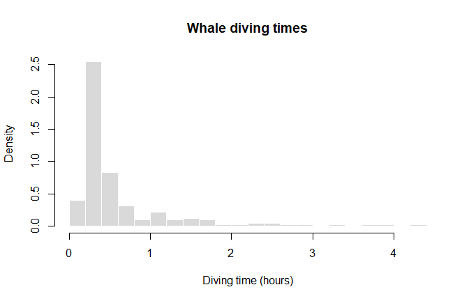
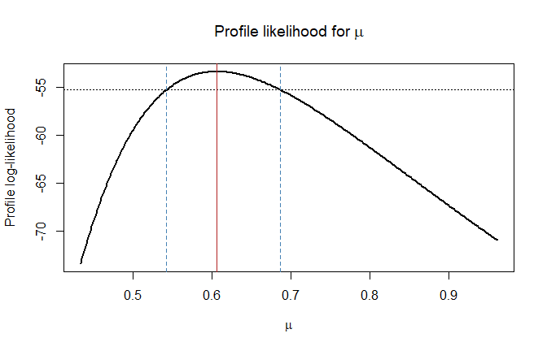
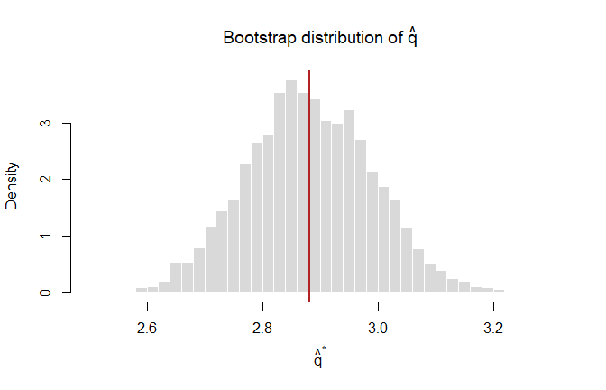
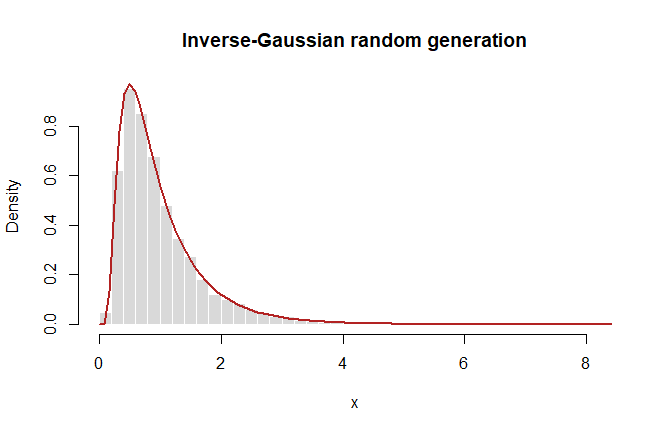

# Inverse-Gaussian Inference and Simulation
George Oikonomidis

- [Exercise 1: inverse-Gaussian
  likelihood](#exercise-1-inverse-gaussian-likelihood)
- [Exercise 2: bootstrap inference for
  $q$](#exercise-2-bootstrap-inference-for-q)
- [Exercise 3: inverse-Gaussian random
  generation](#exercise-3-inverse-gaussian-random-generation)

``` r
set.seed(2026)
options(digits = 5)

whales <- scan("data/whales.txt", quiet = TRUE)
stopifnot(length(whales) > 0, all(whales > 0))
```

## Exercise 1: inverse-Gaussian likelihood

Begin by describing the whale diving times with their histogram, mean,
and median. Then model the positive observations with the
inverse-Gaussian density

$$f(x;\mu,\lambda)=
\left(\frac{\lambda}{2\pi x^3}\right)^{1/2}
\exp\left\{-\frac{\lambda(x-\mu)^2}{2\mu^2x}\right\},
\qquad x>0,$$

where $\mu>0$ is the mean parameter and $\lambda>0$ is the shape
parameter.

``` r
hist(
  whales,
  probability = TRUE,
  breaks = 30,
  col = "grey85",
  border = "white",
  main = "Whale diving times",
  xlab = "Diving time (hours)"
)
```



``` r
data.frame(
  observations = length(whales),
  mean = mean(whales),
  median = median(whales),
  minimum = min(whales),
  maximum = max(whales)
)
```

      observations  mean median minimum maximum
    1          210 0.606 0.3509  0.1337  4.3478

The mean is larger than the median, consistently with the visible
right-skewness of the data.

### Log-likelihood

For independent observations $x_1,\ldots,x_n$, the log-likelihood is

$$\ell(\lambda,\mu)=
\frac n2\log\lambda-\frac n2\log(2\pi)
-\frac32\sum_{i=1}^n\log x_i
-\frac{\lambda}{2\mu^2}
\sum_{i=1}^n\frac{(x_i-\mu)^2}{x_i}.$$

``` r
loglik_inverse_gaussian <- function(lambda, mu, x) {
  if (lambda <= 0 || mu <= 0) return(-Inf)

  n <- length(x)
  n / 2 * log(lambda) - n / 2 * log(2 * pi) -
    3 / 2 * sum(log(x)) -
    lambda / (2 * mu^2) * sum((x - mu)^2 / x)
}

loglik_inverse_gaussian(lambda = 1, mu = 1, x = whales)
```

    [1] -82.66

### Newton–Raphson for $\lambda$ with fixed $\mu$

For fixed $\mu$, the score and its derivative are

$$\ell'(\lambda)=\frac{n}{2\lambda}
-\frac{1}{2\mu^2}\sum_{i=1}^n\frac{(x_i-\mu)^2}{x_i},
\qquad
\ell''(\lambda)=-\frac{n}{2\lambda^2}.$$

``` r
inverse_gaussian_lambda_hat <- function(mu, x) {
  length(x) * mu^2 / sum((x - mu)^2 / x)
}

newton_inverse_gaussian_lambda <- function(mu, x, start = 1,
                                           tolerance = 1e-10,
                                           max_iter = 100) {
  lambda <- start
  trace <- data.frame(iteration = 0, lambda = lambda)

  for (iteration in seq_len(max_iter)) {
    score <- length(x) / (2 * lambda) -
      sum((x - mu)^2 / x) / (2 * mu^2)
    hessian <- -length(x) / (2 * lambda^2)
    candidate <- lambda - score / hessian

    if (!is.finite(candidate) || candidate <= 0) {
      stop("Newton-Raphson left the admissible domain lambda > 0.")
    }

    trace <- rbind(
      trace,
      data.frame(iteration = iteration, lambda = candidate)
    )

    if (abs(candidate - lambda) <= tolerance * (1 + abs(lambda))) {
      return(list(estimate = candidate, converged = TRUE, trace = trace))
    }

    lambda <- candidate
  }

  list(estimate = lambda, converged = FALSE, trace = trace)
}

lambda_newton <- newton_inverse_gaussian_lambda(
  mu = 1,
  x = whales,
  start = 1
)
lambda_closed_form <- inverse_gaussian_lambda_hat(mu = 1, x = whales)

data.frame(
  method = c("Newton-Raphson", "Closed-form MLE"),
  lambda_hat = c(lambda_newton$estimate, lambda_closed_form)
)
```

               method lambda_hat
    1  Newton-Raphson    0.67246
    2 Closed-form MLE    0.67246

The numerical and analytical estimates agree. Newton–Raphson is useful
as an implementation exercise, but iteration is not necessary when $\mu$
is fixed because the score equation has a closed-form solution.

### Joint estimation of $\lambda$ and $\mu$

Both parameters can be estimated simultaneously. Optimization on the log
scale enforces their positivity.

``` r
negative_loglik_log_parameters <- function(log_parameters, x) {
  lambda <- exp(log_parameters[1])
  mu <- exp(log_parameters[2])
  -loglik_inverse_gaussian(lambda, mu, x)
}

joint_fit <- optim(
  par = log(c(lambda = 1, mu = 1)),
  fn = negative_loglik_log_parameters,
  x = whales,
  method = "BFGS",
  hessian = TRUE
)

if (joint_fit$convergence != 0) {
  stop("The joint inverse-Gaussian optimization did not converge.")
}

joint_estimates <- exp(joint_fit$par)
names(joint_estimates) <- c("lambda", "mu")
joint_estimates
```

    lambda     mu 
    0.8124 0.6060 

### Profile-likelihood check of $\mu=1$

For each fixed $\mu$, maximize over $\lambda$ using its conditional MLE.
A 95% profile-likelihood interval contains values satisfying

$$2\{\ell_p(\widehat\mu)-\ell_p(\mu)\}
\leq\chi^2_{1,0.95}.$$

``` r
profile_loglik_mu <- function(mu, x) {
  if (mu <= 0) return(-Inf)
  conditional_lambda <- inverse_gaussian_lambda_hat(mu, x)
  loglik_inverse_gaussian(conditional_lambda, mu, x)
}

mu_hat <- unname(joint_estimates["mu"])
profile_cutoff <- -joint_fit$value - qchisq(0.95, df = 1) / 2

profile_root <- function(mu) {
  profile_loglik_mu(mu, whales) - profile_cutoff
}

mu_profile_ci <- c(
  lower = uniroot(profile_root, c(0.01, mu_hat))$root,
  upper = uniroot(profile_root, c(mu_hat, 3))$root
)

data.frame(
  estimate = mu_hat,
  lower_95 = mu_profile_ci["lower"],
  upper_95 = mu_profile_ci["upper"],
  contains_mu_1 = mu_profile_ci["lower"] <= 1 &&
    1 <= mu_profile_ci["upper"]
)
```

          estimate lower_95 upper_95 contains_mu_1
    lower    0.606  0.54235  0.68656         FALSE

``` r
mu_grid <- seq(mu_profile_ci["lower"] * 0.8,
               mu_profile_ci["upper"] * 1.4,
               length.out = 300)

plot(
  mu_grid,
  vapply(mu_grid, profile_loglik_mu, numeric(1), x = whales),
  type = "l",
  lwd = 2,
  xlab = expression(mu),
  ylab = "Profile log-likelihood",
  main = expression("Profile likelihood for " * mu)
)
abline(h = profile_cutoff, lty = 3)
abline(
  v = c(mu_profile_ci["lower"], mu_hat, mu_profile_ci["upper"], 1),
  lty = c(2, 1, 2, 3),
  col = c("steelblue", "firebrick", "steelblue", "grey40")
)
```



The interval provides a direct likelihood-based check of the proposed
value $\mu=1$.

## Exercise 2: bootstrap inference for $q$

Estimate

$$q=E\left(\frac{1}{X}\right)$$

with $\widehat q=n^{-1}\sum_i1/x_i$. Use the non-parametric bootstrap to
estimate its bias and standard error, and construct normal, percentile,
and basic 95% intervals.

``` r
q_hat <- mean(1 / whales)

B <- 4000
bootstrap_q <- replicate(
  B,
  mean(1 / sample(whales, replace = TRUE))
)

bootstrap_bias <- mean(bootstrap_q) - q_hat
bootstrap_se <- sd(bootstrap_q)
bias_corrected_q <- q_hat - bootstrap_bias

normal_ci <- q_hat + qnorm(c(0.025, 0.975)) * bootstrap_se
percentile_ci <- unname(quantile(bootstrap_q, c(0.025, 0.975)))
basic_quantiles <- unname(quantile(bootstrap_q, c(0.975, 0.025)))
basic_ci <- 2 * q_hat - basic_quantiles

data.frame(
  estimate = q_hat,
  bootstrap_bias = bootstrap_bias,
  bootstrap_standard_error = bootstrap_se,
  bias_corrected_estimate = bias_corrected_q,
  relative_bias_to_se = abs(bootstrap_bias) / bootstrap_se
)
```

      estimate bootstrap_bias bootstrap_standard_error bias_corrected_estimate
    1   2.8811     0.00058939                  0.11022                  2.8805
      relative_bias_to_se
    1           0.0053472

``` r
rbind(
  Normal = normal_ci,
  Percentile = percentile_ci,
  Basic = basic_ci
) |>
  as.data.frame() |>
  setNames(c("lower_95", "upper_95"))
```

               lower_95 upper_95
    Normal       2.6651   3.0971
    Percentile   2.6686   3.0998
    Basic        2.6624   3.0936

``` r
hist(
  bootstrap_q,
  probability = TRUE,
  breaks = 35,
  col = "grey85",
  border = "white",
  main = expression("Bootstrap distribution of " * hat(q)),
  xlab = expression(hat(q)^"*")
)
abline(v = q_hat, col = "firebrick", lwd = 2)
```



The ratio $|\widehat{\operatorname{Bias}}|/\widehat{\operatorname{SE}}$
places the estimated bias on the uncertainty scale; it is more
informative than judging the raw bias alone.

## Exercise 3: inverse-Gaussian random generation

Generate inverse-Gaussian observations using the transformation
algorithm

$$Y=Z^2,\qquad Z\sim N(0,1),$$

$$X_1=\mu+\frac{\mu^2Y}{2\lambda}
-\frac{\mu}{2\lambda}
\sqrt{4\mu\lambda Y+\mu^2Y^2},$$

followed by the selection $X=X_1$ with probability $\mu/(\mu+X_1)$ and
$X=\mu^2/X_1$ otherwise.

``` r
rinverse_gaussian <- function(n, mu, lambda) {
  stopifnot(n >= 1, mu > 0, lambda > 0)

  y <- rnorm(n)^2
  x1 <- mu + mu^2 * y / (2 * lambda) -
    mu / (2 * lambda) * sqrt(4 * mu * lambda * y + mu^2 * y^2)
  u <- runif(n)

  ifelse(u <= mu / (mu + x1), x1, mu^2 / x1)
}

dinverse_gaussian <- function(x, mu, lambda) {
  density <- numeric(length(x))
  positive <- x > 0
  density[positive] <- sqrt(lambda / (2 * pi * x[positive]^3)) *
    exp(-lambda * (x[positive] - mu)^2 /
          (2 * mu^2 * x[positive]))
  density
}

mu_simulation <- 1
lambda_simulation <- 2
simulated_inverse_gaussian <- rinverse_gaussian(
  n = 10000,
  mu = mu_simulation,
  lambda = lambda_simulation
)

data.frame(
  quantity = c("Mean", "Variance"),
  empirical = c(
    mean(simulated_inverse_gaussian),
    var(simulated_inverse_gaussian)
  ),
  theoretical = c(
    mu_simulation,
    mu_simulation^3 / lambda_simulation
  )
)
```

      quantity empirical theoretical
    1     Mean   1.00508         1.0
    2 Variance   0.51256         0.5

``` r
hist(
  simulated_inverse_gaussian,
  probability = TRUE,
  breaks = 50,
  col = "grey85",
  border = "white",
  main = "Inverse-Gaussian random generation",
  xlab = "x"
)
curve(
  dinverse_gaussian(x, mu = mu_simulation, lambda = lambda_simulation),
  add = TRUE,
  col = "firebrick",
  lwd = 2
)
```



Agreement between the empirical and theoretical moments, together with
the density overlay, provides a reproducible check of the generator.
