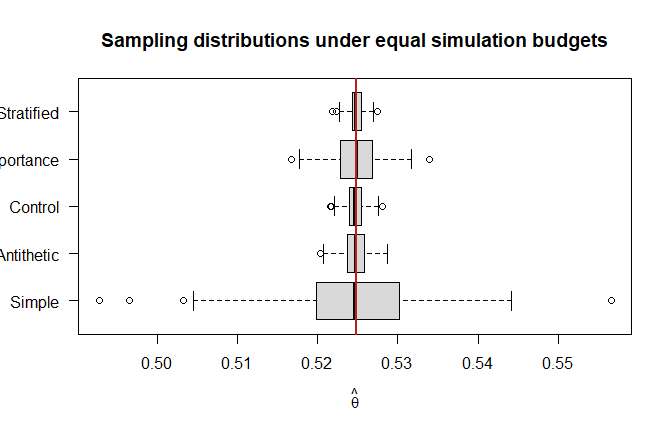

# Monte Carlo Variance Reduction
George Oikonomidis

- [Aim](#aim)
- [Integration problem](#integration-problem)
- [Simple Monte Carlo](#simple-monte-carlo)
- [Antithetic variables](#antithetic-variables)
- [Control variates](#control-variates)
- [Importance sampling](#importance-sampling)
- [Stratified sampling](#stratified-sampling)
- [Efficiency comparison](#efficiency-comparison)
- [Interpretation](#interpretation)

## Aim

Monte Carlo precision improves only at the rate $m^{-1/2}$. This
notebook compares four variance-reduction methods under the same
simulation budget.

``` r
set.seed(2026)
options(digits = 5)
```

## Integration problem

Estimate

$$\theta=\int_0^1\frac{e^{-x}}{1+x^2}\,dx.$$

If $U\sim U(0,1)$ and

$$g(u)=\frac{e^{-u}}{1+u^2},$$

then $\theta=E\{g(U)\}$.

``` r
g <- function(x) {
  exp(-x) / (1 + x^2)
}

reference_value <- integrate(g, lower = 0, upper = 1)$value
reference_value
```

    [1] 0.5248

## Simple Monte Carlo

``` r
simple_mc <- function(m) {
  mean(g(runif(m)))
}

simple_mc(1000)
```

    [1] 0.52749

The estimated Monte Carlo standard error is

$$\widehat{\operatorname{SE}}(\widehat\theta)
=\frac{s_g}{\sqrt m}.$$

``` r
u <- runif(1000)
c(
  estimate = mean(g(u)),
  monte_carlo_se = sd(g(u)) / sqrt(length(u))
)
```

          estimate monte_carlo_se 
         0.5250245      0.0075707 

## Antithetic variables

If $U$ is uniform, then $1-U$ is also uniform. For a monotone function,
$g(U)$ and $g(1-U)$ tend to be negatively correlated.

``` r
antithetic_mc <- function(m) {
  stopifnot(m %% 2 == 0)
  u <- runif(m / 2)
  mean(c(g(u), g(1 - u)))
}

antithetic_mc(1000)
```

    [1] 0.52428

## Control variates

Use $U$ as a control variate because $E(U)=1/2$ is known. For

$$\widehat\theta_c=\overline{g(U)}+widehat c\left(\overline U-\frac12\right),$$

the variance-minimizing coefficient is estimated by

$$\widehat c=-\frac{\widehat{\operatorname{Cov}}\{g(U),U\}}
{\widehat{\operatorname{Var}}(U)}.$$

``` r
control_variate_mc <- function(m) {
  u <- runif(m)
  values <- g(u)
  coefficient <- -cov(values, u) / var(u)

  mean(values) + coefficient * (mean(u) - 0.5)
}

control_variate_mc(1000)
```

    [1] 0.52488

## Importance sampling

Use a truncated exponential importance density on $(0,1)$:

$$f(x)=\frac{e^{-x}}{1-e^{-1}}.$$

Its inverse CDF generates

$$X=-\log\{1-U(1-e^{-1})\}.$$

The estimator averages $g(X)/f(X)$.

``` r
importance_mc <- function(m) {
  u <- runif(m)
  x <- -log(1 - u * (1 - exp(-1)))
  importance_density <- exp(-x) / (1 - exp(-1))

  mean(g(x) / importance_density)
}

importance_mc(1000)
```

    [1] 0.53138

The importance density is positive over the full integration region and
places more draws where the integrand is larger.

## Stratified sampling

Divide $(0,1)$ into equal-width strata. If $m_j$ observations are
generated in stratum $j$, combine the stratum means using their widths
as weights.

``` r
stratified_mc <- function(m, strata = 10) {
  stopifnot(m %% strata == 0)
  observations_per_stratum <- m / strata
  stratum_estimates <- numeric(strata)

  for (j in seq_len(strata)) {
    lower <- (j - 1) / strata
    upper <- j / strata
    x <- runif(observations_per_stratum, lower, upper)
    stratum_estimates[j] <- mean(g(x))
  }

  mean(stratum_estimates)
}

stratified_mc(1000)
```

    [1] 0.52435

## Efficiency comparison

Each method below uses 1,000 evaluations of $g$ per replication.
Repeating the experiment estimates bias, standard deviation, RMSE, and
variance relative to simple Monte Carlo.

``` r
replications <- 500
simulation_budget <- 1000

estimates <- data.frame(
  Simple = replicate(replications, simple_mc(simulation_budget)),
  Antithetic = replicate(
    replications,
    antithetic_mc(simulation_budget)
  ),
  Control = replicate(
    replications,
    control_variate_mc(simulation_budget)
  ),
  Importance = replicate(
    replications,
    importance_mc(simulation_budget)
  ),
  Stratified = replicate(
    replications,
    stratified_mc(simulation_budget, strata = 10)
  )
)

method_variances <- sapply(estimates, var)

comparison <- data.frame(
  Method = names(estimates),
  Mean = sapply(estimates, mean),
  Bias = sapply(estimates, mean) - reference_value,
  Standard_Deviation = sapply(estimates, sd),
  RMSE = sapply(
    estimates,
    function(x) sqrt(mean((x - reference_value)^2))
  ),
  Relative_Efficiency = method_variances["Simple"] / method_variances
)

comparison[order(comparison$RMSE), ]
```

                   Method    Mean        Bias Standard_Deviation       RMSE
    Stratified Stratified 0.52482  2.0934e-05          0.0008220 0.00082145
    Control       Control 0.52473 -6.6253e-05          0.0010546 0.00105558
    Antithetic Antithetic 0.52475 -4.2857e-05          0.0014709 0.00147001
    Importance Importance 0.52478 -1.5760e-05          0.0029333 0.00293042
    Simple         Simple 0.52472 -7.6082e-05          0.0080660 0.00805827
               Relative_Efficiency
    Stratified             96.2868
    Control                58.5028
    Antithetic             30.0729
    Importance              7.5613
    Simple                  1.0000

``` r
boxplot(
  estimates,
  horizontal = TRUE,
  las = 1,
  col = "grey85",
  xlab = expression(hat(theta)),
  main = "Sampling distributions under equal simulation budgets"
)
abline(v = reference_value, col = "firebrick", lwd = 2)
```



## Interpretation

- Antithetic variables exploit negative dependence without changing the
  marginal distribution.
- Control variates use a correlated quantity with known expectation.
- Importance sampling changes the simulation density and corrects with
  weights.
- Stratification forces coverage of the entire integration region.

Variance reduction must be assessed for the specific integrand and
proposal. A method that performs well here is not automatically
efficient for another problem.
