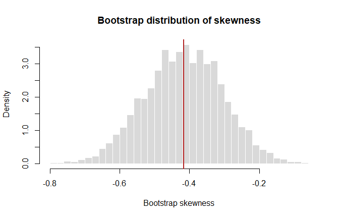
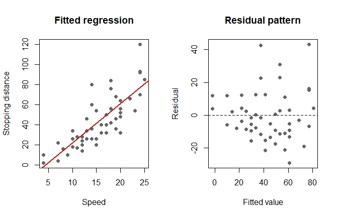
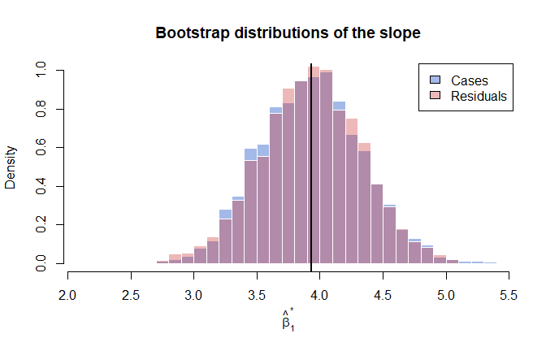
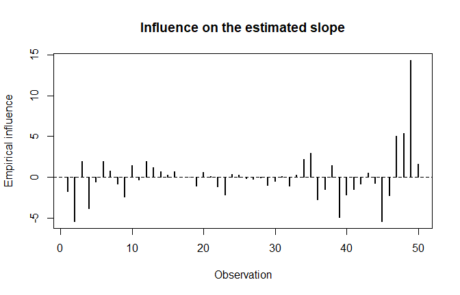

# Jackknife, BCa, and Regression Bootstrap
George Oikonomidis

- [Aim](#aim)
- [Leave-one-out jackknife](#leave-one-out-jackknife)
- [Smooth and non-smooth statistics](#smooth-and-non-smooth-statistics)
- [BCa confidence interval](#bca-confidence-interval)
- [Bootstrap for linear regression](#bootstrap-for-linear-regression)
- [Resampling cases](#resampling-cases)
- [Resampling residuals](#resampling-residuals)
- [Comparing slope uncertainty](#comparing-slope-uncertainty)
- [Jackknife-after-bootstrap
  influence](#jackknife-after-bootstrap-influence)
- [Key distinction](#key-distinction)

## Aim

This notebook extends ordinary bootstrap inference with the jackknife,
BCa confidence intervals, influence diagnostics, and bootstrap methods
for linear regression.

``` r
set.seed(2026)
options(digits = 5)

library(boot)
```

## Leave-one-out jackknife

For an estimator $\widehat\theta=T(x_1,\ldots,x_n)$, the $i$th jackknife
replicate removes observation $i$:

$$\widehat\theta_{(i)}=T(x_1,\ldots,x_{i-1},x_{i+1},\ldots,x_n).$$

The jackknife estimates bias and standard error by

$$\widehat{\operatorname{Bias}}_{\mathrm{jack}}
=(n-1)(\overline\theta_{(\cdot)}-\widehat\theta),$$

$$\widehat{\operatorname{SE}}_{\mathrm{jack}}
=\sqrt{\frac{n-1}{n}\sum_{i=1}^n
(\widehat\theta_{(i)}-\overline\theta_{(\cdot)})^2}.$$

``` r
jackknife_summary <- function(x, statistic) {
  n <- length(x)
  estimate <- statistic(x)
  replicates <- numeric(n)

  for (i in seq_len(n)) {
    replicates[i] <- statistic(x[-i])
  }

  replicate_mean <- mean(replicates)

  c(
    estimate = estimate,
    jackknife_bias = (n - 1) * (replicate_mean - estimate),
    jackknife_se = sqrt(
      (n - 1) / n * sum((replicates - replicate_mean)^2)
    )
  )
}

sample_values <- c(29, 79, 41, 86, 91, 5, 50, 83, 51, 42)

rbind(
  Mean = jackknife_summary(sample_values, mean),
  Median = jackknife_summary(sample_values, median)
)
```

           estimate jackknife_bias jackknife_se
    Mean       55.7              0       8.9406
    Median     50.5              0       1.5000

## Smooth and non-smooth statistics

The ordinary jackknife works best for smooth statistics. Compare its
standard-error estimates with a non-parametric bootstrap.

``` r
bootstrap_standard_error <- function(x, statistic, B = 4000) {
  replicates <- replicate(
    B,
    statistic(sample(x, replace = TRUE))
  )
  sd(replicates)
}

data.frame(
  Statistic = c("Mean", "Median"),
  Jackknife_SE = c(
    jackknife_summary(sample_values, mean)["jackknife_se"],
    jackknife_summary(sample_values, median)["jackknife_se"]
  ),
  Bootstrap_SE = c(
    bootstrap_standard_error(sample_values, mean),
    bootstrap_standard_error(sample_values, median)
  )
)
```

      Statistic Jackknife_SE Bootstrap_SE
    1      Mean       8.9406       8.3409
    2    Median       1.5000      13.8968

The large disagreement for the median is a warning: deleting one
observation may not describe the sampling variability of a non-smooth
statistic adequately.

## BCa confidence interval

The BCa interval adjusts percentile limits for median bias and
acceleration. The acceleration term is obtained from jackknife influence
values.

Use the skewness of the Old Faithful eruption durations as an asymmetric
statistic.

``` r
skewness <- function(x) {
  centered <- x - mean(x)
  mean(centered^3) / mean(centered^2)^(3 / 2)
}

skewness_statistic <- function(data, indices) {
  skewness(data[indices])
}

set.seed(2026)
skewness_bootstrap <- boot(
  data = faithful$eruptions,
  statistic = skewness_statistic,
  R = 4000
)

boot.ci(
  skewness_bootstrap,
  type = c("norm", "basic", "perc", "bca")
)
```

    BOOTSTRAP CONFIDENCE INTERVAL CALCULATIONS
    Based on 4000 bootstrap replicates

    CALL : 
    boot.ci(boot.out = skewness_bootstrap, type = c("norm", "basic", 
        "perc", "bca"))

    Intervals : 
    Level      Normal              Basic         
    95%   (-0.6348, -0.1942 )   (-0.6298, -0.1961 )  

    Level     Percentile            BCa          
    95%   (-0.6356, -0.2019 )   (-0.6349, -0.2006 )  
    Calculations and Intervals on Original Scale

``` r
hist(
  skewness_bootstrap$t,
  probability = TRUE,
  breaks = 40,
  col = "grey85",
  border = "white",
  main = "Bootstrap distribution of skewness",
  xlab = "Bootstrap skewness"
)
abline(v = skewness_bootstrap$t0, col = "firebrick", lwd = 2)
```



BCa is often preferable when the bootstrap distribution is biased or
skewed, but no interval method is universally best. Coverage should be
checked by simulation when the population model is known.

## Bootstrap for linear regression

Fit the simple regression model

$$Y_i=\beta_0+\beta_1x_i+\varepsilon_i$$

to the built-in `cars` data.

``` r
regression_data <- cars
regression_model <- lm(dist ~ speed, data = regression_data)

summary(regression_model)
```


    Call:
    lm(formula = dist ~ speed, data = regression_data)

    Residuals:
       Min     1Q Median     3Q    Max 
    -29.07  -9.53  -2.27   9.21  43.20 

    Coefficients:
                Estimate Std. Error t value Pr(>|t|)    
    (Intercept)  -17.579      6.758   -2.60    0.012 *  
    speed          3.932      0.416    9.46  1.5e-12 ***
    ---
    Signif. codes:  0 '***' 0.001 '**' 0.01 '*' 0.05 '.' 0.1 ' ' 1

    Residual standard error: 15.4 on 48 degrees of freedom
    Multiple R-squared:  0.651, Adjusted R-squared:  0.644 
    F-statistic: 89.6 on 1 and 48 DF,  p-value: 1.49e-12

``` r
par(mfrow = c(1, 2))
plot(
  regression_data$speed,
  regression_data$dist,
  pch = 19,
  col = "grey40",
  xlab = "Speed",
  ylab = "Stopping distance",
  main = "Fitted regression"
)
abline(regression_model, col = "firebrick", lwd = 2)

plot(
  fitted(regression_model),
  residuals(regression_model),
  pch = 19,
  col = "grey40",
  xlab = "Fitted value",
  ylab = "Residual",
  main = "Residual pattern"
)
abline(h = 0, lty = 2)
```



``` r
par(mfrow = c(1, 1))
```

## Resampling cases

Case resampling draws $(x_i,y_i)$ pairs with replacement and refits the
model. It does not condition on the observed predictor values and is
less dependent on correct specification of the regression error
distribution.

``` r
bootstrap_cases <- function(data, B = 4000) {
  n <- nrow(data)
  coefficients <- matrix(
    NA_real_,
    nrow = B,
    ncol = 2,
    dimnames = list(NULL, c("Intercept", "Slope"))
  )

  for (b in seq_len(B)) {
    indices <- sample(seq_len(n), size = n, replace = TRUE)
    fit <- lm(dist ~ speed, data = data[indices, ])
    coefficients[b, ] <- coef(fit)
  }

  coefficients
}

set.seed(2026)
case_coefficients <- bootstrap_cases(regression_data)
```

## Resampling residuals

Residual resampling keeps $x_i$ fixed and generates

$$Y_i^*=\widehat Y_i+e_i^*,$$

where $e_i^*$ is sampled from the centered residuals. This method
assumes that the fitted mean structure is adequate and that residuals
are exchangeable, which is closely related to constant error variance.

``` r
bootstrap_residuals <- function(model, B = 4000) {
  fitted_values <- fitted(model)
  centered_residuals <- residuals(model) - mean(residuals(model))
  original_data <- model.frame(model)
  coefficients <- matrix(
    NA_real_,
    nrow = B,
    ncol = 2,
    dimnames = list(NULL, c("Intercept", "Slope"))
  )

  for (b in seq_len(B)) {
    bootstrap_data <- original_data
    bootstrap_data$dist <- fitted_values + sample(
      centered_residuals,
      replace = TRUE
    )
    fit <- lm(dist ~ speed, data = bootstrap_data)
    coefficients[b, ] <- coef(fit)
  }

  coefficients
}

set.seed(2026)
residual_coefficients <- bootstrap_residuals(regression_model)
```

## Comparing slope uncertainty

``` r
original_slope <- coef(regression_model)["speed"]
ols_slope_se <- summary(regression_model)$coefficients["speed", "Std. Error"]

case_interval <- quantile(
  case_coefficients[, "Slope"],
  c(0.025, 0.975)
)
residual_interval <- quantile(
  residual_coefficients[, "Slope"],
  c(0.025, 0.975)
)
ols_interval <- original_slope +
  qt(c(0.025, 0.975), df = df.residual(regression_model)) * ols_slope_se

data.frame(
  Method = c("OLS theory", "Resample cases", "Resample residuals"),
  Slope = original_slope,
  Standard_Error = c(
    ols_slope_se,
    sd(case_coefficients[, "Slope"]),
    sd(residual_coefficients[, "Slope"])
  ),
  Lower_95 = c(
    ols_interval[1],
    case_interval[1],
    residual_interval[1]
  ),
  Upper_95 = c(
    ols_interval[2],
    case_interval[2],
    residual_interval[2]
  )
)
```

                  Method  Slope Standard_Error Lower_95 Upper_95
    1         OLS theory 3.9324        0.41551   3.0970   4.7679
    2     Resample cases 3.9324        0.40464   3.1821   4.7507
    3 Resample residuals 3.9324        0.40245   3.1227   4.7303

``` r
hist(
  case_coefficients[, "Slope"],
  probability = TRUE,
  breaks = 35,
  col = rgb(0.2, 0.4, 0.8, 0.45),
  border = "white",
  xlab = expression(hat(beta)[1]^"*"),
  main = "Bootstrap distributions of the slope"
)
hist(
  residual_coefficients[, "Slope"],
  probability = TRUE,
  breaks = 35,
  col = rgb(0.8, 0.2, 0.2, 0.35),
  border = "white",
  add = TRUE
)
abline(v = original_slope, lwd = 2)
legend(
  "topright",
  legend = c("Cases", "Residuals"),
  fill = c(rgb(0.2, 0.4, 0.8, 0.45), rgb(0.8, 0.2, 0.2, 0.35))
)
```



## Jackknife-after-bootstrap influence

The `boot` object retains the resampling structure required to estimate
empirical influence values without rerunning an entirely new bootstrap
for every deleted observation.

``` r
slope_statistic <- function(data, indices) {
  coef(lm(dist ~ speed, data = data[indices, ]))["speed"]
}

set.seed(2026)
slope_bootstrap <- boot(
  data = regression_data,
  statistic = slope_statistic,
  R = 2000
)

slope_influence <- empinf(slope_bootstrap, type = "jack")

plot(
  slope_influence,
  type = "h",
  lwd = 2,
  xlab = "Observation",
  ylab = "Empirical influence",
  main = "Influence on the estimated slope"
)
abline(h = 0, lty = 2)
```



Large absolute influence values identify observations that deserve
investigation. They are diagnostics, not automatic deletion rules.

## Key distinction

| Method | What is resampled? | Main assumption |
|----|----|----|
| Cases bootstrap | Observed $(x_i,y_i)$ pairs | Independent observational units |
| Residual bootstrap | Centered fitted residuals | Adequate mean model and exchangeable errors |

The two methods answer related questions under different assumptions.
Their intervals should not be expected to agree exactly, especially when
residual variability changes with the fitted value.
