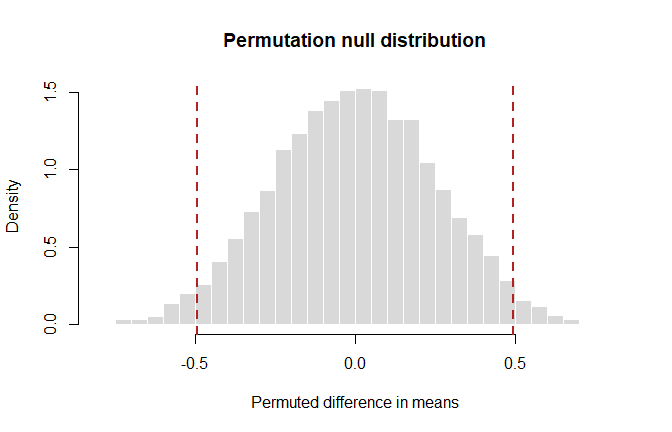
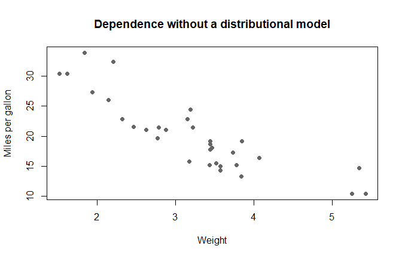

# Permutation Tests
George Oikonomidis

- [Aim](#aim)
- [Two-sample permutation test](#two-sample-permutation-test)
- [Exact versus Monte Carlo
  permutation](#exact-versus-monte-carlo-permutation)
- [Multivariate energy test](#multivariate-energy-test)
- [Distance correlation test of
  independence](#distance-correlation-test-of-independence)
- [Interpretation checklist](#interpretation-checklist)

## Aim

Permutation tests approximate a null distribution by rearranging labels
without replacement. They require an exchangeability argument under the
null hypothesis, not merely repeated random shuffling.

``` r
set.seed(2026)
options(digits = 5)
```

## Two-sample permutation test

Compare the control and treatment-2 groups in the built-in `PlantGrowth`
data. The statistic is the difference in sample means:

$$T=\overline X_{\mathrm{trt2}}-\overline X_{\mathrm{ctrl}}.$$

``` r
plant_data <- subset(PlantGrowth, group %in% c("ctrl", "trt2"))
plant_data$group <- droplevels(plant_data$group)

observed_difference <- with(
  plant_data,
  mean(weight[group == "trt2"]) - mean(weight[group == "ctrl"])
)

observed_difference
```

    [1] 0.494

Under equal distributions, the group labels are exchangeable while group
sizes remain fixed.

``` r
permutation_mean_difference <- function(values, labels, B = 9999) {
  observed <- mean(values[labels == "trt2"]) -
    mean(values[labels == "ctrl"])

  replicates <- numeric(B)

  for (b in seq_len(B)) {
    permuted_labels <- sample(labels, replace = FALSE)
    replicates[b] <- mean(values[permuted_labels == "trt2"]) -
      mean(values[permuted_labels == "ctrl"])
  }

  p_value <- (1 + sum(abs(replicates) >= abs(observed))) / (B + 1)

  list(
    statistic = observed,
    replicates = replicates,
    p_value = p_value
  )
}

set.seed(2026)
plant_permutation <- permutation_mean_difference(
  plant_data$weight,
  plant_data$group
)

c(
  observed_statistic = plant_permutation$statistic,
  permutation_p_value = plant_permutation$p_value,
  t_test_p_value = t.test(weight ~ group, data = plant_data)$p.value,
  wilcoxon_p_value = wilcox.test(
    weight ~ group,
    data = plant_data,
    exact = FALSE
  )$p.value
)
```

     observed_statistic permutation_p_value      t_test_p_value    wilcoxon_p_value 
               0.494000            0.045300            0.047899            0.064022 

The plus-one correction prevents a Monte Carlo permutation p-value from
being reported as zero.

``` r
hist(
  plant_permutation$replicates,
  probability = TRUE,
  breaks = 35,
  col = "grey85",
  border = "white",
  xlab = "Permuted difference in means",
  main = "Permutation null distribution"
)
abline(
  v = c(-abs(observed_difference), abs(observed_difference)),
  col = "firebrick",
  lwd = 2,
  lty = 2
)
```



## Exact versus Monte Carlo permutation

With 10 observations in each group, the number of distinct label
allocations is

$${20\choose10}=184756.$$

This is still manageable, but it grows rapidly. The Monte Carlo version
samples allocations and reports simulation uncertainty.

``` r
monte_carlo_p <- plant_permutation$p_value
monte_carlo_se <- sqrt(
  monte_carlo_p * (1 - monte_carlo_p) /
    (length(plant_permutation$replicates) + 1)
)

c(
  possible_allocations = choose(20, 10),
  estimated_p_value = monte_carlo_p,
  monte_carlo_standard_error = monte_carlo_se
)
```

          possible_allocations          estimated_p_value 
                    1.8476e+05                 4.5300e-02 
    monte_carlo_standard_error 
                    2.0796e-03 

## Multivariate energy test

For two multivariate samples $X_1,\ldots,X_n$ and $Y_1,\ldots,Y_m$, the
sample energy distance combines between-sample and within-sample
Euclidean distances:

$$\mathcal E_{n,m}
=\frac{2}{nm}\sum_{i,j}\lVert X_i-Y_j\rVert
-\frac{1}{n^2}\sum_{i,i'}\lVert X_i-X_{i'}\rVert
-\frac{1}{m^2}\sum_{j,j'}\lVert Y_j-Y_{j'}\rVert.$$

Use the four standardized iris measurements to compare `setosa` and
`versicolor`.

``` r
iris_two_species <- subset(
  iris,
  Species %in% c("setosa", "versicolor")
)
iris_two_species$Species <- droplevels(iris_two_species$Species)
iris_measurements <- scale(iris_two_species[, 1:4])
```

``` r
mean_cross_distance <- function(x, y) {
  combined <- rbind(x, y)
  distance_matrix <- as.matrix(dist(combined))
  nx <- nrow(x)
  mean(distance_matrix[seq_len(nx), nx + seq_len(nrow(y))])
}

energy_distance <- function(x, y) {
  2 * mean_cross_distance(x, y) -
    mean(as.matrix(dist(x))) -
    mean(as.matrix(dist(y)))
}

energy_permutation_test <- function(data, labels, B = 999) {
  first_level <- levels(labels)[1]
  observed <- energy_distance(
    data[labels == first_level, , drop = FALSE],
    data[labels != first_level, , drop = FALSE]
  )

  replicates <- numeric(B)

  for (b in seq_len(B)) {
    permuted_labels <- sample(labels, replace = FALSE)
    replicates[b] <- energy_distance(
      data[permuted_labels == first_level, , drop = FALSE],
      data[permuted_labels != first_level, , drop = FALSE]
    )
  }

  list(
    statistic = observed,
    p_value = (1 + sum(replicates >= observed)) / (B + 1),
    replicates = replicates
  )
}

set.seed(2026)
iris_energy_test <- energy_permutation_test(
  iris_measurements,
  iris_two_species$Species,
  B = 999
)

c(
  energy_statistic = iris_energy_test$statistic,
  permutation_p_value = iris_energy_test$p_value
)
```

       energy_statistic permutation_p_value 
                 4.6741              0.0010 

Energy distance compares entire multivariate distributions, not only
their mean vectors.

## Distance correlation test of independence

Distance correlation is zero at the population level only under
independence, provided the required moments exist. A permutation test
breaks the pairing between $X$ and $Y$ while preserving their marginal
samples.

``` r
double_center_distances <- function(x) {
  distance_matrix <- as.matrix(dist(as.matrix(x)))
  sweep(
    sweep(distance_matrix, 1, rowMeans(distance_matrix)),
    2,
    colMeans(distance_matrix)
  ) + mean(distance_matrix)
}

distance_correlation <- function(x, y) {
  x_centered <- double_center_distances(x)
  y_centered <- double_center_distances(y)

  squared_covariance <- mean(x_centered * y_centered)
  squared_variance_x <- mean(x_centered^2)
  squared_variance_y <- mean(y_centered^2)

  sqrt(
    squared_covariance /
      sqrt(squared_variance_x * squared_variance_y)
  )
}

distance_correlation_test <- function(x, y, B = 1999) {
  observed <- distance_correlation(x, y)
  replicates <- numeric(B)

  for (b in seq_len(B)) {
    replicates[b] <- distance_correlation(
      x,
      y[sample(seq_along(y))]
    )
  }

  list(
    statistic = observed,
    p_value = (1 + sum(replicates >= observed)) / (B + 1),
    replicates = replicates
  )
}

set.seed(2026)
mtcars_dependence <- distance_correlation_test(
  mtcars$wt,
  mtcars$mpg,
  B = 1999
)

c(
  distance_correlation = mtcars_dependence$statistic,
  permutation_p_value = mtcars_dependence$p_value
)
```

    distance_correlation  permutation_p_value 
                 0.87102              0.00050 

``` r
plot(
  mtcars$wt,
  mtcars$mpg,
  pch = 19,
  col = "grey40",
  xlab = "Weight",
  ylab = "Miles per gallon",
  main = "Dependence without a distributional model"
)
```



## Interpretation checklist

- State exactly what is exchangeable under $H_0$.
- Preserve the original sample sizes or pairing structure.
- Use a statistic whose extreme direction is defined in advance.
- Report the number of permutations and Monte Carlo uncertainty.
- Do not interpret a small p-value as an effect-size measure.
