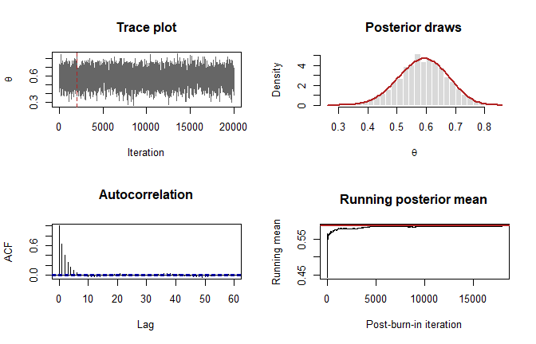
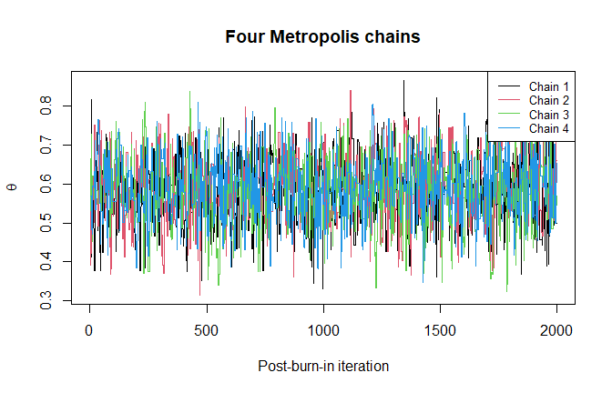
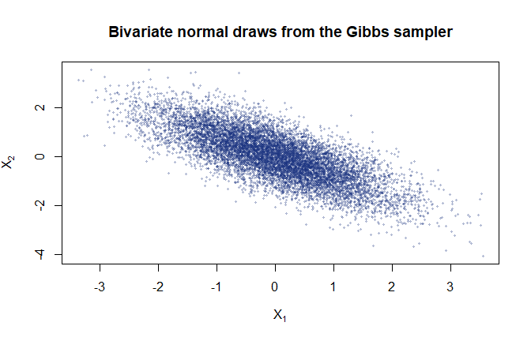

# Markov Chain Monte Carlo from Scratch
George Oikonomidis

- [Aim](#aim)
- [Beta-binomial posterior](#beta-binomial-posterior)
- [Random-walk Metropolis](#random-walk-metropolis)
- [Burn-in and posterior summary](#burn-in-and-posterior-summary)
- [Proposal-scale comparison](#proposal-scale-comparison)
- [Multiple chains and Gelman-Rubin
  diagnostic](#multiple-chains-and-gelman-rubin-diagnostic)
- [Gibbs sampler for a bivariate normal
  target](#gibbs-sampler-for-a-bivariate-normal-target)
- [Practical checklist](#practical-checklist)

## Aim

MCMC constructs a Markov chain whose stationary distribution is a target
density. Unlike ordinary Monte Carlo samples, successive draws are
dependent, so convergence and autocorrelation must be assessed
explicitly.

``` r
set.seed(2026)
options(digits = 5)
```

## Beta-binomial posterior

Suppose $y=18$ successes are observed in $n=30$ Bernoulli trials. With
prior

$$\theta\sim\operatorname{Beta}(2,2),$$

the posterior is available analytically:

$$\theta\mid y\sim\operatorname{Beta}(20,14).$$

This known answer provides a controlled check of an MCMC implementation.

``` r
successes <- 18
trials <- 30
prior_shape1 <- 2
prior_shape2 <- 2

posterior_shape1 <- prior_shape1 + successes
posterior_shape2 <- prior_shape2 + trials - successes

c(
  exact_mean = posterior_shape1 /
    (posterior_shape1 + posterior_shape2),
  exact_lower_95 = qbeta(
    0.025,
    posterior_shape1,
    posterior_shape2
  ),
  exact_upper_95 = qbeta(
    0.975,
    posterior_shape1,
    posterior_shape2
  )
)
```

        exact_mean exact_lower_95 exact_upper_95 
           0.58824        0.42139        0.74524 

## Random-walk Metropolis

Work on the unconstrained logit scale

$$\eta=\log\frac{\theta}{1-\theta},
\qquad \theta=\frac{e^\eta}{1+e^\eta}.$$

The target density on the $\eta$ scale includes the Jacobian
$\theta(1-\theta)$.

``` r
log_target_eta <- function(eta, shape1, shape2) {
  theta <- plogis(eta)
  dbeta(theta, shape1, shape2, log = TRUE) +
    log(theta) + log1p(-theta)
}

random_walk_metropolis <- function(iterations, initial_theta,
                                   proposal_sd, shape1, shape2) {
  eta <- numeric(iterations)
  accepted <- logical(iterations)
  eta[1] <- qlogis(initial_theta)

  for (iteration in 2:iterations) {
    proposal <- rnorm(1, mean = eta[iteration - 1], sd = proposal_sd)
    log_acceptance_ratio <-
      log_target_eta(proposal, shape1, shape2) -
      log_target_eta(eta[iteration - 1], shape1, shape2)

    if (log(runif(1)) <= min(0, log_acceptance_ratio)) {
      eta[iteration] <- proposal
      accepted[iteration] <- TRUE
    } else {
      eta[iteration] <- eta[iteration - 1]
    }
  }

  list(
    theta = plogis(eta),
    eta = eta,
    acceptance_rate = mean(accepted[-1])
  )
}

set.seed(2026)
metropolis_chain <- random_walk_metropolis(
  iterations = 20000,
  initial_theta = 0.5,
  proposal_sd = 1,
  shape1 = posterior_shape1,
  shape2 = posterior_shape2
)

metropolis_chain$acceptance_rate
```

    [1] 0.38607

## Burn-in and posterior summary

``` r
burn_in <- 2000
posterior_draws <- metropolis_chain$theta[-seq_len(burn_in)]

data.frame(
  Quantity = c("Mean", "2.5% quantile", "97.5% quantile"),
  MCMC = c(
    mean(posterior_draws),
    quantile(posterior_draws, 0.025),
    quantile(posterior_draws, 0.975)
  ),
  Exact = c(
    posterior_shape1 / (posterior_shape1 + posterior_shape2),
    qbeta(0.025, posterior_shape1, posterior_shape2),
    qbeta(0.975, posterior_shape1, posterior_shape2)
  )
)
```

                Quantity    MCMC   Exact
                    Mean 0.58731 0.58824
    2.5%   2.5% quantile 0.41885 0.42139
    97.5% 97.5% quantile 0.74667 0.74524

``` r
par(mfrow = c(2, 2))
plot(
  metropolis_chain$theta,
  type = "l",
  col = "grey40",
  xlab = "Iteration",
  ylab = expression(theta),
  main = "Trace plot"
)
abline(v = burn_in, lty = 2, col = "firebrick")

hist(
  posterior_draws,
  probability = TRUE,
  breaks = 40,
  col = "grey85",
  border = "white",
  xlab = expression(theta),
  main = "Posterior draws"
)
curve(
  dbeta(x, posterior_shape1, posterior_shape2),
  add = TRUE,
  col = "firebrick",
  lwd = 2
)

acf(posterior_draws, lag.max = 60, main = "Autocorrelation")
plot(
  cumsum(posterior_draws) / seq_along(posterior_draws),
  type = "l",
  xlab = "Post-burn-in iteration",
  ylab = "Running mean",
  main = "Running posterior mean"
)
abline(
  h = posterior_shape1 / (posterior_shape1 + posterior_shape2),
  col = "firebrick",
  lwd = 2
)
```



``` r
par(mfrow = c(1, 1))
```

## Proposal-scale comparison

Very small steps produce high acceptance but strong autocorrelation.
Very large steps produce many rejections. Both reduce efficiency.

``` r
effective_sample_size <- function(x, maximum_lag = 1000) {
  autocorrelations <- as.numeric(
    acf(x, lag.max = maximum_lag, plot = FALSE)$acf
  )[-1]

  first_nonpositive <- which(autocorrelations <= 0)[1]
  if (!is.na(first_nonpositive)) {
    autocorrelations <- autocorrelations[
      seq_len(first_nonpositive - 1)
    ]
  }

  length(x) / (1 + 2 * sum(autocorrelations))
}

proposal_scales <- c(0.15, 1, 4)
scale_results <- data.frame()

for (proposal_scale in proposal_scales) {
  chain <- random_walk_metropolis(
    iterations = 12000,
    initial_theta = 0.5,
    proposal_sd = proposal_scale,
    shape1 = posterior_shape1,
    shape2 = posterior_shape2
  )
  draws <- chain$theta[-seq_len(2000)]

  scale_results <- rbind(
    scale_results,
    data.frame(
      Proposal_SD = proposal_scale,
      Acceptance_Rate = chain$acceptance_rate,
      Posterior_Mean = mean(draws),
      Effective_Sample_Size = effective_sample_size(draws)
    )
  )
}

scale_results
```

      Proposal_SD Acceptance_Rate Posterior_Mean Effective_Sample_Size
    1        0.15         0.86541        0.58638                259.16
    2        1.00         0.38420        0.59066               2110.33
    3        4.00         0.10843        0.58623                644.04

Effective sample size translates a correlated chain into an approximate
number of independent draws carrying similar information.

## Multiple chains and Gelman-Rubin diagnostic

Run four chains from dispersed starting points. For a matrix with
iterations in rows and chains in columns,

$$\widehat R=\sqrt{\frac{\widehat V}{W}},$$

where $W$ is within-chain variance and $\widehat V$ combines within- and
between-chain variation.

``` r
gelman_rubin_rhat <- function(chains) {
  iterations <- nrow(chains)
  within_variance <- mean(apply(chains, 2, var))
  between_variance <- iterations * var(colMeans(chains))
  pooled_variance <-
    (iterations - 1) / iterations * within_variance +
    between_variance / iterations

  sqrt(pooled_variance / within_variance)
}

starting_values <- c(0.05, 0.25, 0.75, 0.95)
multiple_chains <- matrix(
  NA_real_,
  nrow = 10000,
  ncol = length(starting_values)
)

set.seed(2026)
for (chain_number in seq_along(starting_values)) {
  chain <- random_walk_metropolis(
    iterations = 12000,
    initial_theta = starting_values[chain_number],
    proposal_sd = 1,
    shape1 = posterior_shape1,
    shape2 = posterior_shape2
  )
  multiple_chains[, chain_number] <- chain$theta[-seq_len(2000)]
}

c(
  R_hat = gelman_rubin_rhat(multiple_chains),
  minimum_chain_mean = min(colMeans(multiple_chains)),
  maximum_chain_mean = max(colMeans(multiple_chains))
)
```

                 R_hat minimum_chain_mean maximum_chain_mean 
               1.00012            0.58755            0.59086 

``` r
matplot(
  multiple_chains[1:2000, ],
  type = "l",
  lty = 1,
  col = 1:4,
  xlab = "Post-burn-in iteration",
  ylab = expression(theta),
  main = "Four Metropolis chains"
)
legend(
  "topright",
  legend = paste("Chain", 1:4),
  col = 1:4,
  lty = 1,
  cex = 0.8
)
```



An $\widehat R$ near one is reassuring but not sufficient by itself.
Trace plots, autocorrelation, effective sample size, and sensitivity to
starting values should be considered together.

## Gibbs sampler for a bivariate normal target

Let

$$\begin{pmatrix}X_1\\X_2\end{pmatrix}
\sim N_2\left[
\begin{pmatrix}0\\0\end{pmatrix},
\begin{pmatrix}1&\rho\\\rho&1\end{pmatrix}
\right],$$

with $\rho=-0.75$. The full conditional distributions are

$$X_1\mid X_2=x_2\sim N(\rho x_2,1-\rho^2),$$

$$X_2\mid X_1=x_1\sim N(\rho x_1,1-\rho^2).$$

``` r
gibbs_bivariate_normal <- function(iterations, rho, initial = c(0, 0)) {
  draws <- matrix(
    NA_real_,
    nrow = iterations,
    ncol = 2,
    dimnames = list(NULL, c("X1", "X2"))
  )
  draws[1, ] <- initial
  conditional_sd <- sqrt(1 - rho^2)

  for (iteration in 2:iterations) {
    draws[iteration, "X1"] <- rnorm(
      1,
      mean = rho * draws[iteration - 1, "X2"],
      sd = conditional_sd
    )
    draws[iteration, "X2"] <- rnorm(
      1,
      mean = rho * draws[iteration, "X1"],
      sd = conditional_sd
    )
  }

  draws
}

set.seed(2026)
gibbs_chain <- gibbs_bivariate_normal(
  iterations = 12000,
  rho = -0.75
)
gibbs_draws <- gibbs_chain[-seq_len(2000), ]

data.frame(
  Quantity = c("Mean X1", "Mean X2", "Var X1", "Var X2", "Correlation"),
  Empirical = c(
    colMeans(gibbs_draws),
    apply(gibbs_draws, 2, var),
    cor(gibbs_draws)[1, 2]
  ),
  Target = c(0, 0, 1, 1, -0.75)
)
```

         Quantity Empirical Target
    1     Mean X1 -0.014673   0.00
    2     Mean X2  0.027280   0.00
    3      Var X1  1.031329   1.00
    4      Var X2  1.037804   1.00
    5 Correlation -0.755708  -0.75

``` r
plot(
  gibbs_draws,
  pch = 19,
  cex = 0.35,
  col = rgb(0.1, 0.2, 0.5, 0.25),
  xlab = expression(X[1]),
  ylab = expression(X[2]),
  main = "Bivariate normal draws from the Gibbs sampler"
)
```



## Practical checklist

- Compute acceptance rates for Metropolis-Hastings samplers.
- Inspect several chains from dispersed starting points.
- Report burn-in and retained iterations explicitly.
- Examine trace plots, autocorrelation, effective sample size, and
  $\widehat R$.
- Compare with an analytical result when one is available.
- Never treat dependent MCMC draws as an equally sized independent
  sample.
