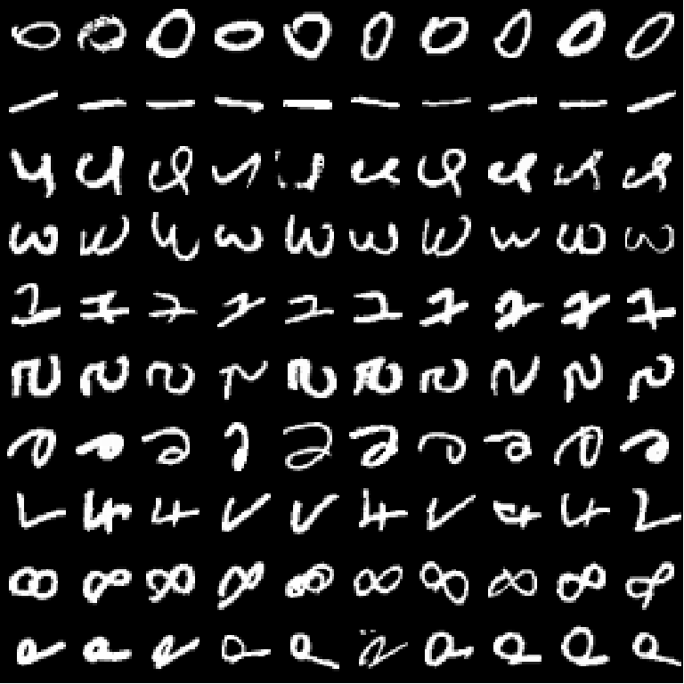
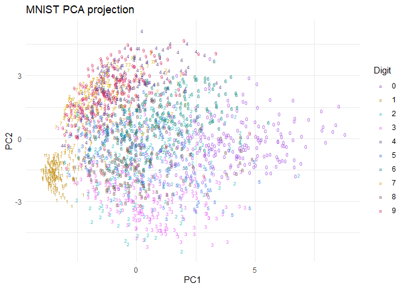
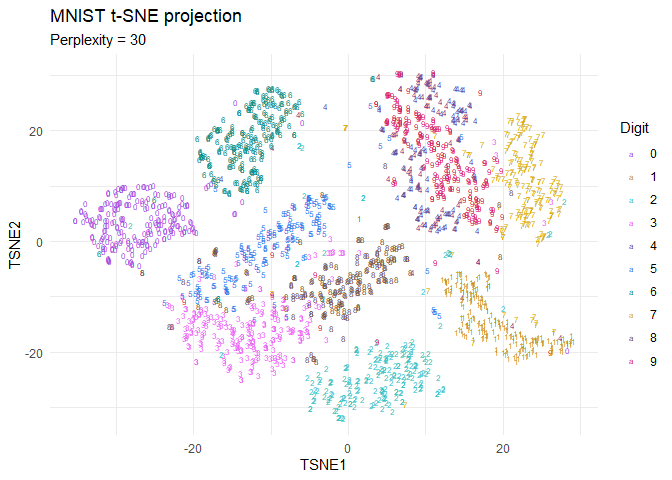

# MNIST: PCA and t-SNE


- [<span class="toc-section-number">1</span> Setup](#setup)
- [<span class="toc-section-number">2</span> Load MNIST](#load-mnist)
- [<span class="toc-section-number">3</span> Ten images for every
  digit](#ten-images-for-every-digit)
- [<span class="toc-section-number">4</span> Prepare a common
  sample](#prepare-a-common-sample)
- [<span class="toc-section-number">5</span> Principal component
  analysis](#principal-component-analysis)
- [<span class="toc-section-number">6</span> t-SNE](#t-sne)
- [<span class="toc-section-number">7</span>
  Interpretation](#interpretation)

This notebook compares PCA and t-SNE on the MNIST test set. The same
random sample is used for both projections, so their visual comparison
is based on identical observations.

## Setup

Install `keras3` and its TensorFlow backend once, outside this notebook:

``` r
install.packages("keras3")
keras3::install_keras(backend = "tensorflow")
install.packages(c("Rtsne", "ggplot2"))
```

``` r
required_packages <- c("keras3", "Rtsne", "ggplot2")
missing_packages <- required_packages[
  !vapply(required_packages, requireNamespace, logical(1), quietly = TRUE)
]

if (length(missing_packages) > 0) {
  stop("Install the missing packages: ", paste(missing_packages, collapse = ", "))
}

library(keras3)
library(Rtsne)
library(ggplot2)
```

## Load MNIST

``` r
mnist <- dataset_mnist()
```

    Error in python_config_impl(python) : 
      Error 103 occurred running C:/Users/zedax/Documents/.virtualenvs/r-tensorflow/Scripts/python.exe: 

    Error in python_config_impl(python) : 
      Error 103 occurred running C:/Users/zedax/Documents/.virtualenvs/r-tensorflow/Scripts/python.exe: 

    Error in python_config_impl(python) : 
      Error 103 occurred running C:/Users/zedax/Documents/.virtualenvs/r-tensorflow/Scripts/python.exe: 

    Error in python_config_impl(python) : 
      Error 103 occurred running C:/Users/zedax/Documents/.virtualenvs/r-tensorflow/Scripts/python.exe: 

``` r
mnist_digits <- mnist$test$x
labels <- mnist$test$y

dim(mnist_digits)
```

    [1] 10000    28    28

``` r
table(labels)
```

    labels
       0    1    2    3    4    5    6    7    8    9 
     980 1135 1032 1010  982  892  958 1028  974 1009 

## Ten images for every digit

``` r
set.seed(12993)
par(mfrow = c(10, 10), mar = c(0, 0, 0, 0))

for (digit in 0:9) {
  digit_rows <- which(labels == digit)
  selected_rows <- sample(digit_rows, 10)

  for (row in selected_rows) {
    image_data <- mnist_digits[row, , ]
    image(
      1:28,
      1:28,
      image_data[, 28:1],
      col = gray((0:255) / 255),
      axes = FALSE
    )
  }
}
```



``` r
par(mfrow = c(1, 1))
```

## Prepare a common sample

``` r
digits_matrix <- t(apply(mnist_digits, 1, as.vector)) / 255
digits_matrix <- digits_matrix[, apply(digits_matrix, 2, var) > 0]

set.seed(42)
sample_rows <- sample(seq_len(nrow(digits_matrix)), 2000)
sample_matrix <- digits_matrix[sample_rows, ]
sample_labels <- factor(labels[sample_rows])

digit_colors <- c(
  "0" = "#A047DE", "1" = "#C58F10", "2" = "#33BFC4",
  "3" = "#E95AF5", "4" = "#674492", "5" = "#2E75E8",
  "6" = "#00897B", "7" = "#D6A900", "8" = "#6D4C41",
  "9" = "#D81B60"
)
```

## Principal component analysis

PCA finds orthogonal linear directions that retain as much sample
variance as possible.

``` r
mnist_pca <- prcomp(sample_matrix, center = TRUE, scale. = FALSE, rank. = 2)

pca_data <- data.frame(
  PC1 = mnist_pca$x[, 1],
  PC2 = mnist_pca$x[, 2],
  Digit = sample_labels
)

ggplot(pca_data, aes(x = PC1, y = PC2, color = Digit, label = Digit)) +
  geom_text(size = 2) +
  scale_color_manual(values = digit_colors) +
  labs(title = "MNIST PCA projection") +
  theme_minimal()
```



``` r
explained_variance <- mnist_pca$sdev^2 / sum(mnist_pca$sdev^2)
round(100 * explained_variance[1:2], 2)
```

    [1] 10.17  7.65

The first two principal components summarize global linear variation,
but several digit classes overlap in the projection.

## t-SNE

t-SNE converts pairwise neighbourhood relationships in the original
space into probabilities. For observations $x_i$ and $x_j$, the
symmetrized high-dimensional similarity is

$$p_{ij} = \frac{p_{j\mid i} + p_{i\mid j}}{2n}.$$

In two dimensions it uses a Student $t$ distribution,

$$q_{ij} =
\frac{(1 + \lVert y_i-y_j\rVert^2)^{-1}}
{\sum_{k\ne l}(1 + \lVert y_k-y_l\rVert^2)^{-1}},$$

and minimizes

$$KL(P\Vert Q)=\sum_{i\ne j}p_{ij}\log\left(\frac{p_{ij}}{q_{ij}}\right).$$

``` r
set.seed(42)

tsne_result <- Rtsne(
  sample_matrix,
  dims = 2,
  perplexity = 30,
  max_iter = 1000,
  pca = TRUE,
  check_duplicates = FALSE,
  verbose = FALSE
)

tsne_data <- data.frame(
  TSNE1 = tsne_result$Y[, 1],
  TSNE2 = tsne_result$Y[, 2],
  Digit = sample_labels
)

ggplot(tsne_data, aes(x = TSNE1, y = TSNE2, color = Digit, label = Digit)) +
  geom_text(size = 2) +
  scale_color_manual(values = digit_colors) +
  labs(title = "MNIST t-SNE projection", subtitle = "Perplexity = 30") +
  theme_minimal()
```



## Interpretation

t-SNE separates local digit neighbourhoods more clearly than the
two-component PCA projection. This does not prove that every visible
island is a stable or natural cluster: t-SNE is stochastic, emphasizes
local structure, and does not preserve global distances between
separated groups. PCA remains useful for a fast, deterministic summary
of global linear variation.
