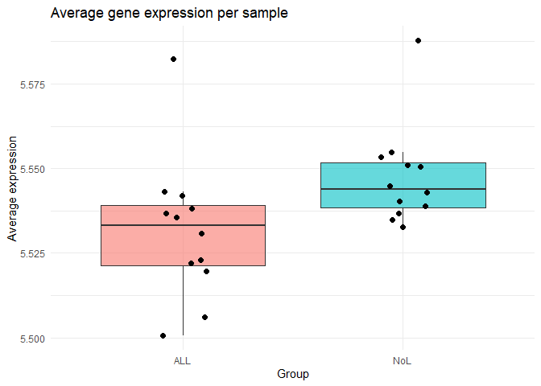
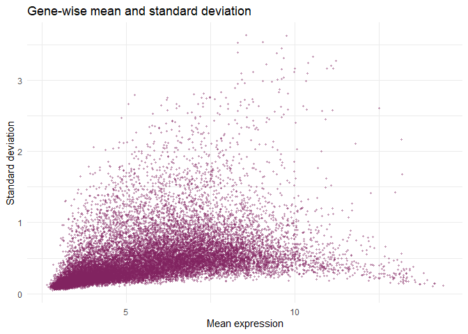
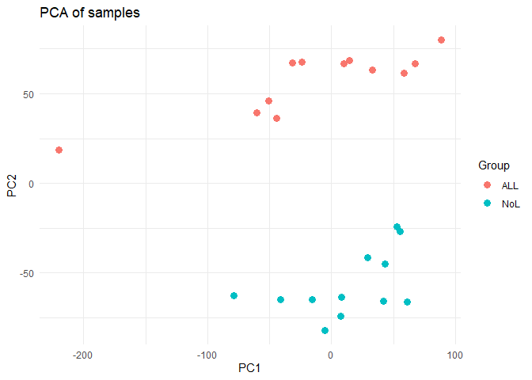
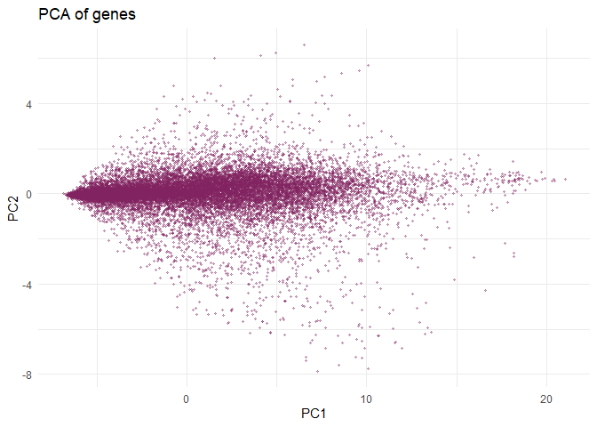
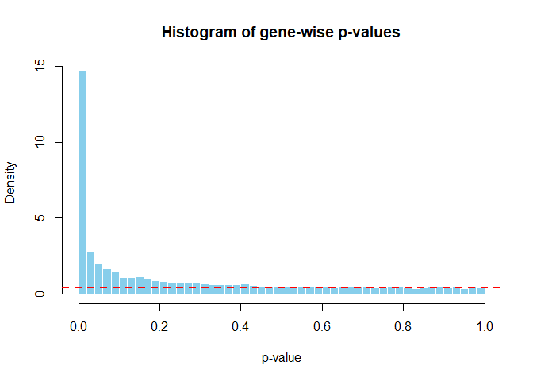
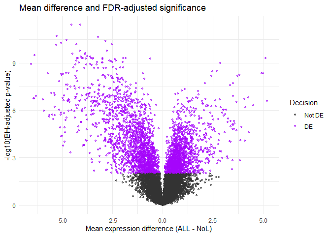
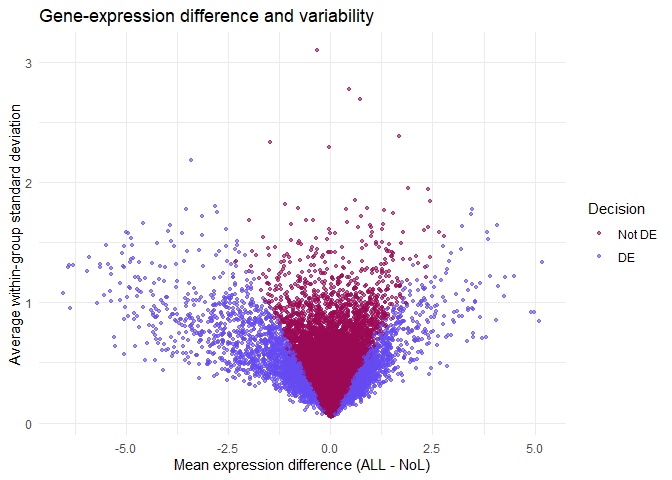
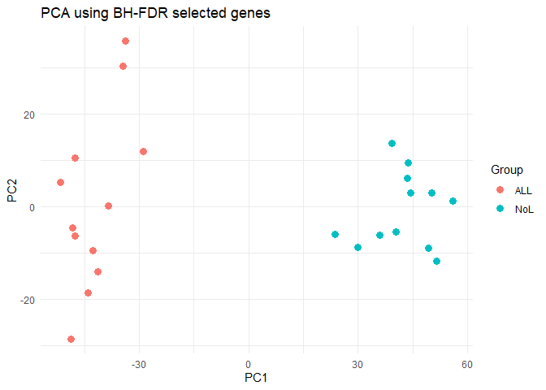

# Leukemia Gene Expression and Multiple Testing


- [<span class="toc-section-number">1</span> Setup](#setup)
- [<span class="toc-section-number">2</span> Select ALL and NoL
  samples](#select-all-and-nol-samples)
- [<span class="toc-section-number">3</span> Descriptive
  analysis](#descriptive-analysis)
- [<span class="toc-section-number">4</span> PCA of samples and
  genes](#pca-of-samples-and-genes)
- [<span class="toc-section-number">5</span> Gene-wise two-sample
  t-tests](#gene-wise-two-sample-t-tests)
- [<span class="toc-section-number">6</span> FWER, FDR, and pFDR
  control](#fwer-fdr-and-pfdr-control)
- [<span class="toc-section-number">7</span> Visualization using BH-FDR
  decisions](#visualization-using-bh-fdr-decisions)
- [<span class="toc-section-number">8</span> Exploratory PCA using
  selected genes](#exploratory-pca-using-selected-genes)

This notebook compares gene expression between the ALL and non-leukemia
groups. It follows the original assignment workflow while correcting the
order of the q-value calculations, the rejection counts, and the
distinction between FDR and pFDR.

## Setup

Install the Bioconductor packages once, outside the notebook:

``` r
if (!requireNamespace("BiocManager", quietly = TRUE)) {
  install.packages("BiocManager")
}

BiocManager::install(c("leukemiasEset", "qvalue"))
install.packages(c("ggplot2", "knitr"))
```

``` r
library(leukemiasEset)
library(qvalue)
library(Biobase)
library(ggplot2)
library(knitr)
```

## Select ALL and NoL samples

``` r
data(leukemiasEset)

selected_samples <- leukemiasEset$LeukemiaType %in% c("ALL", "NoL")
selected_data <- leukemiasEset[, selected_samples]

expression_matrix <- exprs(selected_data)
groups <- factor(selected_data$LeukemiaType, levels = c("ALL", "NoL"))

dim(expression_matrix)
```

    [1] 20172    24

``` r
table(groups)
```

    groups
    ALL NoL 
     12  12 

The analysis contains 20,172 genes and 24 samples: 12 ALL and 12 NoL
observations.

## Descriptive analysis

``` r
sample_average <- colMeans(expression_matrix)

average_data <- data.frame(
  Sample = colnames(expression_matrix),
  AverageExpression = sample_average,
  Group = groups
)

ggplot(average_data, aes(x = Group, y = AverageExpression, fill = Group)) +
  geom_boxplot(outlier.shape = NA, alpha = 0.6) +
  geom_jitter(width = 0.12, size = 2) +
  labs(
    title = "Average gene expression per sample",
    x = "Group",
    y = "Average expression"
  ) +
  theme_minimal() +
  theme(legend.position = "none")
```



``` r
by(average_data$AverageExpression, average_data$Group, summary)
```

    average_data$Group: ALL
       Min. 1st Qu.  Median    Mean 3rd Qu.    Max. 
      5.501   5.521   5.533   5.532   5.539   5.582 
    ------------------------------------------------------------ 
    average_data$Group: NoL
       Min. 1st Qu.  Median    Mean 3rd Qu.    Max. 
      5.533   5.538   5.544   5.547   5.552   5.588 

``` r
gene_mean <- rowMeans(expression_matrix)
gene_sd <- apply(expression_matrix, 1, sd)

gene_variability <- data.frame(Mean = gene_mean, SD = gene_sd)

ggplot(gene_variability, aes(x = Mean, y = SD)) +
  geom_point(alpha = 0.35, size = 0.8, color = "#80225F") +
  labs(
    title = "Gene-wise mean and standard deviation",
    x = "Mean expression",
    y = "Standard deviation"
  ) +
  theme_minimal()
```



## PCA of samples and genes

``` r
sample_pca <- prcomp(t(expression_matrix), center = TRUE, scale. = TRUE, rank. = 2)
gene_pca <- prcomp(expression_matrix, center = TRUE, scale. = TRUE, rank. = 2)

sample_pca_data <- data.frame(
  PC1 = sample_pca$x[, 1],
  PC2 = sample_pca$x[, 2],
  Group = groups
)

gene_pca_data <- data.frame(
  PC1 = gene_pca$x[, 1],
  PC2 = gene_pca$x[, 2]
)
```

``` r
ggplot(sample_pca_data, aes(x = PC1, y = PC2, color = Group)) +
  geom_point(size = 3) +
  labs(title = "PCA of samples") +
  theme_minimal()
```



``` r
ggplot(gene_pca_data, aes(x = PC1, y = PC2)) +
  geom_point(size = 0.7, alpha = 0.35, color = "#80225F") +
  labs(title = "PCA of genes") +
  theme_minimal()
```



The sample-level projection is the relevant view for comparing patient
groups. The gene-level projection instead summarizes relationships among
genes across the 24 samples.

## Gene-wise two-sample t-tests

For every gene $g$,

$$H_{0g}: \mu_{g,ALL}=\mu_{g,NoL}
\qquad\text{against}\qquad
H_{1g}: \mu_{g,ALL}\ne\mu_{g,NoL}.$$

The assignment assumes independent samples, approximate normality, and
equal group variances.

``` r
p_values <- apply(expression_matrix, 1, function(gene_expression) {
  all_values <- gene_expression[groups == "ALL"]
  nol_values <- gene_expression[groups == "NoL"]
  t.test(all_values, nol_values, var.equal = TRUE)$p.value
})

qvalue_result <- qvalue(p_values)
q_values <- qvalue_result$qvalues
pi0 <- qvalue_result$pi0

pi0
```

    [1] 0.4321183

``` r
hist(
  p_values,
  breaks = 40,
  probability = TRUE,
  col = "skyblue",
  border = "white",
  main = "Histogram of gene-wise p-values",
  xlab = "p-value"
)
abline(h = pi0, col = "red", lwd = 2, lty = 2)
```



The horizontal line shows the estimated proportion of true null
hypotheses on the density scale.

## FWER, FDR, and pFDR control

``` r
alpha <- 0.01

bonferroni_p <- p.adjust(p_values, method = "bonferroni")
bh_p <- p.adjust(p_values, method = "BH")

fwer_rejected <- bonferroni_p < alpha
fdr_rejected <- bh_p < alpha
pfdr_rejected <- q_values < alpha

rejection_counts <- data.frame(
  Procedure = c("Bonferroni FWER", "Benjamini-Hochberg FDR", "Storey q-value / pFDR"),
  Rejected = c(
    sum(fwer_rejected),
    sum(fdr_rejected),
    sum(pfdr_rejected)
  ),
  NotRejected = c(
    sum(!fwer_rejected),
    sum(!fdr_rejected),
    sum(!pfdr_rejected)
  )
)

kable(rejection_counts, caption = "Decisions at alpha = 0.01")
```

| Procedure              | Rejected | NotRejected |
|:-----------------------|---------:|------------:|
| Bonferroni FWER        |      710 |       19462 |
| Benjamini-Hochberg FDR |     3319 |       16853 |
| Storey q-value / pFDR  |     4220 |       15952 |

Decisions at alpha = 0.01

`sum(rejected)` counts the discoveries directly. Applying a second
comparison such as `sum(rejected < alpha)` would instead count the
`FALSE` values.

## Visualization using BH-FDR decisions

Question 6 asks for visualization under FDR control, so the following
plots use the Benjamini-Hochberg decisions rather than q-value
decisions.

``` r
mean_all <- rowMeans(expression_matrix[, groups == "ALL"])
mean_nol <- rowMeans(expression_matrix[, groups == "NoL"])
sd_all <- apply(expression_matrix[, groups == "ALL"], 1, sd)
sd_nol <- apply(expression_matrix[, groups == "NoL"], 1, sd)

gene_results <- data.frame(
  MeanDifference = mean_all - mean_nol,
  MeanSD = (sd_all + sd_nol) / 2,
  NegativeLog10FDR = -log10(pmax(bh_p, .Machine$double.xmin)),
  Decision = factor(
    ifelse(fdr_rejected, "DE", "Not DE"),
    levels = c("Not DE", "DE")
  )
)
```

``` r
ggplot(gene_results, aes(x = MeanDifference, y = NegativeLog10FDR, color = Decision)) +
  geom_point(alpha = 0.6, size = 0.9) +
  scale_color_manual(values = c("Not DE" = "#333333", "DE" = "#A505FB")) +
  labs(
    title = "Mean difference and FDR-adjusted significance",
    x = "Mean expression difference (ALL - NoL)",
    y = "-log10(BH-adjusted p-value)"
  ) +
  theme_minimal()
```



``` r
ggplot(gene_results, aes(x = MeanDifference, y = MeanSD, color = Decision)) +
  geom_point(alpha = 0.6, size = 0.9) +
  scale_color_manual(values = c("Not DE" = "#9B0954", "DE" = "#6549F1")) +
  labs(
    title = "Gene-expression difference and variability",
    x = "Mean expression difference (ALL - NoL)",
    y = "Average within-group standard deviation"
  ) +
  theme_minimal()
```



## Exploratory PCA using selected genes

``` r
fdr_expression <- expression_matrix[fdr_rejected, , drop = FALSE]
selected_pca <- prcomp(t(fdr_expression), center = TRUE, scale. = TRUE, rank. = 2)

selected_pca_data <- data.frame(
  PC1 = selected_pca$x[, 1],
  PC2 = selected_pca$x[, 2],
  Group = groups
)

ggplot(selected_pca_data, aes(x = PC1, y = PC2, color = Group)) +
  geom_point(size = 3) +
  labs(title = "PCA using BH-FDR selected genes") +
  theme_minimal()
```



This final separation is exploratory. The same group labels were used
first to select the genes and then to construct the PCA, so the plot is
not an independent validation of classification performance.
