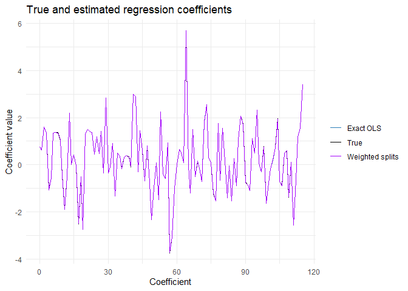

# Streaming Linear Regression


- [<span class="toc-section-number">1</span> Setup](#setup)
- [<span class="toc-section-number">2</span> Generate the synthetic file
  in chunks](#generate-the-synthetic-file-in-chunks)
- [<span class="toc-section-number">3</span> Recursive cross-products
  and random
  partitions](#recursive-cross-products-and-random-partitions)
- [<span class="toc-section-number">4</span> Exact streaming
  OLS](#exact-streaming-ols)
- [<span class="toc-section-number">5</span> Random-split
  estimates](#random-split-estimates)

This notebook estimates a linear regression model from a CSV file using
one chunk at a time. It implements both parts of the assignment:

1.  exact OLS from recursively accumulated cross-products;
2.  random-split estimates combined using inverse-variance weights.

The demonstration uses 20,000 observations so it can run comfortably on
a personal computer. Set `n <- 2000000` and increase `chunk_size` to
reproduce the full assignment scale.

## Setup

``` r
library(ggplot2)
library(knitr)
```

## Generate the synthetic file in chunks

``` r
set.seed(3622310)

p <- rpois(1, lambda = 120)
n <- 20000
chunk_size <- 2000
true_beta <- rt(p, df = 5)

output_file <- tempfile(fileext = ".csv")
connection <- file(output_file, open = "wt")

column_names <- c("y", paste0("x", 1:(p - 1)))
writeLines(paste(column_names, collapse = ","), connection)

rows_written <- 0

while (rows_written < n) {
  rows_now <- min(chunk_size, n - rows_written)
  x <- matrix(rnorm(rows_now * (p - 1)), nrow = rows_now)
  y <- as.numeric(true_beta[1] + x %*% true_beta[-1] + rnorm(rows_now))

  write.table(
    cbind(y, x),
    file = connection,
    sep = ",",
    row.names = FALSE,
    col.names = FALSE,
    quote = FALSE
  )

  rows_written <- rows_written + rows_now
}

close(connection)
file.info(output_file)$size / 1024^2
```

    [1] 40.18606

Only one generated chunk is held in memory at a time.

## Recursive cross-products and random partitions

For the exact estimator, every chunk contributes

$$X^TX = \sum_b X_b^TX_b,
\qquad
X^Ty = \sum_b X_b^Ty.$$

The split-specific matrices are accumulated at the same time. Rows are
assigned randomly to five partitions during streaming.

``` r
global_XtX <- matrix(0, nrow = p, ncol = p)
global_Xty <- matrix(0, nrow = p, ncol = 1)
global_yty <- 0
global_n <- 0

n_splits <- 5
split_XtX <- replicate(n_splits, matrix(0, p, p), simplify = FALSE)
split_Xty <- replicate(n_splits, matrix(0, p, 1), simplify = FALSE)
split_yty <- numeric(n_splits)
split_n <- integer(n_splits)

connection <- file(output_file, open = "rt")
header <- strsplit(readLines(connection, n = 1), ",")[[1]]

set.seed(3622311)

repeat {
  lines <- readLines(connection, n = chunk_size)
  if (length(lines) == 0) break

  chunk <- read.csv(text = lines, header = FALSE)
  names(chunk) <- header

  y <- as.matrix(chunk$y)
  X <- cbind(Intercept = 1, as.matrix(chunk[, -1, drop = FALSE]))

  global_XtX <- global_XtX + crossprod(X)
  global_Xty <- global_Xty + crossprod(X, y)
  global_yty <- global_yty + sum(y^2)
  global_n <- global_n + nrow(chunk)

  split_id <- sample.int(n_splits, nrow(chunk), replace = TRUE)

  for (split in 1:n_splits) {
    rows <- which(split_id == split)
    if (length(rows) == 0) next

    X_split <- X[rows, , drop = FALSE]
    y_split <- y[rows, , drop = FALSE]

    split_XtX[[split]] <- split_XtX[[split]] + crossprod(X_split)
    split_Xty[[split]] <- split_Xty[[split]] + crossprod(X_split, y_split)
    split_yty[split] <- split_yty[split] + sum(y_split^2)
    split_n[split] <- split_n[split] + length(rows)
  }
}

close(connection)

global_n
```

    [1] 20000

``` r
split_n
```

    [1] 4044 3995 3887 4119 3955

## Exact streaming OLS

``` r
global_beta <- solve(global_XtX, global_Xty)

global_sse <- as.numeric(
  global_yty -
    2 * t(global_beta) %*% global_Xty +
    t(global_beta) %*% global_XtX %*% global_beta
)

global_sigma2 <- global_sse / (global_n - p)
global_se <- sqrt(global_sigma2 * diag(solve(global_XtX)))

head(
  data.frame(
    Coefficient = 0:(p - 1),
    True = true_beta,
    Estimate = as.numeric(global_beta),
    StandardError = global_se
  ),
  10
) |>
  kable(digits = 4, caption = "First ten exact streaming OLS estimates")
```

|           | Coefficient |    True | Estimate | StandardError |
|:----------|------------:|--------:|---------:|--------------:|
| Intercept |           0 |  0.7601 |   0.7601 |         0.007 |
| x1        |           1 |  0.6230 |   0.6237 |         0.007 |
| x2        |           2 |  1.5998 |   1.6005 |         0.007 |
| x3        |           3 |  1.3493 |   1.3521 |         0.007 |
| x4        |           4 | -1.0575 |  -1.0686 |         0.007 |
| x5        |           5 | -0.5517 |  -0.5540 |         0.007 |
| x6        |           6 |  1.3557 |   1.3474 |         0.007 |
| x7        |           7 |  1.3768 |   1.3762 |         0.007 |
| x8        |           8 |  1.3635 |   1.3579 |         0.007 |
| x9        |           9 |  1.0494 |   1.0578 |         0.007 |

First ten exact streaming OLS estimates

## Random-split estimates

``` r
split_beta <- matrix(NA_real_, nrow = p, ncol = n_splits)
split_variance <- matrix(NA_real_, nrow = p, ncol = n_splits)

for (split in 1:n_splits) {
  beta_now <- solve(split_XtX[[split]], split_Xty[[split]])

  sse_now <- as.numeric(
    split_yty[split] -
      2 * t(beta_now) %*% split_Xty[[split]] +
      t(beta_now) %*% split_XtX[[split]] %*% beta_now
  )

  sigma2_now <- sse_now / (split_n[split] - p)

  split_beta[, split] <- beta_now
  split_variance[, split] <- sigma2_now * diag(solve(split_XtX[[split]]))
}

split_weights <- 1 / split_variance
meta_beta <- rowSums(split_weights * split_beta) / rowSums(split_weights)
mean_beta <- rowMeans(split_beta)
meta_se <- 1 / sqrt(rowSums(split_weights))
```

``` r
estimator_comparison <- data.frame(
  Estimator = c("Exact streaming OLS", "Inverse-variance split estimate", "Unweighted split mean"),
  RMSE_against_true_beta = c(
    sqrt(mean((as.numeric(global_beta) - true_beta)^2)),
    sqrt(mean((meta_beta - true_beta)^2)),
    sqrt(mean((mean_beta - true_beta)^2))
  )
)

kable(estimator_comparison, digits = 6, caption = "Estimator comparison")
```

| Estimator                       | RMSE_against_true_beta |
|:--------------------------------|-----------------------:|
| Exact streaming OLS             |               0.007034 |
| Inverse-variance split estimate |               0.006993 |
| Unweighted split mean           |               0.007006 |

Estimator comparison

``` r
coefficient_results <- data.frame(
  Coefficient = 0:(p - 1),
  True = true_beta,
  ExactOLS = as.numeric(global_beta),
  WeightedSplits = meta_beta,
  WeightedSE = meta_se
)

ggplot(coefficient_results, aes(x = Coefficient)) +
  geom_line(aes(y = True, color = "True"), linewidth = 0.7) +
  geom_line(aes(y = ExactOLS, color = "Exact OLS"), linewidth = 0.6) +
  geom_line(aes(y = WeightedSplits, color = "Weighted splits"), linewidth = 0.6) +
  scale_color_manual(values = c("True" = "black", "Exact OLS" = "#2C7FB8", "Weighted splits" = "#A505FB")) +
  labs(title = "True and estimated regression coefficients", y = "Coefficient value", color = NULL) +
  theme_minimal()
```



The recursively accumulated estimator is the exact OLS solution for the
complete file. The random-split estimator is an approximation and is
evaluated against both the exact estimator and the known simulation
coefficients.

``` r
unlink(output_file)
```
