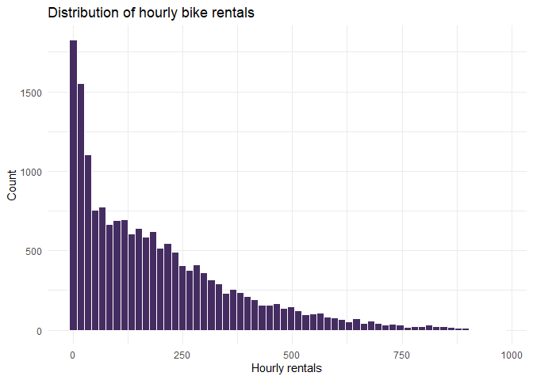
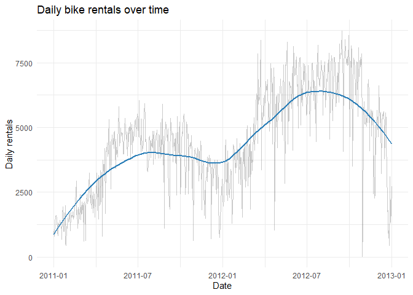
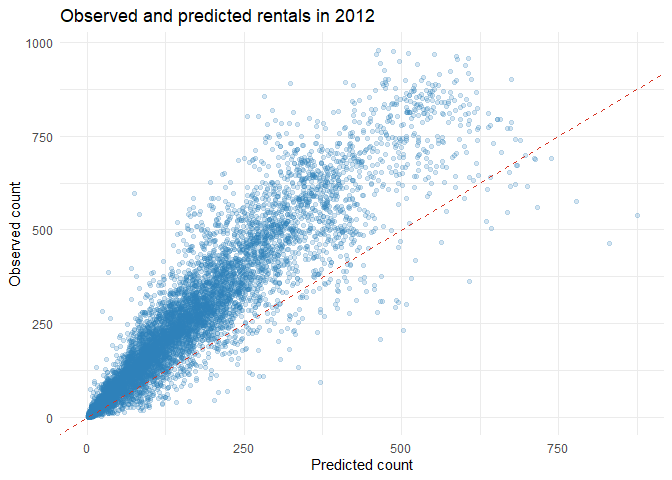
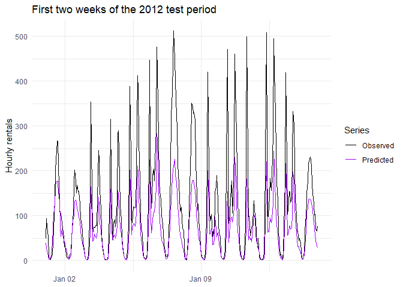

# Bike Sharing Count Models


- [<span class="toc-section-number">1</span> Setup and data
  validation](#setup-and-data-validation)
- [<span class="toc-section-number">2</span> Descriptive
  analysis](#descriptive-analysis)
- [<span class="toc-section-number">3</span> Prepare categorical
  predictors](#prepare-categorical-predictors)
- [<span class="toc-section-number">4</span> Poisson and
  overdispersion](#poisson-and-overdispersion)
- [<span class="toc-section-number">5</span>
  Quasi-Poisson](#quasi-poisson)
- [<span class="toc-section-number">6</span> Negative-binomial
  models](#negative-binomial-models)
- [<span class="toc-section-number">7</span> Temporal test-set
  evaluation](#temporal-test-set-evaluation)
- [<span class="toc-section-number">8</span> Limitations](#limitations)

This notebook models hourly Capital Bikeshare rentals using
environmental and seasonal predictors. It corrects the main limitation
of the original analysis: `casual` and `registered` are components of
the response because

$$cnt = casual + registered.$$

They are therefore excluded from every predictive model.

## Setup and data validation

``` r
required_packages <- c("ggplot2", "MASS", "knitr")
missing_packages <- required_packages[
  !vapply(required_packages, requireNamespace, logical(1), quietly = TRUE)
]

if (length(missing_packages) > 0) {
  stop("Install the missing packages: ", paste(missing_packages, collapse = ", "))
}

library(ggplot2)
library(MASS)
library(knitr)
```

``` r
hours <- read.csv(file.path("data", "hour.csv"))
hours$dteday <- as.Date(hours$dteday)

stopifnot(all(hours$cnt == hours$casual + hours$registered))
stopifnot(!anyNA(hours))

data.frame(
  Observations = nrow(hours),
  Variables = ncol(hours),
  StartDate = min(hours$dteday),
  EndDate = max(hours$dteday)
) |>
  kable(caption = "Dataset validation")
```

| Observations | Variables | StartDate  | EndDate    |
|-------------:|----------:|:-----------|:-----------|
|        17379 |        17 | 2011-01-01 | 2012-12-31 |

Dataset validation

## Descriptive analysis

``` r
ggplot(hours, aes(x = cnt)) +
  geom_histogram(bins = 60, fill = "#452D62", color = "white") +
  labs(title = "Distribution of hourly bike rentals", x = "Hourly rentals", y = "Count") +
  theme_minimal()
```



``` r
daily_counts <- aggregate(cnt ~ dteday, data = hours, sum)

ggplot(daily_counts, aes(x = dteday, y = cnt)) +
  geom_line(alpha = 0.35, color = "gray40") +
  geom_smooth(se = FALSE, color = "#2C7FB8") +
  labs(title = "Daily bike rentals over time", x = "Date", y = "Daily rentals") +
  theme_minimal()
```



## Prepare categorical predictors

``` r
hours$season <- factor(
  hours$season,
  levels = 1:4,
  labels = c("winter", "spring", "summer", "fall")
)
hours$yr <- factor(hours$yr, levels = c(0, 1), labels = c("2011", "2012"))
hours$mnth <- factor(hours$mnth)
hours$hr <- factor(hours$hr)
hours$holiday <- factor(hours$holiday)
hours$weekday <- factor(hours$weekday)
hours$workingday <- factor(hours$workingday)
hours$weathersit <- factor(hours$weathersit)

train_data <- subset(hours, yr == "2011")
test_data <- subset(hours, yr == "2012")

c(train = nrow(train_data), test = nrow(test_data))
```

    train  test 
     8645  8734 

Using 2011 for estimation and 2012 for evaluation avoids a random split
that would mix neighbouring time periods. `instant`, `casual`,
`registered`, and `yr` are not included in the model formula.

## Poisson and overdispersion

``` r
base_formula <- cnt ~ season + mnth + hr + holiday + weekday +
  workingday + weathersit + atemp + hum + windspeed

poisson_model <- glm(base_formula, data = train_data, family = poisson)

poisson_dispersion <- sum(residuals(poisson_model, type = "pearson")^2) /
  df.residual(poisson_model)

poisson_dispersion
```

    [1] 24.8258

A dispersion value far above one indicates that the Poisson variance
assumption is too restrictive.

## Quasi-Poisson

``` r
quasipoisson_model <- glm(base_formula, data = train_data, family = quasipoisson)

quasipoisson_dispersion <- summary(quasipoisson_model)$dispersion
quasipoisson_dispersion
```

    [1] 24.82581

The quasi-Poisson model keeps the log-linear mean structure but adjusts
coefficient standard errors for overdispersion. It does not provide a
likelihood-based AIC.

## Negative-binomial models

``` r
negative_binomial_model <- glm.nb(base_formula, data = train_data)

interaction_formula <- cnt ~ season * hr + hr * workingday +
  atemp * hum + holiday + weekday + weathersit + windspeed

negative_binomial_interactions <- glm.nb(
  interaction_formula,
  data = train_data
)
```

``` r
head(coef(summary(negative_binomial_interactions)), 15) |>
  kable(digits = 4, caption = "First fifteen coefficients of the interaction model")
```

|              | Estimate | Std. Error |  z value | Pr(\>\|z\|) |
|:-------------|---------:|-----------:|---------:|------------:|
| (Intercept)  |   3.3618 |     0.0632 |  53.2143 |      0.0000 |
| seasonspring |   0.5772 |     0.0568 |  10.1552 |      0.0000 |
| seasonsummer |   0.6026 |     0.0571 |  10.5458 |      0.0000 |
| seasonfall   |   0.6647 |     0.0569 |  11.6760 |      0.0000 |
| hr1          |  -0.2294 |     0.0713 |  -3.2199 |      0.0013 |
| hr2          |  -0.4936 |     0.0763 |  -6.4718 |      0.0000 |
| hr3          |  -1.0920 |     0.0847 | -12.8977 |      0.0000 |
| hr4          |  -2.3418 |     0.1060 | -22.0889 |      0.0000 |
| hr5          |  -2.3906 |     0.0887 | -26.9511 |      0.0000 |
| hr6          |  -1.6874 |     0.0740 | -22.8179 |      0.0000 |
| hr7          |  -0.8089 |     0.0681 | -11.8824 |      0.0000 |
| hr8          |   0.2908 |     0.0650 |   4.4766 |      0.0000 |
| hr9          |   0.8955 |     0.0642 |  13.9394 |      0.0000 |
| hr10         |   1.1504 |     0.0643 |  17.8885 |      0.0000 |
| hr11         |   1.2823 |     0.0642 |  19.9837 |      0.0000 |

First fifteen coefficients of the interaction model

Because `season`, `hr`, `workingday`, and `weathersit` are factors,
their coefficients and interactions represent category-specific
differences rather than artificial linear changes between numeric codes.

## Temporal test-set evaluation

``` r
poisson_prediction <- predict(poisson_model, newdata = test_data, type = "response")
nb_prediction <- predict(negative_binomial_model, newdata = test_data, type = "response")
nb_interaction_prediction <- predict(
  negative_binomial_interactions,
  newdata = test_data,
  type = "response"
)

prediction_metrics <- function(observed, predicted) {
  c(
    RMSE = sqrt(mean((observed - predicted)^2)),
    MAE = mean(abs(observed - predicted))
  )
}

test_results <- rbind(
  Poisson = prediction_metrics(test_data$cnt, poisson_prediction),
  NegativeBinomial = prediction_metrics(test_data$cnt, nb_prediction),
  NegativeBinomialInteractions = prediction_metrics(test_data$cnt, nb_interaction_prediction)
)

kable(test_results, digits = 3, caption = "Prediction error on 2012 observations")
```

|                              |    RMSE |     MAE |
|:-----------------------------|--------:|--------:|
| Poisson                      | 153.679 | 103.605 |
| NegativeBinomial             | 154.269 | 105.308 |
| NegativeBinomialInteractions | 130.475 |  91.509 |

Prediction error on 2012 observations

``` r
model_comparison <- data.frame(
  Model = c("Poisson", "Quasi-Poisson", "Negative binomial", "Negative binomial with interactions"),
  TrainingAIC = c(
    AIC(poisson_model),
    NA,
    AIC(negative_binomial_model),
    AIC(negative_binomial_interactions)
  )
)

kable(model_comparison, digits = 1, caption = "Likelihood-based training comparison")
```

| Model                               | TrainingAIC |
|:------------------------------------|------------:|
| Poisson                             |    273475.2 |
| Quasi-Poisson                       |          NA |
| Negative binomial                   |     89229.0 |
| Negative binomial with interactions |     81773.7 |

Likelihood-based training comparison

Training AIC and future-year prediction error answer different
questions, so both are reported.

``` r
prediction_data <- data.frame(
  Date = test_data$dteday,
  Hour = test_data$hr,
  Observed = test_data$cnt,
  Predicted = nb_interaction_prediction
)

ggplot(prediction_data, aes(x = Predicted, y = Observed)) +
  geom_point(alpha = 0.2, color = "#2C7FB8") +
  geom_abline(intercept = 0, slope = 1, color = "#D7301F", linetype = 2) +
  labs(
    title = "Observed and predicted rentals in 2012",
    x = "Predicted count",
    y = "Observed count"
  ) +
  theme_minimal()
```



``` r
first_two_weeks <- prediction_data[prediction_data$Date <= min(prediction_data$Date) + 13, ]

first_two_weeks$Time <- as.POSIXct(
  paste(first_two_weeks$Date, first_two_weeks$Hour),
  format = "%Y-%m-%d %H"
)

plot_data <- rbind(
  data.frame(Time = first_two_weeks$Time, Count = first_two_weeks$Observed, Series = "Observed"),
  data.frame(Time = first_two_weeks$Time, Count = first_two_weeks$Predicted, Series = "Predicted")
)

ggplot(plot_data, aes(x = Time, y = Count, color = Series)) +
  geom_line() +
  scale_color_manual(values = c("Observed" = "black", "Predicted" = "#A505FB")) +
  labs(title = "First two weeks of the 2012 test period", x = NULL, y = "Hourly rentals") +
  theme_minimal()
```



## Limitations

- The 2011-to-2012 split is intentionally difficult because overall
  demand changes over time.
- AIC is not available for quasi-Poisson models.
- Interactions increase flexibility and should be judged using the
  untouched future period.
- The models describe associations and predictions, not causal effects.
- `casual` and `registered` remain excluded because using components of
  `cnt` would make the prediction problem tautological.
