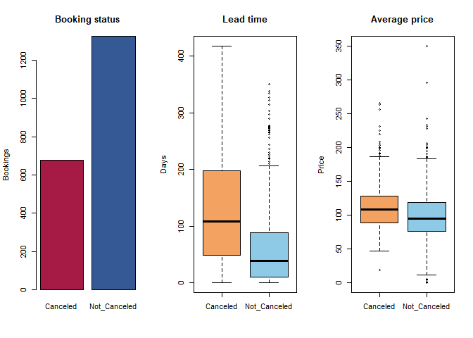
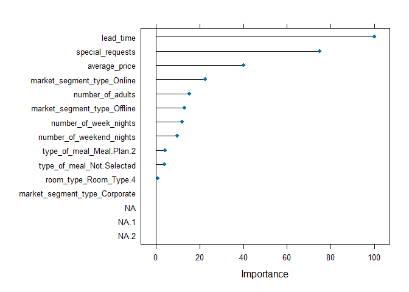
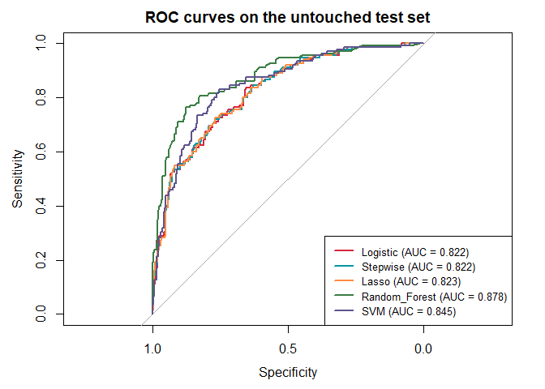

# Hotel Booking Cancellation


- [<span class="toc-section-number">1</span> Goal](#goal)
- [<span class="toc-section-number">2</span> Setup](#setup)
- [<span class="toc-section-number">3</span> Data
  preparation](#data-preparation)
- [<span class="toc-section-number">4</span> Stratified train-test
  split](#stratified-train-test-split)
- [<span class="toc-section-number">5</span> Training-only
  preprocessing](#training-only-preprocessing)
- [<span class="toc-section-number">6</span> Models](#models)
  - [<span class="toc-section-number">6.1</span> Logistic
    regression](#logistic-regression)
  - [<span class="toc-section-number">6.2</span> Stepwise logistic
    regression](#stepwise-logistic-regression)
  - [<span class="toc-section-number">6.3</span> Lasso logistic
    regression](#lasso-logistic-regression)
  - [<span class="toc-section-number">6.4</span> Random
    Forest](#random-forest)
  - [<span class="toc-section-number">6.5</span> Support Vector
    Machine](#support-vector-machine)
- [<span class="toc-section-number">7</span> Training-only model
  selection](#training-only-model-selection)
- [<span class="toc-section-number">8</span> Final test-set
  evaluation](#final-test-set-evaluation)
- [<span class="toc-section-number">9</span>
  Interpretation](#interpretation)

## Goal

The goal is to predict whether a hotel booking will be cancelled.
Logistic regression, stepwise logistic regression, Lasso, Random Forest,
and Support Vector Machines are compared using the same stratified split
and the same cross-validation folds.

Model tuning, preprocessing, and variable selection use only the
training data. The test set is used once for the final comparison.

## Setup

``` r
## Setup

required_packages <- c(
  "caret",
  "recipes",
  "glmnet",
  "MASS",
  "randomForest",
  "kernlab",
  "pROC",
  "knitr",
  "readxl"
)

missing_packages <- required_packages[
  !vapply(
    required_packages,
    requireNamespace,
    logical(1),
    quietly = TRUE
  )
]

if (length(missing_packages) > 0) {
  install.packages(missing_packages)
}

invisible(
  lapply(
    required_packages,
    library,
    character.only = TRUE
  )
)

set.seed(42)
```

## Data preparation

``` r
## Data preparation

bookings <- readxl::read_excel(
  "E:/data/room_bookings.xlsx"
)

bookings <- as.data.frame(bookings)

names(bookings) <- gsub("[. ]", "_", names(bookings))

categorical_variables <- c(
  "type_of_meal",
  "car_parking_space",
  "room_type",
  "market_segment_type",
  "repeated"
)

for (variable in categorical_variables) {
  bookings[[variable]] <- as.factor(bookings[[variable]])
}

bookings$average_price <- as.numeric(bookings$average_price)

bookings$booking_status <- factor(
  bookings$booking_status,
  levels = c("Canceled", "Not_Canceled")
)

model_data <- subset(
  bookings,
  select = -c(Booking_ID, date_of_reservation)
)

stopifnot(nrow(model_data) == 2000)
stopifnot(!anyNA(model_data))

dim(model_data)
```

    [1] 2000   15

``` r
table(model_data$booking_status)
```


        Canceled Not_Canceled 
             678         1322 

``` r
round(
  prop.table(table(model_data$booking_status)),
  3
)
```


        Canceled Not_Canceled 
           0.339        0.661 

`Canceled` is the positive class throughout the analysis.

``` r
par(mfrow = c(1, 3))

barplot(
  table(model_data$booking_status),
  col = c("#A61B46", "#345995"),
  main = "Booking status",
  ylab = "Bookings"
)

boxplot(
  lead_time ~ booking_status,
  data = model_data,
  col = c("#F4A261", "#8ECAE6"),
  main = "Lead time",
  xlab = "",
  ylab = "Days"
)

boxplot(
  average_price ~ booking_status,
  data = model_data,
  col = c("#F4A261", "#8ECAE6"),
  main = "Average price",
  xlab = "",
  ylab = "Price"
)
```



``` r
par(mfrow = c(1, 1))
```

## Stratified train-test split

``` r
## Stratified train-test split

## Stratified train-test split

set.seed(42)

train_index <- caret::createDataPartition(
  model_data$booking_status,
  p = 0.80,
  list = FALSE
)

train_data <- model_data[train_index, ]
test_data  <- model_data[-train_index, ]

# Remove unused factor levels from the training sample.
# Novel levels in the test set are handled later by the recipe.
train_data <- droplevels(train_data)

split_summary <- rbind(
  Training = table(train_data$booking_status),
  Test = table(test_data$booking_status)
)

knitr::kable(split_summary)
```

|          | Canceled | Not_Canceled |
|:---------|---------:|-------------:|
| Training |      543 |         1058 |
| Test     |      135 |          264 |

The same five folds are supplied to every model. ROC AUC is the tuning
criterion because accuracy alone can hide poor identification of
cancelled bookings.

``` r
set.seed(2025)
cv_folds <- createFolds(
  train_data$booking_status,
  k = 5,
  returnTrain = TRUE
)

cv_control <- trainControl(
  method = "cv",
  number = 5,
  index = cv_folds,
  classProbs = TRUE,
  summaryFunction = twoClassSummary,
  savePredictions = "final",
  allowParallel = FALSE
)
```

## Training-only preprocessing

The preprocessing recipe is estimated from training data only. It
handles unseen or very rare categorical levels, converts categorical
predictors to dummy variables, and removes near-zero-variance
predictors. This prevents unstable or singular fits caused by extremely
sparse predictors while preserving the same raw feature set for all
models.

``` r
base_recipe <- recipe(
  booking_status ~ .,
  data = train_data
)

base_recipe <- step_novel(
  base_recipe,
  all_nominal_predictors(),
  new_level = "Novel"
)

base_recipe <- step_other(
  base_recipe,
  all_nominal_predictors(),
  threshold = 0.01,
  other = "Other"
)

base_recipe <- step_dummy(
  base_recipe,
  all_nominal_predictors()
)

base_recipe <- step_nzv(
  base_recipe,
  all_predictors()
)

scaled_recipe <- step_normalize(
  base_recipe,
  all_numeric_predictors()
)
```

Lasso and SVM use the normalized recipe. Logistic regression, stepwise
logistic regression, and Random Forest use the common base recipe.
Because `caret` prepares the recipe separately inside each resampling
fold, preprocessing remains training-only during cross-validation.

## Models

### Logistic regression

``` r
set.seed(101)
fit_logistic <- train(
  base_recipe,
  data = train_data,
  method = "glm",
  family = binomial,
  metric = "ROC",
  trControl = cv_control
)
```

### Stepwise logistic regression

``` r
set.seed(102)
fit_stepwise <- train(
  base_recipe,
  data = train_data,
  method = "glmStepAIC",
  family = binomial,
  direction = "both",
  trace = FALSE,
  metric = "ROC",
  trControl = cv_control
)

names(coef(fit_stepwise$finalModel))
```

    [1] "(Intercept)"                   "number_of_weekend_nights"     
    [3] "lead_time"                     "average_price"                
    [5] "special_requests"              "market_segment_type_Corporate"
    [7] "market_segment_type_Offline"  

### Lasso logistic regression

Lasso performs embedded variable selection through the L1 penalty:
coefficients of weak predictors can be shrunk exactly to zero.

``` r
lambda_grid <- 10^seq(-4, 0, length.out = 30)

set.seed(103)
fit_lasso <- train(
  scaled_recipe,
  data = train_data,
  method = "glmnet",
  family = "binomial",
  tuneGrid = expand.grid(alpha = 1, lambda = lambda_grid),
  metric = "ROC",
  trControl = cv_control
)

fit_lasso$bestTune
```

       alpha      lambda
    15     1 0.008531679

``` r
coef(fit_lasso$finalModel, s = fit_lasso$bestTune$lambda)
```

    13 x 1 sparse Matrix of class "dgCMatrix"
                                  s=0.008531679
    (Intercept)                      0.95197718
    number_of_adults                 .         
    number_of_weekend_nights        -0.08006096
    number_of_week_nights            .         
    lead_time                       -1.22301056
    average_price                   -0.54192513
    special_requests                 1.09339706
    type_of_meal_Meal.Plan.2         .         
    type_of_meal_Not.Selected        .         
    room_type_Room_Type.4            .         
    market_segment_type_Corporate    .         
    market_segment_type_Offline      0.28796744
    market_segment_type_Online      -0.51651538

### Random Forest

``` r
set.seed(104)
fit_random_forest <- train(
  base_recipe,
  data = train_data,
  method = "rf",
  tuneLength = 5,
  ntree = 500,
  importance = TRUE,
  metric = "ROC",
  trControl = cv_control
)

fit_random_forest$bestTune
```

      mtry
    2    4

``` r
plot(varImp(fit_random_forest), top = 15)
```



### Support Vector Machine

``` r
set.seed(105)
fit_svm <- train(
  scaled_recipe,
  data = train_data,
  method = "svmRadial",
  tuneLength = 5,
  metric = "ROC",
  trControl = cv_control
)

fit_svm$bestTune
```

           sigma C
    5 0.06891841 4

## Training-only model selection

``` r
models <- list(
  Logistic = fit_logistic,
  Stepwise = fit_stepwise,
  Lasso = fit_lasso,
  Random_Forest = fit_random_forest,
  SVM = fit_svm
)

cv_results <- data.frame(
  Model = names(models),
  CV_ROC = vapply(
    models,
    function(model) max(model$results$ROC, na.rm = TRUE),
    numeric(1)
  )
)

cv_results <- cv_results[order(cv_results$CV_ROC, decreasing = TRUE), ]
kable(cv_results, digits = 3)
```

|               | Model         | CV_ROC |
|:--------------|:--------------|-------:|
| Random_Forest | Random_Forest |  0.895 |
| SVM           | SVM           |  0.867 |
| Lasso         | Lasso         |  0.857 |
| Logistic      | Logistic      |  0.856 |
| Stepwise      | Stepwise      |  0.856 |

``` r
selected_model <- cv_results$Model[1]
selected_model
```

    [1] "Random_Forest"

## Final test-set evaluation

``` r
evaluate_model <- function(model, model_name, test_data) {
  predicted_class <- predict(model, newdata = test_data)
  predicted_probability <- predict(
    model,
    newdata = test_data,
    type = "prob"
  )[, "Canceled"]

  confusion <- confusionMatrix(
    predicted_class,
    test_data$booking_status,
    positive = "Canceled"
  )

  roc_object <- roc(
    response = test_data$booking_status,
    predictor = predicted_probability,
    levels = c("Not_Canceled", "Canceled"),
    direction = "<",
    quiet = TRUE
  )

  metrics <- data.frame(
    Model = model_name,
    Accuracy = unname(confusion$overall["Accuracy"]),
    Sensitivity = unname(confusion$byClass["Sensitivity"]),
    Specificity = unname(confusion$byClass["Specificity"]),
    Balanced_Accuracy = unname(confusion$byClass["Balanced Accuracy"]),
    AUC = as.numeric(auc(roc_object))
  )

  list(
    metrics = metrics,
    confusion = confusion$table,
    roc = roc_object
  )
}

test_results <- lapply(
  names(models),
  function(model_name) {
    evaluate_model(models[[model_name]], model_name, test_data)
  }
)

test_metrics <- do.call(
  rbind,
  lapply(test_results, function(result) result$metrics)
)

kable(test_metrics, digits = 3, row.names = FALSE)
```

| Model         | Accuracy | Sensitivity | Specificity | Balanced_Accuracy |   AUC |
|:--------------|---------:|------------:|------------:|------------------:|------:|
| Logistic      |    0.762 |       0.585 |       0.852 |             0.719 | 0.822 |
| Stepwise      |    0.764 |       0.593 |       0.852 |             0.722 | 0.822 |
| Lasso         |    0.767 |       0.585 |       0.860 |             0.723 | 0.823 |
| Random_Forest |    0.830 |       0.741 |       0.875 |             0.808 | 0.878 |
| SVM           |    0.794 |       0.674 |       0.856 |             0.765 | 0.845 |

The selected model was chosen from cross-validation, not from these test
results.

``` r
selected_index <- match(selected_model, names(models))
test_results[[selected_index]]$confusion
```

                  Reference
    Prediction     Canceled Not_Canceled
      Canceled          100           33
      Not_Canceled       35          231

``` r
roc_colors <- c("#D7263D", "#0396A6", "#FF8C42", "#3A7D44", "#5E548E")

plot(
  test_results[[1]]$roc,
  col = roc_colors[1],
  lwd = 2,
  main = "ROC curves on the untouched test set"
)

for (index in 2:length(test_results)) {
  lines(test_results[[index]]$roc, col = roc_colors[index], lwd = 2)
}

legend(
  "bottomright",
  legend = paste0(
    test_metrics$Model,
    " (AUC = ",
    round(test_metrics$AUC, 3),
    ")"
  ),
  col = roc_colors,
  lwd = 2,
  cex = 0.8
)
```



## Interpretation

- The stratified split keeps the cancellation rate comparable between
  training and test data.
- Preprocessing is estimated from training data only and repeated
  independently inside each cross-validation fold.
- Rare or previously unseen factor levels are handled before model
  fitting, avoiding singularities from empty categories.
- Near-zero-variance predictors are removed before modelling because
  they provide too little variation for stable estimation and can cause
  numerical separation in ordinary logistic regression.
- Lasso still performs embedded variable selection among the predictors
  that remain after basic data-quality preprocessing.
- Stepwise selection and Lasso therefore provide two different
  variable-selection views.
- Sensitivity, specificity, balanced accuracy, and AUC are reported
  alongside accuracy.
- The final test set is not used for tuning, preprocessing decisions, or
  feature selection.
