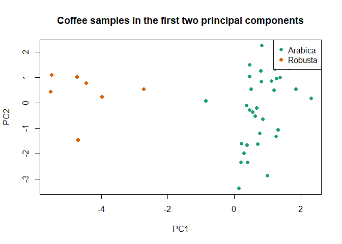
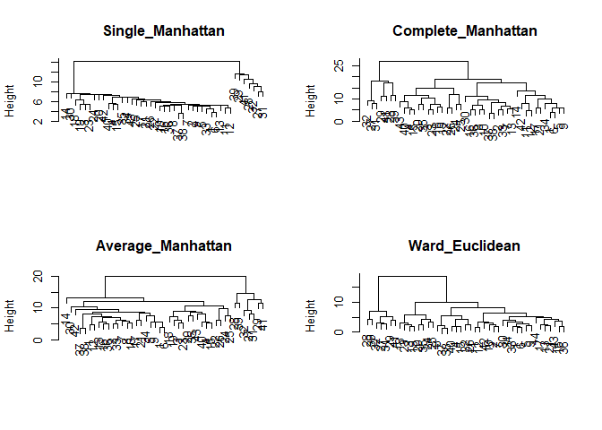
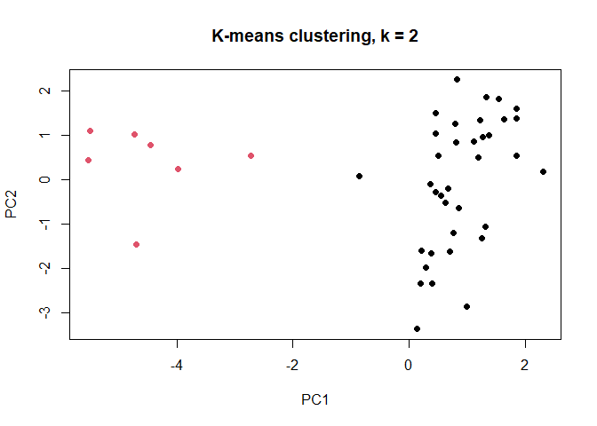
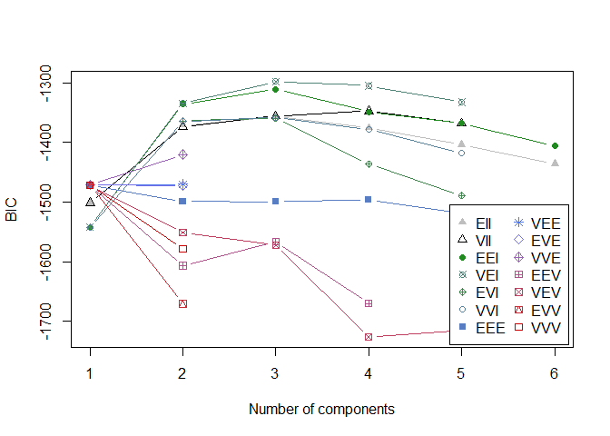

# Coffee Samples: Unsupervised Clustering


- [<span class="toc-section-number">1</span> Goal](#goal)
- [<span class="toc-section-number">2</span> Setup](#setup)
- [<span class="toc-section-number">3</span> Data](#data)
- [<span class="toc-section-number">4</span> Hierarchical
  clustering](#hierarchical-clustering)
- [<span class="toc-section-number">5</span> K-means](#k-means)
- [<span class="toc-section-number">6</span> Gaussian mixture
  model](#gaussian-mixture-model)
- [<span class="toc-section-number">7</span> Parsimonious Gaussian
  mixture models](#parsimonious-gaussian-mixture-models)
- [<span class="toc-section-number">8</span> Bayesian factor-analytic
  mixtures](#bayesian-factor-analytic-mixtures)
- [<span class="toc-section-number">9</span> Post-hoc comparison with
  the known varieties](#post-hoc-comparison-with-the-known-varieties)
- [<span class="toc-section-number">10</span>
  Interpretation](#interpretation)

## Goal

The data contain 43 coffee samples described by 12 chemical
measurements. The clustering algorithms use only the chemical variables.
The known variety, Arabica or Robusta, is reserved for post-hoc
evaluation with the Adjusted Rand Index (ARI).

## Setup

``` r
core_packages <- c("cluster", "mclust", "knitr")

missing_packages <- core_packages[
  !vapply(core_packages, requireNamespace, logical(1), quietly = TRUE)
]

if (length(missing_packages) > 0) {
  stop("Install the missing packages: ", paste(missing_packages, collapse = ", "))
}

library(cluster)
library(mclust)
library(knitr)

set.seed(42)

# These two analyses are computationally heavier and require extra packages.
run_pgmm <- FALSE
run_fabmix <- FALSE
```

## Data

``` r
coffee <- read.csv(
  "data/coffee.csv",
  stringsAsFactors = FALSE,
  check.names = FALSE
)

true_variety <- factor(
  coffee$Variety,
  levels = c(1, 2),
  labels = c("Arabica", "Robusta")
)

x <- scale(coffee[, -c(1, 2)])

stopifnot(nrow(x) == 43)
stopifnot(ncol(x) == 12)
stopifnot(!anyNA(x))

dim(x)
```

    [1] 43 12

``` r
table(true_variety)
```

    true_variety
    Arabica Robusta 
         36       7 

The ground-truth labels are not supplied to any clustering method.

``` r
pca <- prcomp(x)

plot(
  pca$x[, 1],
  pca$x[, 2],
  col = c("#1B9E77", "#D95F02")[true_variety],
  pch = 19,
  xlab = "PC1",
  ylab = "PC2",
  main = "Coffee samples in the first two principal components"
)

legend(
  "topright",
  legend = levels(true_variety),
  col = c("#1B9E77", "#D95F02"),
  pch = 19
)
```



## Hierarchical clustering

Manhattan distance is used with single, complete, and average linkage.
Ward’s criterion is used with Euclidean distance because `ward.D2` is
based on within-cluster sums of squares.

``` r
distance_manhattan <- dist(x, method = "manhattan")
distance_euclidean <- dist(x, method = "euclidean")

hierarchical_models <- list(
  Single_Manhattan = hclust(distance_manhattan, method = "single"),
  Complete_Manhattan = hclust(distance_manhattan, method = "complete"),
  Average_Manhattan = hclust(distance_manhattan, method = "average"),
  Ward_Euclidean = hclust(distance_euclidean, method = "ward.D2")
)

hierarchical_distances <- list(
  Single_Manhattan = distance_manhattan,
  Complete_Manhattan = distance_manhattan,
  Average_Manhattan = distance_manhattan,
  Ward_Euclidean = distance_euclidean
)

par(mfrow = c(2, 2))
for (model_name in names(hierarchical_models)) {
  plot(hierarchical_models[[model_name]], main = model_name, xlab = "", sub = "")
}
```



``` r
par(mfrow = c(1, 1))
```

The number of clusters is selected using average silhouette width,
without using the variety labels.

``` r
hierarchical_silhouette <- data.frame()

for (model_name in names(hierarchical_models)) {
  for (number_of_clusters in 2:6) {
    groups <- cutree(
      hierarchical_models[[model_name]],
      k = number_of_clusters
    )

    average_width <- mean(
      silhouette(
        groups,
        hierarchical_distances[[model_name]]
      )[, "sil_width"]
    )

    hierarchical_silhouette <- rbind(
      hierarchical_silhouette,
      data.frame(
        Method = model_name,
        Clusters = number_of_clusters,
        Average_Silhouette = average_width
      )
    )
  }
}

kable(hierarchical_silhouette, digits = 3, row.names = FALSE)
```

| Method             | Clusters | Average_Silhouette |
|:-------------------|---------:|-------------------:|
| Single_Manhattan   |        2 |              0.454 |
| Single_Manhattan   |        3 |              0.359 |
| Single_Manhattan   |        4 |              0.316 |
| Single_Manhattan   |        5 |              0.323 |
| Single_Manhattan   |        6 |              0.325 |
| Complete_Manhattan |        2 |              0.454 |
| Complete_Manhattan |        3 |              0.272 |
| Complete_Manhattan |        4 |              0.232 |
| Complete_Manhattan |        5 |              0.150 |
| Complete_Manhattan |        6 |              0.166 |
| Average_Manhattan  |        2 |              0.454 |
| Average_Manhattan  |        3 |              0.401 |
| Average_Manhattan  |        4 |              0.198 |
| Average_Manhattan  |        5 |              0.195 |
| Average_Manhattan  |        6 |              0.220 |
| Ward_Euclidean     |        2 |              0.419 |
| Ward_Euclidean     |        3 |              0.218 |
| Ward_Euclidean     |        4 |              0.173 |
| Ward_Euclidean     |        5 |              0.160 |
| Ward_Euclidean     |        6 |              0.144 |

``` r
best_hierarchical_row <- hierarchical_silhouette[
  which.max(hierarchical_silhouette$Average_Silhouette),
]

best_hierarchical_model <- best_hierarchical_row$Method
best_hierarchical_k <- best_hierarchical_row$Clusters

best_hierarchical_groups <- cutree(
  hierarchical_models[[best_hierarchical_model]],
  k = best_hierarchical_k
)

best_hierarchical_row
```

                Method Clusters Average_Silhouette
    1 Single_Manhattan        2          0.4540868

## K-means

Multiple random starts make the result reproducible and reduce
dependence on one initial allocation.

``` r
kmeans_models <- list()
kmeans_silhouette <- data.frame()

for (number_of_clusters in 2:6) {
  set.seed(100 + number_of_clusters)

  fit <- kmeans(
    x,
    centers = number_of_clusters,
    nstart = 50
  )

  kmeans_models[[as.character(number_of_clusters)]] <- fit

  kmeans_silhouette <- rbind(
    kmeans_silhouette,
    data.frame(
      Clusters = number_of_clusters,
      Average_Silhouette = mean(
        silhouette(fit$cluster, distance_euclidean)[, "sil_width"]
      )
    )
  )
}

kable(kmeans_silhouette, digits = 3, row.names = FALSE)
```

| Clusters | Average_Silhouette |
|---------:|-------------------:|
|        2 |              0.419 |
|        3 |              0.229 |
|        4 |              0.199 |
|        5 |              0.186 |
|        6 |              0.160 |

``` r
best_kmeans_k <- kmeans_silhouette$Clusters[
  which.max(kmeans_silhouette$Average_Silhouette)
]

best_kmeans <- kmeans_models[[as.character(best_kmeans_k)]]
best_kmeans_k
```

    [1] 2

``` r
plot(
  pca$x[, 1],
  pca$x[, 2],
  col = best_kmeans$cluster,
  pch = 19,
  xlab = "PC1",
  ylab = "PC2",
  main = paste("K-means clustering, k =", best_kmeans_k)
)
```



## Gaussian mixture model

``` r
mclust_model <- Mclust(
  x,
  G = 1:6,
  verbose = FALSE
)

summary(mclust_model)
```

    ---------------------------------------------------- 
    Gaussian finite mixture model fitted by EM algorithm 
    ---------------------------------------------------- 

    Mclust VEI (diagonal, equal shape) model with 3 components: 

     log-likelihood  n df       BIC       ICL
          -551.1776 43 52 -1297.938 -1298.114

    Clustering table:
     1  2  3 
    22 14  7 

``` r
plot(mclust_model, what = "BIC")
```



## Parsimonious Gaussian mixture models

The assignment requests both random (`zstart = 1`) and K-means
(`zstart = 2`) initial values. Change `run_pgmm` to `TRUE` after
installing `pgmm`.

``` r
if (run_pgmm) {
  if (!requireNamespace("pgmm", quietly = TRUE)) {
    stop("Install the pgmm package before setting run_pgmm <- TRUE")
  }

  set.seed(42)
  pgmm_random <- pgmm::pgmmEM(
    x,
    rG = 2:5,
    rq = 1:2,
    zstart = 1,
    loop = 5,
    seed = 42
  )

  set.seed(42)
  pgmm_kmeans <- pgmm::pgmmEM(
    x,
    rG = 2:5,
    rq = 1:2,
    zstart = 2,
    seed = 42
  )

  pgmm_summary <- data.frame(
    Start = c("Random", "K-means"),
    Model = c(pgmm_random$model, pgmm_kmeans$model),
    Clusters = c(pgmm_random$g, pgmm_kmeans$g),
    Factors = c(pgmm_random$q, pgmm_kmeans$q),
    ARI = c(
      adjustedRandIndex(pgmm_random$map, true_variety),
      adjustedRandIndex(pgmm_kmeans$map, true_variety)
    )
  )

  kable(pgmm_summary, digits = 3, row.names = FALSE)
}
```

## Bayesian factor-analytic mixtures

`fabMix` is intentionally optional because it is substantially slower.
The code considers one and two latent factors, three heated chains, and
a larger MCMC run than the short exploratory run in the original
assignment.

``` r
if (run_fabmix) {
  if (!requireNamespace("fabMix", quietly = TRUE)) {
    stop("Install the fabMix package before setting run_fabmix <- TRUE")
  }

  fabmix_output <- file.path(
    tempdir(),
    paste0("fabmix_coffee_", format(Sys.time(), "%Y%m%d_%H%M%S"))
  )

  set.seed(42)
  fabmix_model <- fabMix::fabMix(
    model = c("UUU", "UUC", "UCC", "CCC"),
    nChains = 3,
    rawData = as.matrix(x),
    outDir = fabmix_output,
    Kmax = 6,
    mCycles = 1100,
    burnCycles = 100,
    q = 1:2,
    warm_up_overfitting = 500,
    warm_up = 2000,
    progressGraphs = FALSE
  )

  fabmix_model$selected_model
  plot(fabmix_model, what = "BIC")
  plot(fabmix_model, what = "classification_pairs")
}
```

## Post-hoc comparison with the known varieties

Only after each method has selected its clustering do we compare it with
the known variety.

``` r
comparison <- data.frame(
  Method = c(
    paste0(best_hierarchical_model, " (k = ", best_hierarchical_k, ")"),
    paste0("K-means (k = ", best_kmeans_k, ")"),
    paste0("mclust ", mclust_model$modelName, " (G = ", mclust_model$G, ")")
  ),
  Clusters = c(
    best_hierarchical_k,
    best_kmeans_k,
    mclust_model$G
  ),
  ARI = c(
    adjustedRandIndex(best_hierarchical_groups, true_variety),
    adjustedRandIndex(best_kmeans$cluster, true_variety),
    adjustedRandIndex(mclust_model$classification, true_variety)
  )
)

if (run_pgmm) {
  comparison <- rbind(
    comparison,
    data.frame(
      Method = c("pgmm: random start", "pgmm: K-means start"),
      Clusters = c(pgmm_random$g, pgmm_kmeans$g),
      ARI = c(
        adjustedRandIndex(pgmm_random$map, true_variety),
        adjustedRandIndex(pgmm_kmeans$map, true_variety)
      )
    )
  )
}

if (run_fabmix) {
  comparison <- rbind(
    comparison,
    data.frame(
      Method = "fabMix",
      Clusters = length(unique(fabmix_model$class)),
      ARI = adjustedRandIndex(fabmix_model$class, true_variety)
    )
  )
}

kable(comparison, digits = 3, row.names = FALSE)
```

| Method                   | Clusters |   ARI |
|:-------------------------|---------:|------:|
| Single_Manhattan (k = 2) |        2 | 1.000 |
| K-means (k = 2)          |        2 | 1.000 |
| mclust VEI (G = 3)       |        3 | 0.383 |

## Interpretation

- Cluster-number selection is based on silhouette width, BIC, or each
  model’s own criterion, never on the known variety.
- ARI is used only as an external, post-hoc measure of agreement.
- Ward clustering is paired with Euclidean geometry.
- K-means uses multiple starts and a fixed seed.
- The selected number of mixture components does not have to equal the
  number of known varieties; a mixture model may represent
  within-variety heterogeneity with additional components.
