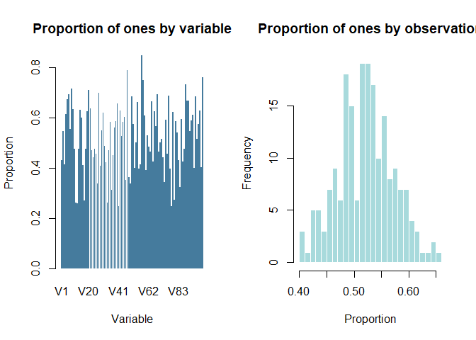
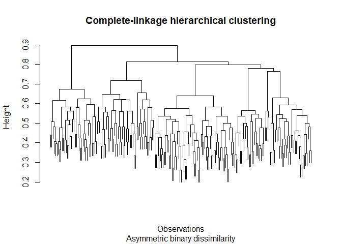
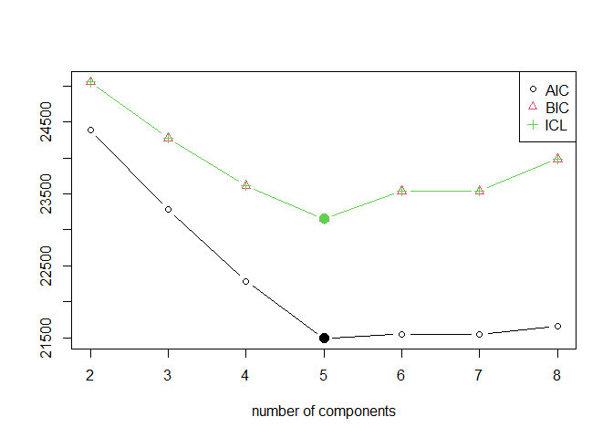
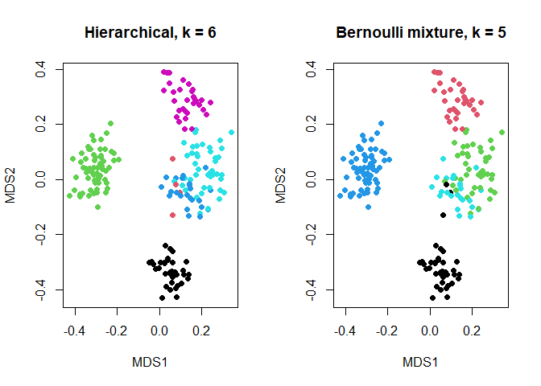

# High-Dimensional Binary Data Clustering


- [<span class="toc-section-number">1</span> Goal](#goal)
- [<span class="toc-section-number">2</span> Setup](#setup)
- [<span class="toc-section-number">3</span> Data
  validation](#data-validation)
- [<span class="toc-section-number">4</span> Hierarchical
  clustering](#hierarchical-clustering)
- [<span class="toc-section-number">5</span> Mode imputation for the
  frequentist Bernoulli
  mixture](#mode-imputation-for-the-frequentist-bernoulli-mixture)
- [<span class="toc-section-number">6</span> Mixture of multivariate
  Bernoulli
  distributions](#mixture-of-multivariate-bernoulli-distributions)
- [<span class="toc-section-number">7</span> Two-dimensional
  representation](#two-dimensional-representation)
- [<span class="toc-section-number">8</span> Bayesian Bernoulli
  mixtures](#bayesian-bernoulli-mixtures)
- [<span class="toc-section-number">9</span>
  Interpretation](#interpretation)

## Goal

The dataset contains 200 observations, 100 binary variables, and missing
values. The analysis respects the binary nature of the variables and
compares hierarchical clustering with mixtures of multivariate Bernoulli
distributions.

## Setup

``` r
core_packages <- c("cluster", "flexmix", "mclust", "knitr")

missing_packages <- core_packages[
  !vapply(core_packages, requireNamespace, logical(1), quietly = TRUE)
]

if (length(missing_packages) > 0) {
  stop("Install the missing packages: ", paste(missing_packages, collapse = ", "))
}

library(cluster)
library(flexmix)
library(mclust)
library(knitr)

set.seed(42)

# Change to TRUE after installing BayesBinMix.
run_bayesian <- FALSE
```

## Data validation

``` r
binary_data <- read.table(
  "data/x1.txt",
  header = TRUE,
  na.strings = "NA",
  check.names = FALSE
)

observed_values <- sort(unique(na.omit(as.vector(as.matrix(binary_data)))))

stopifnot(nrow(binary_data) == 200)
stopifnot(ncol(binary_data) == 100)
stopifnot(setequal(observed_values, c(0, 1)))

data_summary <- data.frame(
  Observations = nrow(binary_data),
  Variables = ncol(binary_data),
  Missing_Values = sum(is.na(binary_data)),
  Complete_Rows = sum(complete.cases(binary_data))
)

kable(data_summary, row.names = FALSE)
```

| Observations | Variables | Missing_Values | Complete_Rows |
|-------------:|----------:|---------------:|--------------:|
|          200 |       100 |            652 |            46 |

Only 46 rows are complete. A complete-case Bernoulli mixture would
therefore discard most of the sample.

``` r
proportion_ones_variable <- colMeans(binary_data, na.rm = TRUE)
proportion_ones_observation <- rowMeans(binary_data, na.rm = TRUE)

par(mfrow = c(1, 2))

barplot(
  proportion_ones_variable,
  border = NA,
  col = "#457B9D",
  main = "Proportion of ones by variable",
  xlab = "Variable",
  ylab = "Proportion"
)

hist(
  proportion_ones_observation,
  breaks = 20,
  col = "#A8DADC",
  border = "white",
  main = "Proportion of ones by observation",
  xlab = "Proportion"
)
```



``` r
par(mfrow = c(1, 1))
```

## Hierarchical clustering

For asymmetric binary variables, joint zeros are not treated as evidence
of similarity. `daisy()` therefore uses an asymmetric binary,
Jaccard-type dissimilarity. This is different from simple matching,
where both joint zeros and joint ones count as matches.

``` r
binary_dissimilarity <- daisy(
  binary_data,
  metric = "gower",
  type = list(asymm = 1:ncol(binary_data))
)

hierarchical_model <- hclust(
  binary_dissimilarity,
  method = "complete"
)

plot(
  hierarchical_model,
  labels = FALSE,
  main = "Complete-linkage hierarchical clustering",
  xlab = "Observations",
  sub = "Asymmetric binary dissimilarity"
)
```



The number of clusters is selected by average silhouette width rather
than by visually choosing a cut.

``` r
hierarchical_silhouette <- data.frame()

for (number_of_clusters in 2:8) {
  groups <- cutree(hierarchical_model, k = number_of_clusters)

  hierarchical_silhouette <- rbind(
    hierarchical_silhouette,
    data.frame(
      Clusters = number_of_clusters,
      Average_Silhouette = mean(
        silhouette(groups, binary_dissimilarity)[, "sil_width"]
      )
    )
  )
}

kable(hierarchical_silhouette, digits = 3, row.names = FALSE)
```

| Clusters | Average_Silhouette |
|---------:|-------------------:|
|        2 |              0.113 |
|        3 |              0.140 |
|        4 |              0.185 |
|        5 |              0.216 |
|        6 |              0.224 |
|        7 |              0.197 |
|        8 |              0.168 |

``` r
best_hierarchical_k <- hierarchical_silhouette$Clusters[
  which.max(hierarchical_silhouette$Average_Silhouette)
]

hierarchical_groups <- cutree(
  hierarchical_model,
  k = best_hierarchical_k
)

best_hierarchical_k
```

    [1] 6

``` r
table(hierarchical_groups)
```

    hierarchical_groups
     1  2  3  4  5  6 
    36  4 61 23 44 32 

## Mode imputation for the frequentist Bernoulli mixture

`FLXMCmvbinary()` does not model missing entries directly. Missing
values are imputed column by column using the training dataset’s
observed mode so that all 200 observations enter the model.

``` r
mode_impute <- function(column) {
  observed <- na.omit(column)
  mode_value <- as.numeric(
    names(sort(table(observed), decreasing = TRUE)[1])
  )
  column[is.na(column)] <- mode_value
  column
}

binary_mode <- as.data.frame(lapply(binary_data, mode_impute))

stopifnot(nrow(binary_mode) == 200)
stopifnot(sum(is.na(binary_mode)) == 0)
```

## Mixture of multivariate Bernoulli distributions

Several values of (K) and several initializations are compared. BIC
selects the final frequentist mixture.

``` r
set.seed(42)
flexmix_models <- stepFlexmix(
  as.matrix(binary_mode) ~ 1,
  k = 2:8,
  nrep = 5,
  model = FLXMCmvbinary(),
  verbose = 0
)

plot(flexmix_models)
```



``` r
flexmix_model <- getModel(flexmix_models, "BIC")
flexmix_groups <- clusters(flexmix_model)

summary(flexmix_model)
```


    Call:
    stepFlexmix(as.matrix(binary_mode) ~ 1, model = FLXMCmvbinary(), 
        k = 5, nrep = 5, verbose = 0)

           prior size post>0 ratio
    Comp.1 0.195   39     39     1
    Comp.2 0.160   32     32     1
    Comp.3 0.220   44     44     1
    Comp.4 0.305   61     61     1
    Comp.5 0.120   24     24     1

    'log Lik.' -10240.85 (df=504)
    AIC: 21489.7   BIC: 23152.05 

``` r
table(flexmix_groups)
```

    flexmix_groups
     1  2  3  4  5 
    39 32 44 61 24 

``` r
frequentist_comparison <- data.frame(
  Method = c("Hierarchical", "Bernoulli mixture"),
  Clusters = c(
    length(unique(hierarchical_groups)),
    length(unique(flexmix_groups))
  )
)

kable(frequentist_comparison, row.names = FALSE)
```

| Method            | Clusters |
|:------------------|---------:|
| Hierarchical      |        6 |
| Bernoulli mixture |        5 |

``` r
adjustedRandIndex(hierarchical_groups, flexmix_groups)
```

    [1] 0.9798689

The ARI above measures agreement between two estimated partitions; it is
not an accuracy score because no ground-truth labels are available.

## Two-dimensional representation

``` r
mds <- cmdscale(
  binary_dissimilarity,
  k = 2,
  add = TRUE,
  eig = TRUE
)

par(mfrow = c(1, 2))

plot(
  mds$points,
  col = hierarchical_groups,
  pch = 19,
  main = paste("Hierarchical, k =", best_hierarchical_k),
  xlab = "MDS1",
  ylab = "MDS2"
)

plot(
  mds$points,
  col = flexmix_groups,
  pch = 19,
  main = paste("Bernoulli mixture, k =", length(unique(flexmix_groups))),
  xlab = "MDS1",
  ylab = "MDS2"
)
```



``` r
par(mfrow = c(1, 1))
```

MDS is a visualization of the dissimilarities, not proof that the
clusters are separated in the original 100-dimensional space.

## Bayesian Bernoulli mixtures

`BayesBinMix` can model the missing values directly. The run is optional
because MCMC is computationally expensive. The upper bound is increased
to 10, the Dirichlet parameter has the correct length, and four heated
chains are used. Unique temporary output paths make the code rerunnable.

``` r
if (run_bayesian) {
  if (!requireNamespace("BayesBinMix", quietly = TRUE)) {
    stop("Install BayesBinMix before setting run_bayesian <- TRUE")
  }

  Kmax <- 10
  number_of_chains <- 4
  chain_heats <- seq(1, 0.3, length.out = number_of_chains)

  poisson_output <- file.path(
    tempdir(),
    paste0("bayes_binomial_poisson_", format(Sys.time(), "%Y%m%d_%H%M%S"))
  )

  uniform_output <- file.path(
    tempdir(),
    paste0("bayes_binomial_uniform_", format(Sys.time(), "%Y%m%d_%H%M%S"))
  )

  set.seed(42)
  bayes_poisson <- BayesBinMix::coupledMetropolis(
    Kmax = Kmax,
    nChains = number_of_chains,
    heats = chain_heats,
    binaryData = as.matrix(binary_data),
    outPrefix = poisson_output,
    ClusterPrior = "poisson",
    m = 1100,
    burn = 100,
    alpha = 1,
    beta = 1,
    gamma = rep(1, Kmax),
    ejectionAlpha = 0.2
  )

  set.seed(42)
  bayes_uniform <- BayesBinMix::coupledMetropolis(
    Kmax = Kmax,
    nChains = number_of_chains,
    heats = chain_heats,
    binaryData = as.matrix(binary_data),
    outPrefix = uniform_output,
    ClusterPrior = "uniform",
    m = 1100,
    burn = 100,
    alpha = 1,
    beta = 1,
    gamma = rep(1, Kmax),
    ejectionAlpha = 0.2
  )

  poisson_k <- as.numeric(bayes_poisson$K.mcmc)
  uniform_k <- as.numeric(bayes_uniform$K.mcmc)

  posterior_k <- data.frame(
    Prior = c("Poisson", "Uniform"),
    Most_Probable_K = c(
      as.numeric(names(which.max(table(poisson_k)))),
      as.numeric(names(which.max(table(uniform_k))))
    ),
    Probability_at_Kmax = c(
      mean(poisson_k == Kmax),
      mean(uniform_k == Kmax)
    )
  )

  kable(posterior_k, digits = 3, row.names = FALSE)

  matplot(
    bayes_poisson$K.allChains,
    type = "l",
    lty = 1,
    main = "Poisson prior: number of clusters by chain",
    xlab = "MCMC cycle",
    ylab = "K"
  )

  matplot(
    bayes_uniform$K.allChains,
    type = "l",
    lty = 1,
    main = "Uniform prior: number of clusters by chain",
    xlab = "MCMC cycle",
    ylab = "K"
  )

  bayes_poisson_groups <- bayes_poisson$clusterMembershipPerMethod$ECR
  bayes_uniform_groups <- bayes_uniform$clusterMembershipPerMethod$ECR

  agreement <- data.frame(
    Comparison = c(
      "Poisson vs Uniform",
      "Poisson vs FlexMix",
      "Uniform vs FlexMix"
    ),
    ARI = c(
      adjustedRandIndex(bayes_poisson_groups, bayes_uniform_groups),
      adjustedRandIndex(bayes_poisson_groups, flexmix_groups),
      adjustedRandIndex(bayes_uniform_groups, flexmix_groups)
    )
  )

  kable(agreement, digits = 3, row.names = FALSE)

  if (any(posterior_k$Probability_at_Kmax > 0.05)) {
    warning("Posterior mass reaches Kmax; increase Kmax before interpreting K.")
  }
}
```

## Interpretation

- The original dataset contains 652 missing entries, so complete-case
  analysis uses only 46 of 200 observations.
- Hierarchical clustering uses an asymmetric binary dissimilarity and
  handles missing comparisons pairwise.
- The frequentist Bernoulli mixture uses explicit mode imputation and
  checks that all 200 rows remain.
- The number of clusters is selected rather than fixed in advance.
- A posterior concentrated at `Kmax` is treated as a boundary warning,
  not as certainty that the true number of clusters equals the imposed
  maximum.
